# 课程三第一章 ML策略（1）如何降低误差以达成优化目标

## **P82 Why ML Strategy**

常用优化方法

- **Collect more data**
- **Collect more diverse training set样本多样性**
- **Train algorithm longer with gradient descent**
- **Try Adam instead of gradient descent**
- **Try bigger network**
- **Try smaller network**
- **Try dropout**
- **Add L2 regularization**
- **Network architecture: Activation functions, #hidden units…**

可选择的方法很多，也很复杂、繁琐。盲目选择、尝试不仅耗费时间而且可能收效甚微。因此，**使用快速、有效的策略来优化机器学习模型是非常必要的。**

## P83 正交化方法（Orthogonalization）

概念：只调试一个参数，保持其它参数不变

对应到机器学习监督式学习模型中，可以大致分成四个独立的“功能”：

- Fit training set well on cost function
  - 优化训练集可以通过使用更复杂NN，使用Adam等优化算法来实现
- Fit dev set well on cost function
  - 优化验证集可以通过正则化，采用更多训练样本来实现
- Fit test set well on cost function
  - 优化测试集可以通过使用更多的验证集样本来实现
- Performs well in real world
  - 提升实际应用模型可以通过更换验证集，使用新的cost function来实现

**这些调节方法只会对应一个“功能”，是正交的。**

<!--ps：early stopping在模型功能调试中并不推荐使用。因为early stopping在提升验证集性能的同时降低了训练集的性能。也就是说early stopping同时影响两个“功能”，不具有独立性、正交性。-->

## P84 单值评价指标(**Single number evaluation metric**)

[准确率、精确率、召回率辨析 - 知乎 (zhihu.com)](https://zhuanlan.zhihu.com/p/337119937)

以垃圾短信分类器为例

准确率**A**：预测成功的概率。成功预测垃圾短信(TP)+成功预测非垃圾短信(TN)/TP+TN+FP+FN)

精确率**P**：成功**预测为**正例占总**预测为**正例的比例。TP/(TP+FP) 

召回率**R**：成功**预测为**正例总正例的比例。recall=TP/(TP+FN)=TP/P=sensitive

比如7条垃圾短息，3条非垃圾短信。

10条预测，6个预测是垃圾短信，4个预测不是垃圾短息。

真实情况预测对5个垃圾短信(TP)，2个不是垃圾短信（TF）。

1个垃圾短息预测错（FP）,2个非垃圾短息预测错(FN)。

TP+TF+FP+FN = 10

准确率为 TP+TN/TP+TN+FP+FN = 5+2/10=0.7

精确率为 TP/(TP+FP)  = 5/6

召回率为 TP/(TP+FN) = 5/7

F 值是 精确率 和 召回率 的 调和平均：

参数α=1时，就是最常见的F1，也即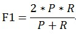

通过引入单值评价指标F1 Score，很方便对不同模型进行比较

除了F1 Score之外，还可以使用平均值等。

## P85 满足和优化指标(Satisficing and Optimizing metric)

把所有的性能指标都综合在一起，构成单值评价指标比较困难。

****

将Accuracy设为优化指标。Running time设为满足指标小于100ms。结果选出**模型B**。

优化指标（Optimizing metric）越优越好；而满意指标（Satisficing metric）只要满足设定的阈值就好了。

## **P86 训练 开发 测试分布(Train/dev/test distributions**)

Train/dev/test sets如何设置对机器学习的模型训练非常重要，合理设置能够大大提高模型训练效率和模型质量。

原则上应该尽量保证**dev sets和test sets来源于同一分布****且都反映了实际样本的情况**。如果dev sets和test sets不来自同一分布，那么我们从dev sets上选择的“最佳”模型往往不能够在test sets上表现得很好。

这就好比我们在dev sets上找到最接近一个靶的靶心的箭，但是我们test sets提供的靶心却远远偏离dev sets上的靶心，结果这支肯定无法射中test sets上的靶心位置。

## P87开发测试集的大小 **(Size of the dev and test sets**)

- 当样本数量不多（小于一万）的时候，通常将Train/dev/test sets的比例设为60%/20%/20%，在没有dev sets的情况下，Train/test sets的比例设为70%/30%。
- 当样本数量很大（百万级别）的时候，通常将相应的比例设为98%/1%/1%或99%/1%。

对于dev sets数量的设置，应该遵循的准则是通过dev sets能够检测不同算法或模型的区别，以便选择出更好的模型。

对于test sets数量的设置，应该遵循的准则是通过test sets能够反映出模型在实际中的表现。

实际应用中，可能只有train/dev sets，而没有test sets。这种情况也是允许的，只要算法模型没有对dev sets过拟合。但是，条件允许的话，最好是有test sets，实现无偏估计。

## **P88 什么时候更换开发集/测试集与评价指标（When to change dev/test sets and metrics**）

在算法投入应用后，我们可能会发现新的评价角度。比如对于小猫分类模型，我们本来只期望它能正确识别小猫。可是，随着使用应用的人变多，我们发现有的用户会上传色情图片。这时，我们不仅希望模型能只找出小猫，还要能过滤掉色情图片。

这样，我们就引入了一个新的评价指标。这样，之前辨认小猫能力强的模型，可能会在辨认色情图片上较差。

为了考虑这个新的评价指标，我们可以修改误差函数，用更高的权重加大色情图片分类错误的惩罚。

原cost function：

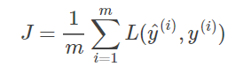

修改后cost function：
$$
J=\frac{1}{m}\sum_{i=1}^mw^{(i)}L(\hat y^{(i)},y^{(i)})
$$

$$
w^{(i)}=\begin{cases} 
		1, & x^{(i)}\ is\ non-porn\\ 
		10, & x^{(i)}\ is\ porn 
	\end{cases}
$$
总结来说，当我们发现使用当前指标得出来的最优模型，与考虑到某些新因素后得到的最优模型不同时，我们就应该更换开发/测试集与评价指标了。

## P89 为什么是人类级表现(Why human-level performance)

我们经常能看到AI与人类比较的新闻：什么AlphaGo在围棋上战胜人类了，什么在ImageNet上AI的分类准确率超过了人类啊，等等。除了博眼球的新闻外，业内同样也会时常将机器学习模型和人类比较。这是为什么呢？

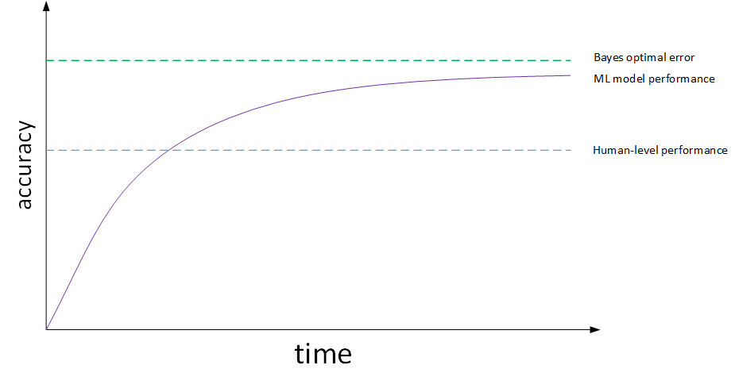

在许多任务中，人类的表现都非常出色。当AI超过了人类后，往往也达到了这类问题的最优精度。在机器学习模型超过人类前，与人类比较有以下好处：

1. 获取人类标注的数据。
2. 从手动误差分析中获得启发：为什么人就能做对？
3. 更好地分析偏差与方差。

其中，第1条是显然的，第2条会在下周介绍。接下来，我们看看第3条是怎么回事。

## P90 可规避偏差(**Avoidable bias**)

实际应用中，要看human-level error，training error和dev error的相对值。

例如猫类识别的例子中，如果human-level error为1%，training error为8%，dev error为10%。

由于training error与human-level error相差7%，dev error与training error只相差2%，所以目标是尽量在训练过程中减小training error，即减小偏差bias。

如果图片很模糊，肉眼也看不太清，human-level error提高到7.5%。这时，由于training error与human-level error只相差0.5%，dev error与training error只相差2%，所以目标是尽量在训练过程中减小dev error，即方差variance。这是相对而言的.

如果人类误差是1%，那么模型的训练误差还有7%的提升空间；而如果人类误差是7.5%，那说不定模型的训练误差只有0.5%的提升空间了。对于前者，我们应该关注偏差；关于后者，我们应该关注方差。这里讲到的7%, 0.5%的提升空间，可以称作**可规避偏差**。

## P91 理解人类级表现(**Understanding human-level performance**)

假如让人类来完成医学图片分类任务，人们得到了以下的分类误差：

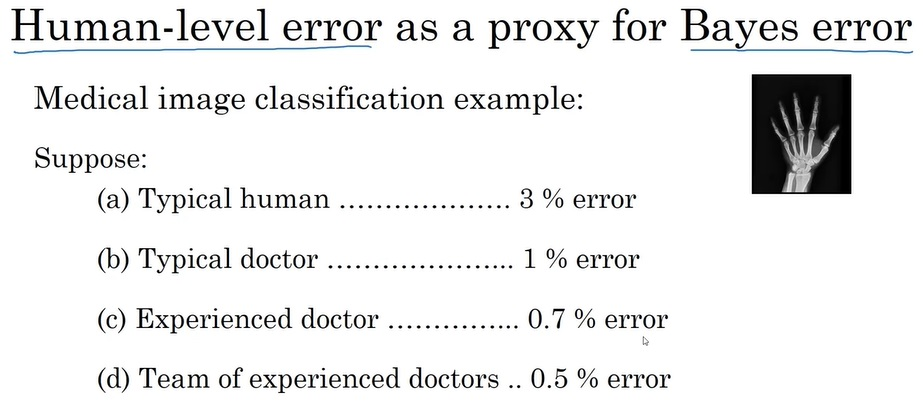

从一个普通人，到一群有经验的医生，误差逐渐降低。那么，哪个误差算是人类级表现呢？

回顾上一节的内容，人类误差是贝叶斯误差的一个估计。因此，人类最优的表现，才应该被视作是人类误差。

------

假如该模型training error为0.7%，dev error为0.8。

如果选择Team of experienced doctors，即human-level error为0.5%，则bias比variance更加突出。

如果选择Experienced doctor，即human-level error为0.7%，则variance更加突出。

也就是说，选择什么样的human-level error，有时候会影响bias和variance值的相对变化。当然这种情况一般只会在模型表现很好，接近bayes optimal error的时候出现。越接近bayes optimal error，模型越难继续优化，因为这时候的human-level performance可能是比较模糊难以准确定义的。

## P92 超越模型表现(**Surpassing human-level performance**)

对于自然感知类问题，例如视觉、听觉等，机器学习的表现不及人类。但是在很多其它方面，机器学习模型的表现已经超过人类了，包括：

- Online advertising

- Product recommendations

- Logistics(predicting transit time)

- Loan approvals

机器学习模型超过human-level performance是比较困难的。但是只要提供足够多的样本数据，训练复杂的神经网络，模型预测准确性会大大提高，很有可能接近甚至超过human-level performance。值得一提的是当算法模型的表现超过human-level performance时，很难再通过人的直觉来解决如何继续提高算法模型性能的问题。

## P93 提升模型表现(**Improving your model performance**)

training error与human-level error之间的差值反映的是avoidable bias，

dev error与training error之间的差值反映的是variance。

解决avoidable bias的常用方法包括：

- **Train bigger model** 
- **Train longer/better optimization algorithms: momentum, RMSprop, Adam**
- **NN architecture/hyperparameters search**

解决variance的常用方法包括：

- **More data**
- **Regularization: L2, dropout**
- **NN architecture/hyperparameters search**

# 课程三 第二章ML策略（2）错误分析、数据集匹配、多任务学习、端到端学习

p94 Andrej Karpathy访谈 

## p95 误差分析

当我们想提升模型的准确率时，一种做法是统计模型输出错误的样例，看看哪类数据更容易让模型出错。

比如，在提升一个小猫分类器的准确率时，我们可以去看看分类器最容易把其他哪种动物错分类成小猫。经过调查后，我们可能会发现一些小狗长得很像小猫，分类器在这些小狗图片上的表现不佳：

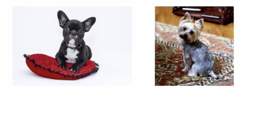

但是，在决定朝着某个方向改进模型之前，我们应该先做一个数据分析，看看这样的改进究竟有没有意义。我们可以去统计100张**分类错误**的**开发集**图片，看看这些图片里有多少张是小狗。如果小狗图片的数量很小，比如说只有5张，那么无论我们再怎么提升模型辨别小狗的能力，我们顶多把10%的错误率降到9.5%，提升微乎其微；但如果错分为小狗图片的数量很多，比如有50张，那么我们最优情况下可以把错误率从10%降到5%，这个提升就很显著了。

更系统地，我们可以建立一套同时分析多个改进方向的数据分析方法。比如说，在小猫的错误样例中，一些输入样本是很像小猫的小狗，一些输入样本是其他大型猫科动物，一些输入样本过于模糊。我们可以挑一些错误的样例，分别去记录这些错误样例的出现情况：

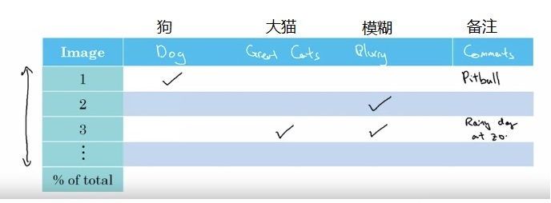

在这个表格中，我们可以记录每张分类错误的图片是由哪一种错误引起的，并留下一些备注。

调研已有问题的同时，我们还可以顺便去发现一些新的问题。比如我们可能会发现某些错分类的图片加了滤镜。发现这个新问题后，我们可以去表格中新建“滤镜”这一列。

手动分析完所有样例后，我们统计每种错误的百分比，看看改进哪种问题的价值更大。

## P96 清理标错的数据

在有监督学习中，标注数据往往是人工完成的，数据的标签有误也是情理之中的事。那么，如果数据中有标错的数据，它们会对模型的表现有什么影响呢？

首先，来看训练集有误的影响。事实上，深度学习算法对**随机错误**的容忍度很高。如果有少量样本是不小心标错的，那么它们对训练结果几乎没有影响。但是，如果数据中有**系统性错误**，比如白色的小狗全部被标成了小猫，那问题就大了，因为模型也会学到数据集中这种错误的规律。

接着，我们来看开发集有误的影响。为了确认标错数据的影响，我们应该用刚刚的表格统计法，顺便调查一下标错数据的比例：

在开发集误差不同时，标错数据产生的影响也不同。假设我们分别有一个开发集误差为10%的分类器和一个误差为2%的分类器：

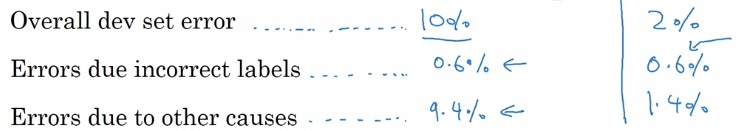

在这种情况下，假如有同一个模型有两个权重记录点，一个误差为2.1%，一个误差为1.9%。由于误差的存在，我们不好说第二个记录点就优于第一个记录点。回想一下，开发集本来的目的就是帮助我们选择一个在开发集上表现更好的模型。分辨不出更好的模型，开发集就失效了。因此，我们必须要去纠正一下这些开发集中的错标数据对于第一个分类器，总体占比0.6%的错标数据相对于10%的开发集错误率几乎可以忽略。但是，对于第二个误差为2%的分类器，0.6%的错标数据就显得占比很大了。

在纠正错标数据时，我们要注意以下几点：

- 由于开发集和测试集应来自同一个分布，**纠正数据的过程应该在开发集和测试集上同步进行**。
- 不仅要检查算法**输出错误的样本中的错标样本**，还要考虑那些**标注错误却输出正确**的样本。
- **不一定要去训练集上纠正错标样本**，因为训练集和开发集/测试集可以来自不同的分布。

吴恩达老师建议道，尽管很多人会因为检查数据这件事很琐碎而不愿意去一个一个检查算法输出错误的样本，但他还是鼓励大家这样做。他在自己领导的深度学习项目中，经常亲自去检查错误样本。检查错误样本往往能够确认算法之后的改进方向，在这件事上花时间绝对是值得的。

## p97 快速构建第一个系统，再迭代更新

在面对一个全新的深度学习问题时，我们不应该一上来就花很多时间去开发一个复杂的系统，而是应该按照下面的步骤尽快开始迭代：

- 快速建立开发集、测试集和评估指标以树立一个目标。
- 快速构建一个初始的系统。
- 使用偏差和方差分析、错误分析来获取后续任务的优先级。

简而言之，就是：快速构建第一个系统，再迭代更新。

当然，如果你在这个问题上已经很有经验了，或者这个问题已经有很多的科研文献，那么一上来就使用一套较为复杂却十分成熟的系统也是可以的。

> 这种快速迭代的思想同样适用于人生中的其他任务。比如，软件开发中，敏捷开发指的就是快速开发出原型，再逐步迭代。同样，我们在计划做一件事时，不必事先就想得面面俱到，可以尽快下手，再逐渐去改良做法。

## p98 训练与测试的不同分布

到目前为止，我们已经多次学习过，开发集和测试集的分布必须一致，但是它们与训练集的分布不一定要一致。让我们来看一个实际的例子：

假设我们要开发一个小猫分类的手机程序。我们有两批数据，第一批是从网站上爬取的高清图片，共200,000张；第二批是使用手机摄像头拍摄上传的图片，有10,000张。最终，用户在使用我们的手机程序时，也是要通过拍照上传。

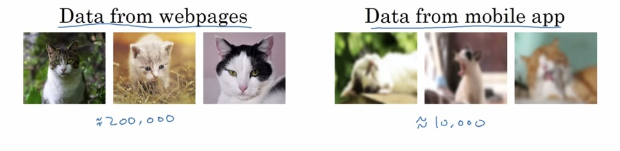

现在，有一个问题：该如何划分训练集、测试集、开发集呢？

一种方法是把所有数据混在一起，得到210,000张图片。之后，按照某种比例划分三个集合，比如按照205,000/2,500/2,500的比例划分训练/测试/开发集。

这种方法有一个问题：我们的开发集和测试集中有很多高清图片。但是，用户最终上传的图片可能都不是高清图片，而是模糊的收集摄像图片。**在开发集和测试集中混入更简单的高清图片会让评估结果偏好，不能反映模型在实际应用中的真正表现。**

另一种方法是**只用手机拍摄的图片作为开发集和测试集**。我们可以从手机拍摄的图片里选5,000张放进训练集里，剩下各放2,500张到开发/训练集里。这样的话，开发集和测试集就能更好地反映模型在我们所期望的指标上的表现了。

总结来说，如果我们有来自不同分布的数据，我们应该谨慎地划分训练集与开发/测试集，尽可能让开发/测试集只包含我们期待的分布中的数据，哪怕这样做会让训练集和开发/测试集的分布不一致。

## p99 不同数据分布下的偏差与方差问题

如果train set和dev/test set来源于不同分布，则无法直接根据相对值大小来判断。例如某个模型human-level error为0%，training error为1%，dev error为10%。

根据我们之前的理解，显然该模型出现了variance。但是，training error与dev error之间的差值9%可能来自算法本身（variance），也可能来自于样本分布不同。比如dev set都是很模糊的图片样本，本身就难以识别，跟算法模型关系不大。因此不能简单认为出现了variance。

方法：

- 从原来的train set中分割出一部分作为train-dev set，train-dev set不作为训练模型使用，而是与dev set一样用于 **验证**。

  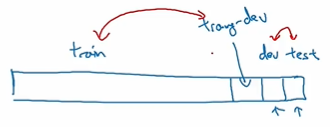

- 此时，有training error、training-dev error和dev error。**其中，training error与training-dev error的差值反映了variance（方差）**（因为是同分布的数据）；

- **training-dev error与dev error的差值反映了data mismatch problem**，即样本分布不一致。

举例：

- 如果training error为1%，**training-dev error为9%**，dev error为10%，则variance问题比较突出。

- 如果training error为1%，**training-dev error为1.5%**，dev error为10%，则data mismatch problem比较突出。

- 通过引入train-dev set，能够比较准确地定位出现了variance还是data mismatch。

  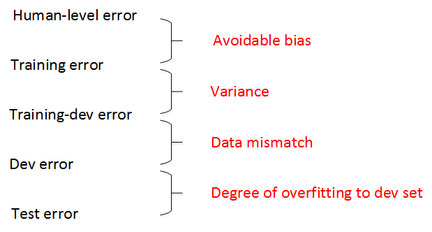

dev set 和 test set 来自同一分布

通常，human-level error、training error、training-dev error、dev error以及test error的数值是递增的

但是也会出现dev error和test error下降的情况。这主要可能是因为 **训练样本** 比 **验证/测试样本** 更加复杂，难以训练。

|  误差/样本   |   1    |     2      |   3    |         4          |
| :----------: | :----: | :--------: | :----: | :----------------: |
|   人类误差   |   0    |     0      |   0    |         0          |
|   训练误差   |   1%   |     1      |  10%   |        10%         |
| 训练开发误差 |   9%   |    1.5%    |  11%   |        11%         |
|   开发误差   |  10%   |     10     |  12%   |        20%         |
|   问题诊断   | 高方差 | 数据不匹配 | 高偏差 | 高偏差、数据不匹配 |

## p100 处理数据不匹配（**Addressing data mismatch**）

关于如何解决train set与dev/test set样本分布不一致的问题，有两条建议：

1. **Carry out manual error analysis to try to understand difference between training dev/test sets**
2. **Make training data more similar; or collect more data similar to dev/test sets**

为了让train set与dev/test set类似，我们可以使用人工数据合成的方法（artificial data synthesis）。

例如说话人识别问题，实际应用场合（dev/test set）是包含背景噪声的，而训练样本train set很可能没有背景噪声。为了让train set与dev/test set分布一致，我们可以在train set上人工添加背景噪声，合成类似实际场景的声音。这样会让模型训练的效果更准确。但是，需要注意的是，我们不能给每段语音都增加同一段背景噪声，这样会出现对背景噪音的过拟合，效果不佳。这就是人工数据合成需要注意的地方。

## p101 迁移学习（**Transfer learning**）

深度学习的一大强大之处，就是一个深度学习模型在某任务中学习到的知识，能够在另一项任务中使用。比如在计算机视觉中，目标检测等更难的任务会把图像分类任务的模型作为其模型组成的一部分。这种技术叫做**迁移学习**。

假如我们有一个通用图像识别的数据集和一个医学图像识别数据集，我们可以先训好一个通用的图像识别模型，再对模型做一些调整，换医学图像数据上去再训练出一个医学图像识别模型。

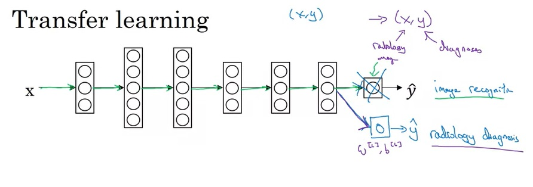

具体来说，以上图中展示的情况为例，我们可以在训练完通用图像识别模型后，删掉最后一个输出层，初始化一个符合医学图像识别任务要求的输出层。之后，我们使用医学图像来训练。在这个过程中，如果新数据较少，我们既可以只训练最后的输出层，而保持其他层参数不变；如果新数据够多，我们可以让所有参数都参与训练。

这里还要介绍两个重要的深度学习名词。如果**换新数据后要训练所有参数**，则换数据前的训练过程称为**预训练(pre-training)** ，换数据后的训练过程称为**微调(fine-tuning)** 。

迁移学习最常见的场合，是我们想完成训练数据较少的B任务，却在相似的A任务中有大量的训练数据。这时，我们就可以先学A任务，再迁移到B任务上。如果A、B任务的数据量差不多，那迁移学习就没什么意义了，因为同样是一份数据，对于B任务来说，一份B任务的数据肯定比一份A任务的数据要有用得多。

- 迁移学习的应用场合主要包括三点：
  - Task A 和 B 有同样的 input x.
  - Task A 的数据比 Task B 的数据**多很多**.（**希望提高B的性能，B的数据很少**）
  - A的低层次特征(Low level features) 可以帮助任务B的学习，那么迁移学习更有意义.

另外，迁移学习之所以能有效，是因为神经网络的**浅层总能学到一些和任务无关，而之和数据相关的知识**。因此，A任务和B任务要有一样的输入，且A任务的浅层特征能够帮助到任务B。

## p102 多任务学习（**Multi-task learning**）

多任务学习（multi-task learning）就是**构建神经网络同时执行多个任务**。

这跟二元分类或者多元分类都不同，多任务学习:类似**将多个神经网络融合在一起，用一个网络模型来实现多种分类效果**。

> 这里，一定要区分多个二分类问题**（多任务学习）**和多分类问题。多分类中，一个物体只可能属于多个类别中的一种；而多个二分类问题中，图片可以被同时归为多个类别。

如果有C个，那么输出y的维度是 (C,1)

例如汽车自动驾驶中，需要实现的多任务为行人、车辆、交通标志和信号灯。如果检测出汽车和交通标志，则y为：
$$
y=
\left[
 \begin{matrix}
   0\\
   1\\
   1\\
   0
  \end{matrix}
  \right]
$$
多任务学习模型的cost function为：
$$
\frac1m\sum_{i=1}^m\sum_{j=1}^cL(\hat y_j^{(i)},y_j^{(i)})
$$
其中，j表示任务下标，总有c个任务。对应的loss function为：
$$
L(\hat y_j^{(i)},y_j^{(i)})=-y_j^{(i)}log\ \hat y_j^{(i)}-(1-y_j^{(i)})log\ (1-\hat y_j^{(i)})
$$
Multi-task learning与Softmax regression的区别

- Softmax regression是**single label**的，即输出向量y只有一个元素为1；
- 而Multi-task learning是**multiple labels**的，即输出向量y可以有多个元素为1。

多任务学习是使用单个神经网络模型来实现多个任务。实际上，也可以分别构建多个神经网络来实现。

**如果各个任务之间是相似问题（例如都是图片类别检测），则可以使用多任务学习模型。**另外，多任务学习中，可能存在训练样本Y某些label空白的情况，这并不影响多任务模型的训练。

- 多任务学习的应用场合主要包括三点：

- - 所有任务都必须受益于**相同的浅层特征**。这是显而易见的。
- - 每个任务的**数据量很接近**
- - 只有当**神经网络模型足够大**时，使用多任务学习才至少不比分别学习每个任务差

迁移学习和多任务学习在实际应用中，迁移学习使用得更多一些。

## P103 端到端深度学习（**What is end-to-end deep learning**）

端到端（end-to-end）深度学习就是将所有不同阶段的数据处理系统或学习系统模块组合在一起，用一个单一的神经网络模型来实现所有的功能。它将所有模块混合在一起，只关心输入和输出。

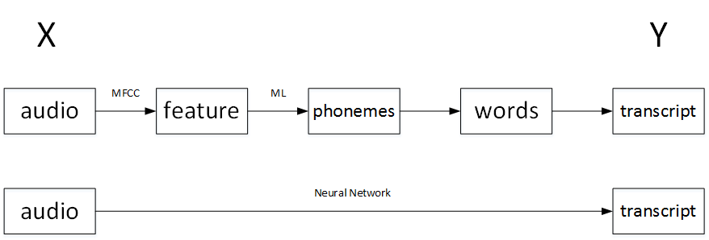

如**果训练样本足够大**，神经网络模型足够复杂，那么end-to-end模型性能比传统机器学习分块模型更好。

实际上，end-to-end让神经网络模型内部去自我训练模型特征，自我调节，增加了模型整体契合度。

------

相较于多步骤的方法，端到端学习的方法需要更多的数据。仅在数据足够的情况下，端到端学习才是有效的。下面，我们来看一个反例。

在人脸识别任务中，输入是一张图片，输出是图片中人脸的身份。这里有一个问题：识别人脸之前，算法需要先定位人脸的位置。如果使用端到端学习的话，学习算法要花很长时间才能学会找到人脸并识别人脸的身份。

相比之下，我们可以把这个人物拆成两个阶段：

- 第一阶段，算法的输入是图片，输出是一个框，框出了人脸所在位置；
- 第二阶段，输入是框里的人脸，输出是人脸的身份。学习算法可以轻松地完成这两个子问题，这种非端到端的方法反而更加通用。

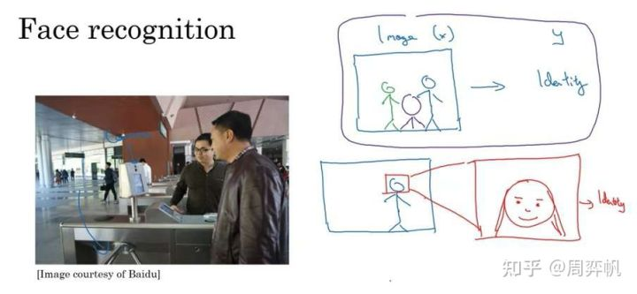

总结一下，非端到端学习想要优于端到端学习，必须满足两个条件：每个子任务都比较简单；每个子任务的数据很多，而整个任务的数据很少。

## P104 什么时候使用端到端

端到端学习的优缺点：

优点：

- 让数据说话。相较于手工设计的某些步骤，端到端学习能够从海量数据中发现于更适合计算机理解的统计规律。
- 减少手工设计的工作量，让设计者少花点精力。

缺点：

- 可能需要大量的数据。
- 排除了可能有用的手工设计的东西。比如人脸识别中，显然，找出人脸是一个绕不过去的子步骤。

**归根结底，还是数据量决定了是否使用端到端学习**。在复杂的任务中，要达成端到端需要非常非常多的数据，在不能够获取足够数据之前，还是使用多阶段的方法好；而对于简单的任务，可能要求的数据不多，直接用端到端学习就能很好地完成任务了。

## **p105 Ruslan Salakhutdinov采访**

