# 第三阶段回顾

在过去两周里，我们学习了改进深度学习模型的一些策略。让我们来回顾一下。

1. 首先，我们应该设置好任务的目标。选取开发/测试集时，应参考实际应用中使用的数据分布。设置优化指标时，应使用单一目标。可以设置一个最优化目标和多个满足目标。
2. 在搭建模型时，我们可以根据现有的数据量、问题的难易度，选择端到端学习或者是多阶段学习。
3. 训练模型前，如果有和该任务相似的预训练模型，我们可以采取迁移学习，把其他任务的模型权重搬过来；如果我们的模型要完成多个相似的任务，可以同时训练多个任务的模型。
4. 有了目标，搭好了模型之后，就可以开始训练模型了。有了训练好的模型后，我们可以根据模型的训练误差、训练开发误差、开发误差来诊断模型当前存在的问题。当然，在诊断之前，我们可以先估计一下人类在该问题上的最低误差，以此为贝叶斯误差的一个估计。通过比较贝叶斯误差和训练误差，我们能知道模型是否存在偏差问题；通过比较训练误差和训练开发误差，我们能知道模型是否存在方差问题；通过比较训练开发误差和开发误差，我们能知道模型是否存在数据不匹配问题。
5. 另一方面，如果在改进模型时碰到了问题，不妨采取错误分析技术，看看模型究竟错在哪。我们可以拿出开发集的一个子集，统计一下模型的具体错误样例，看看究竟是模型在某些条件下表现得不好，还是标错的数据太多了。

这些内容可能比较偏向于工程经验，没有过多的数学理论。但是，相信大家在搭建自己的深度学习项目时，这些知识一定能派上用场。

# **第四阶段预览**

在这之后，我们要分别学习两大类神经网络：处理图像的网络和处理序列数据的网络。在第四门课《卷积神经网络》中，我们就会学习能够处理图像问题的卷积神经网络。一起来看看接下来要学的内容吧。

《卷积神经网络》的课需花四周学完。第一周，我们会学习卷积神经网络的基本构件，建立对卷积神经网络的基本认识，为后续的学习做准备。具体的内容有：

- 卷积操作

- - 从卷积核到卷积
  - 卷积的属性——填充、步幅
  - 卷积层

- 池化操作

- 卷积神经网络示例

最简单的计算机视觉任务是图像分类。第二周，我们将学习一系列图像分类网络。这些网络不仅能在图像分类上取得优秀的成绩，还是很多其他计算机视觉任务的基石。通过学习它们，我们不仅能见识一些经典网络的架构，更能从中学习到搭建卷积神经网络的一般规律。其内容有：

- 早期神经网络

- - LeNet-5
  - AlexNet
  - VGG

- 残差神经网络

- Inception 网络

- MobileNet

- 搭建卷积网络项目

- - 使用开源代码
  - 迁移学习
  - 数据增强

第三周，我们将学习计算机视觉中一个比较热门的任务——目标检测。目标检测要求算法不仅能辨别出图片中的物体，还要能把物体精确地框出来。我们会一步一步学习如何搭建完成目标检测的卷积神经网络：

- 目标定位与关键点检测

- 使用卷积神经网络的目标检测

- - 滑动窗口算法
  - 基于卷积的滑动窗口

- YOLO 算法

- - 结合目标定位与滑动窗口
  - 交并比(IoU)
  - NMS（非极大值抑制）
  - 锚框(Anchor boxes)

- R-CNN 系列算法简介

此外，这周还会稍微提及另一个计算机视觉任务——语义分割的基本知识：

- 基于U-Net的语义分割

- - 反卷积
  - U-Net架构

最后一周，第四周，我们又会认识两个新任务：人脸检测与神经网络风格迁移。具体的内容有：

- 人脸检测

- - 人脸检测问题与一次性学习
  - 孪生神经网络
  - 三元组误差
  - 转化成二分类问题

- 神经网络风格迁移

- - 风格迁移简介
  - 利用神经网络学到的东西
  - 风格迁移中的误差
  - 推广到1维和3维

相比之前的课，学习第四门课时需要花更多的精力，主要因为以下几点：

1. 课程难度变高。
2. 课程的编程练习很多。
3. 课堂上介绍了很多论文作为拓展学习的方向。

# 课程四 第一周 卷积神经网络的基础构件

## P106 **计算机视觉** CV(Computer Vision)

CV(Computer Vision, 计算机视觉)是计算机科学的一个研究领域。该领域研究如何让计算机“理解”图像，从而完成一些只有人类才能完成的高级任务。这些高级任务有：图像分类、目标检测、风格转换等。

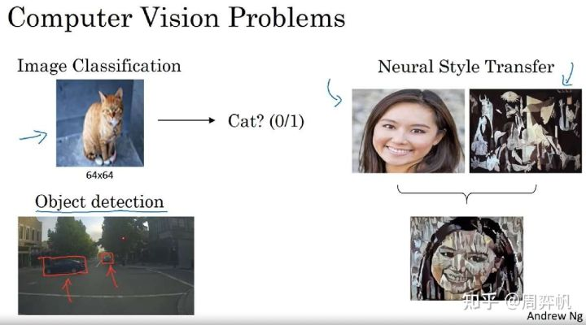

机器视觉（Computer Vision）是深度学习应用的主要方向之一。一般的CV问题包括以下三类：

- **Image Classification** 图像分类 识别是否为猫
- **Object detection** 目标检测
- **Neural Style Transfer **风格转换

> 想具体了解有哪些计算机视觉任务，可以直接去访问OpenMMLab的GitHub主页：[https://github.com/open-mmlab](https://link.zhihu.com/?target=https%3A//github.com/open-mmlab) 。图像分类、目标检测、语义分割、图像补全、光流、图像超分辨率、自动抠图、姿态识别、视频插帧、视频目标跟踪、文字识别与理解、图像生成、视频理解、3D目标检测与语义分割……

使用传统神经网络处理机器视觉的一个主要问题是输入层维度很大。例如一张64x64x3的图片，神经网络输入层的维度为12288。如果图片尺寸较大，例如一张1000x1000x3的图片，神经网络输入层的维度将达到3百万，使得网络权重W非常庞大。

这样会造成两个后果，

1. 神经网络结构复杂，数据量相对不够，容易出现过拟合；
2. 所需内存、计算量较大。

解决这一问题的方法就是使用卷积神经网络（CNN）。

## P107 **边缘检测示例** **Edge Detection Example**

卷积是一种定义在图像上的操作。在深度学习时代之前，它最常用于图像处理。让我们来看看卷积在图像处理中的一个经典应用——边缘检测，通过这个应用来学习卷积。

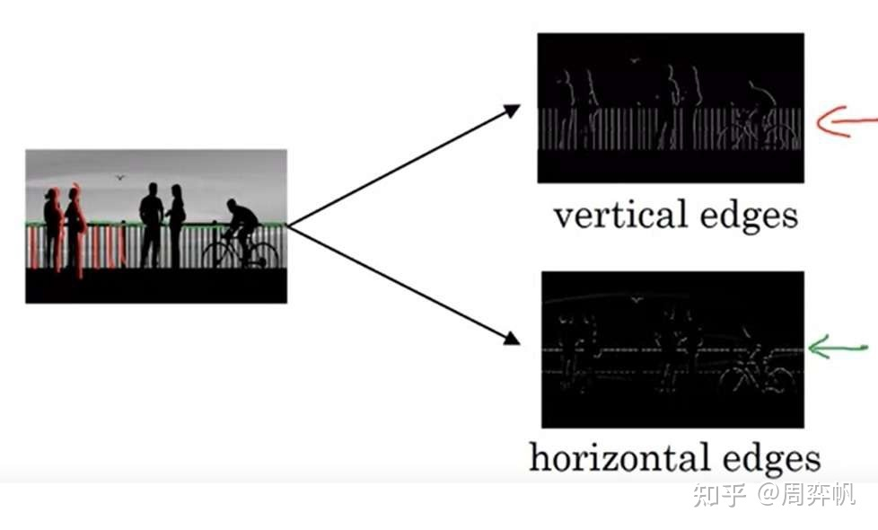

边缘检测的示意图如上所示。输入一张图片，我们希望计算机能够检测出图像纵向和横向的边缘，把有边缘的地方标成白色，没有边缘的地方标成黑色。

### 卷积

我们可以用卷积实现边缘检测。让我们来看看卷积运算是怎么样对数据进行操作的。

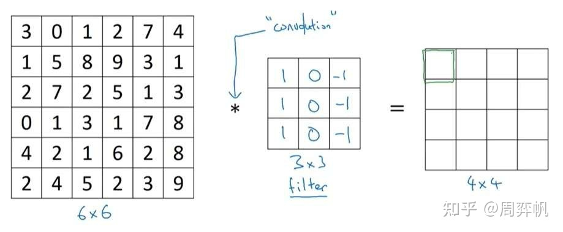

卷积有两个输入：一幅图像和一个**卷积核（英文是kernel，也叫做filter滤波器）**

其中**卷积核是一个二维矩阵**。我们这里假设图像是一幅单通道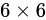的矩阵，卷积核是一个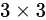矩阵。

卷积操作会依次算出输出图像中每一个格子的值。对于输出左上角第一个格子，它的计算方法如下：

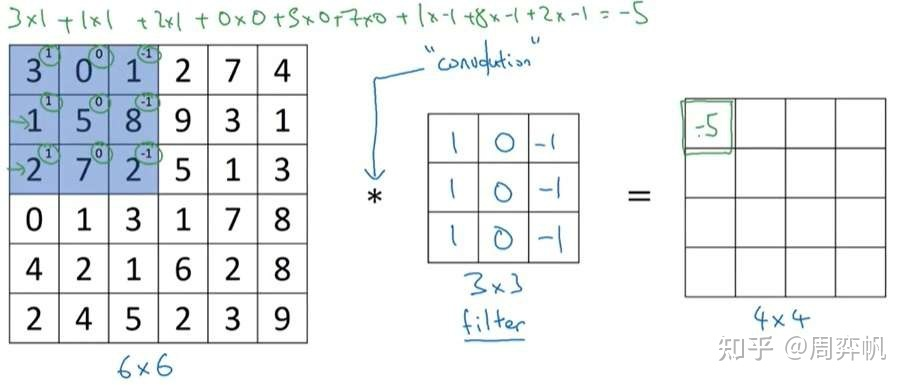

1. 首先，我们把卷积核“套”在输入图像的左上角。
2. 之后，我们把同一个位置的两个数字乘起来。
3. 最后，把所有乘法结果加起来，这个和就是输出中第一个格子的值。通过计算，这个值是**-5**，我们把它填入到输出图像中。

按同样的道理，我们可以填完第一行剩下的格子：

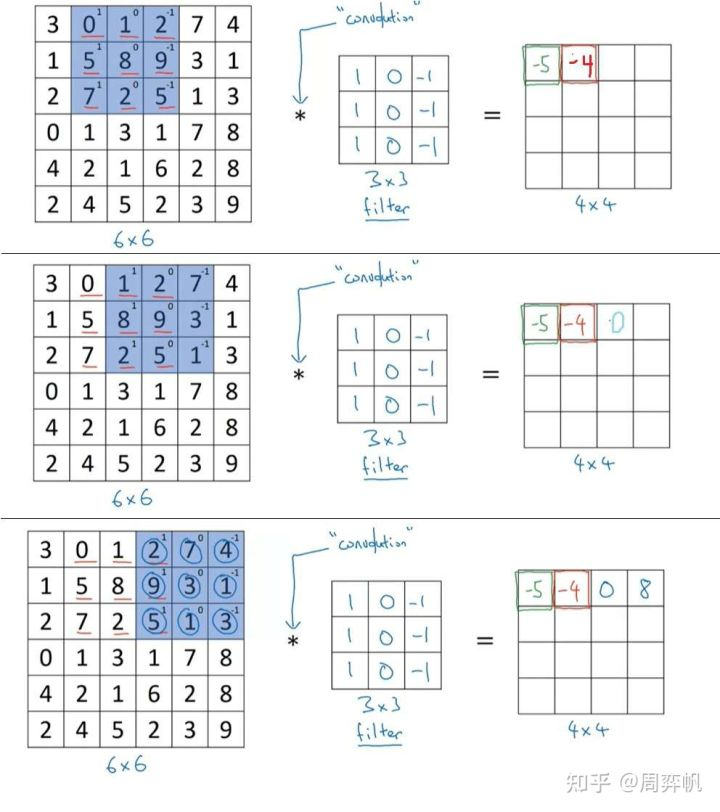

从第二行开始，卷积核要往下移一格。

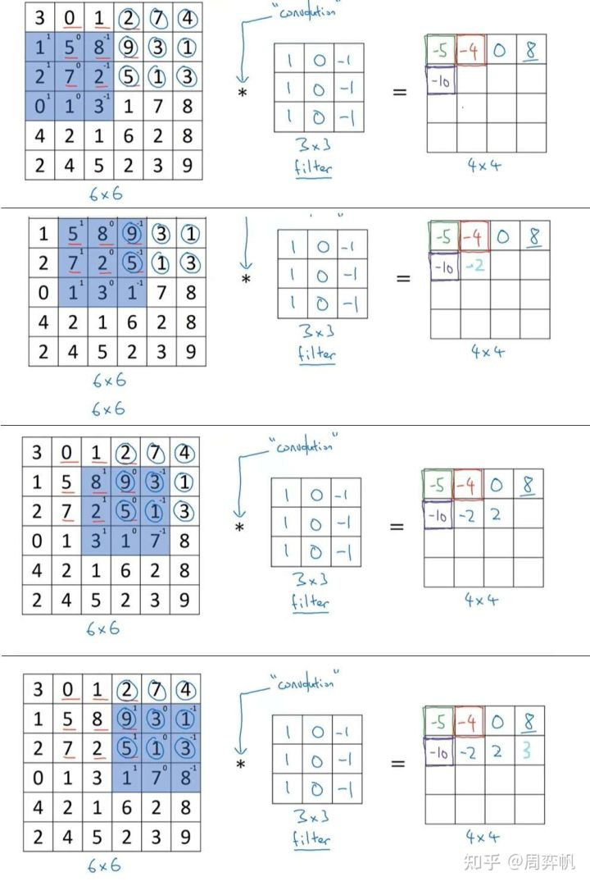

以此类推，我们可以填完所有格子。最后会得到一个4*4的图像。

学会了卷积，该怎么用卷积完成边缘检测呢？

### 卷积完成边缘检测

我们可以看下面这个例子：

来看左边那幅图像，它左侧是白的，右侧是灰的。很明显，中间有一条纵向的边缘。当我们用图中那个卷积核对图像做卷积操作后，输出的图像中间是白色的（非0值），两侧是黑色的。输出图像用白色标出了原图像的纵向边缘，达到了边缘检测的目的。

刚刚那个卷积核只能检测纵向的边缘。

把卷积核转一下，就能检测横向的边缘了。

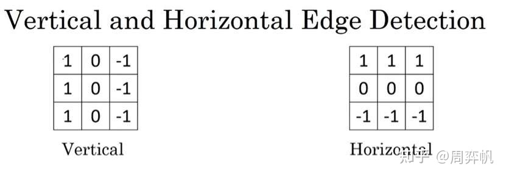

实际上，不仅是横向和纵向，我们还可以通过改变卷积核，检测出图像45°，30°的边缘。同时，卷积核里面的数值也不一定是1和-1，还有各种各样的取值方法。如果大家感兴趣，可以参考数字图像处理中有关边缘检测的介绍。

## P108 **更多边缘检测例子 **More Edge Detection

图片边缘有两种渐变方式，一种是由明变暗，另一种是由暗变明。以垂直边缘检测为例，下图展示了两种方式的区别。实际应用中，这两种渐变方式并不影响边缘检测结果，可以对输出图片取绝对值操作，得到同样的结果。

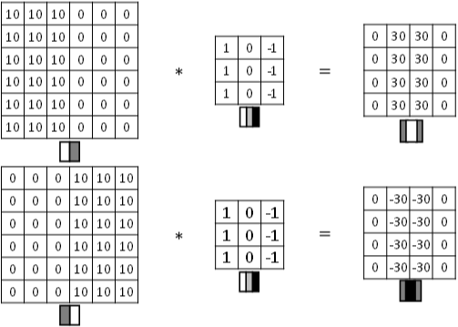

垂直边缘检测和水平边缘检测的滤波器算子如下所示：

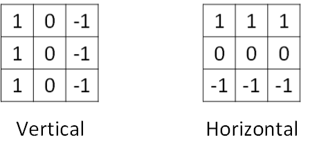

下图展示一个水平边缘检测的例子：

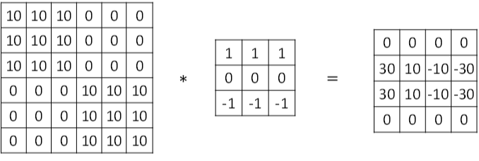

除了上面提到的这种简单的Vertical、Horizontal滤波器之外，还有其它常用的filters，例如Sobel filter和Scharr filter。这两种滤波器的特点是增加图片中心区域的权重。

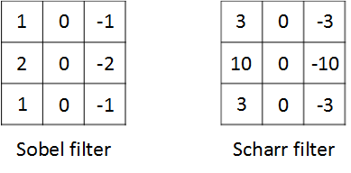

上图展示的是垂直边缘检测算子，水平边缘检测算子只需将上图顺时针翻转90度即可。

在深度学习中，如果我们想检测图片的各种边缘特征，而不仅限于垂直边缘和水平边缘，那么filter的数值一般需要通过模型训练得到，类似于标准神经网络中的权重W一样由梯度下降算法反复迭代求得。CNN的主要目的就是计算出这些filter的数值。确定得到了这些filter后，CNN浅层网络也就实现了对图片所有边缘特征的检测。

## p109 填充 padding

按照我们上面讲的图片卷积，如果原始图片尺寸为n x n，filter尺寸为f x f，则卷积后的图片尺寸为(n-f+1) x (n-f+1)，注意**f一般为奇数**。

这样会带来两个问题：

- 卷积运算后，输出图片尺寸缩小

- 原始图片边缘信息对输出贡献得少，输出图片丢失边缘信息

为了解决图片缩小的问题，可以使用padding方法，即**把原始图片尺寸进行扩展**，扩展区域补零，用p来表示每个方向扩展的宽度。

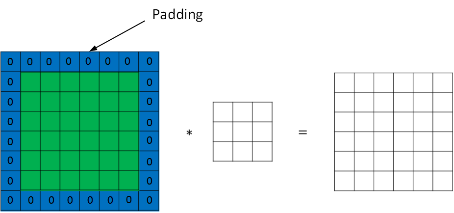

填充操作有两个参数：填充的数据和向四周填充的宽度。

1. 对于填充的数据，一般情况下，全部填0即可。
2. 而对于填充宽度，其取决于卷积核的大小。为了让图像大小不变，我们应该让填充宽度![[公式]](吴恩达深度学习P106-P130.assets/equation.svg)满足![[公式]](吴恩达深度学习P106-P130.assets/equation-1657696188909.svg)解得![[公式]](https://www.zhihu.com/equation?tex=p%3D%5Cfrac%7Bf-1%7D%7B2%7D)。**为了让![[公式]](吴恩达深度学习P106-P130.assets/equation-1657696250494.svg)是整数，卷积核边长最好是奇数**。

加入了填充操作后，我们可以把卷积分成两类：**有效卷积（valid convolution）**和**等长卷积（same convolution）**。前者不做填充操作，只对图像的有效区域做卷积。而后者会在**卷积前做一次填充**，保证整个操作的前后图像大小不变。

## p110 带步长卷积 strided convolution

之前，每做完一次卷积后，我们都会让卷积核往右移1格；每做完一行卷积后，我们都会让卷积核往下移1格。但实际上，我们可以让卷积核移动得更快一点。卷积核每次移动的长度![[公式]](吴恩达深度学习P106-P130.assets/equation-1657696421517.svg)称为**stride**.

我们用s表示stride长度，p表示padding长度，可以看到，步幅改变后，输出图像的边长也改变了。一般地，卷积后图像边长满足下面这个公式：

![[公式]](吴恩达深度学习P106-P130.assets/equation-1657697044255.svg)

其中![[公式]](吴恩达深度学习P106-P130.assets/equation-1657697054038.svg)表示去掉![[公式]](吴恩达深度学习P106-P130.assets/equation-1657697054103.svg)的小数部分，只保留其整数部分，即向下取整。

------

值得一提的是，**相关系数（cross-correlations）与卷积（convolutions）之间是有区别的**。实际上，真正的卷积运算会先将filter绕其中心旋转180度，然后再将旋转后的filter在原始图片上进行滑动计算。filter旋转如下所示：

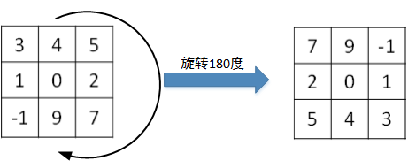

比较而言，相关系数的计算过程则不会对filter进行旋转，而是直接在原始图片上进行滑动计算。

------

其实，**目前为止我们介绍的CNN卷积实际上计算的是相关系数**，**而不是数学意义上的卷积**。**但是，为了简化计算，我们一般把CNN中的这种“相关系数”就称作卷积运算**。之所以可以这么等效，是因为滤波器算子一般是水平或垂直对称的，180度旋转影响不大；而且最终滤波器算子需要通过CNN网络梯度下降算法计算得到，旋转部分可以看作是包含在CNN模型算法中。总的来说，忽略旋转运算可以大大提高CNN网络运算速度，而且不影响模型性能。

**卷积运算服从结合律**：(*A*∗*B*)∗*C*=*A*∗(*B*∗*C*)

## p111 三维卷积 **Convolutions Over Volume**

对于3通道的RGB图片，其对应的滤波器算子同样也是3通道的。例如一个图片是6 x 6 x 3，分别表示图片的高度（height）、宽度（weight）和通道（channel）。

3通道图片的卷积运算与单通道图片的卷积运算基本一致。

- 过程是将每个单通道（R，G，B）与对应的filter进行卷积运算求和，**然后再将3通道的和相加，得到输出图片的一个像素值**。

> 图像是用CHW(通道-高-宽)还是HWC表示，这件事并没有一个定论。似乎TensorFlow是用HWC，PyTorch是用CHW。这门课默认使用的是HWC。

- 既然输入都可以是多通道图像了，输出图像是不是也可以有多个通道呢？
- - 是的，我们只要用多个卷积核来卷图像，就可以得到一个多通道的图像了。

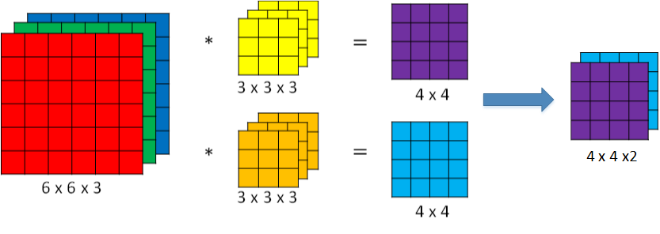

总结一下，假如输入图像的形状是![[公式]](吴恩达深度学习P106-P130.assets/equation-1657698430996.svg)，卷积核的形状则是![[公式]](吴恩达深度学习P106-P130.assets/equation-1657698463636.svg)。注意这个![[公式]](吴恩达深度学习P106-P130.assets/equation-1657698483396.svg)必须是同一个数。假如有![[公式]](吴恩达深度学习P106-P130.assets/equation-1657698505071.svg)个卷积核，则输出图像的形状是：

![[公式]](吴恩达深度学习P106-P130.assets/equation-1657698521875.svg)

> 在某些框架中，卷积核数量会也会当成卷积核的一个维度，比如可以用![[公式]](吴恩达深度学习P106-P130.assets/equation-1657698565578.svg)来表示一个卷积核组。

## **p112 卷积神经网络中的卷积层**One Layer of a Convolutional Network

现在，我们已经掌握了卷积的基本知识，让我们来看看卷积神经网络中的卷积层长什么样。

卷积在卷积层中的地位，就和乘法操作在传统神经网络隐藏层中的地位一样。因此，在卷积层中，除了基础的卷积操作外，还有添加偏移量、使用激活函数这两步。注意，**每有一个输出通道，就有一个![[公式]](吴恩达深度学习P106-P130.assets/equation-1657698653137.svg)。**

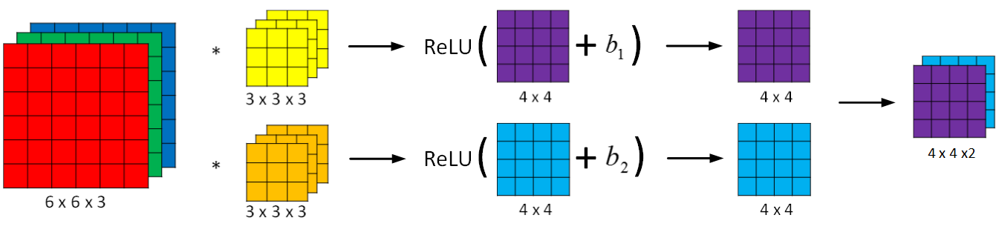

现在，我们可以总结一下一个卷积层中涉及的所有中间变量以及它们的形状了。

> ## 我们来计算一下上图中参数的数目：每个滤波器组有3x3x3=27个参数，还有1个偏移量b，则每个滤波器组有27+1=28个参数，两个滤波器组总共包含28x2=56个参数。我们发现，选定滤波器组后，参数数目与输入图片尺寸无关。所以，就不存在由于图片尺寸过大，造成参数过多的情况。例如一张1000x1000x3的图片，标准神经网络输入层的维度将达到3百万，而在CNN中，参数数目只由滤波器组决定，数目相对来说要少得多，这是CNN的优势之一。

最后，我们总结一下CNN单层结构的所有标记符号，设层数为l。

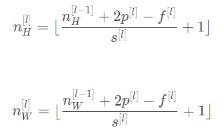

如果有m个样本，进行向量化运算，相应的输出维度为：
$$
m \times n_H^{[l]} \times n_W^{[l]} \times n_c^{[l]}
$$

## p113 CNN的简单示例**Simple Convolutional Network Example**

下面介绍一个简单的CNN网络模型：

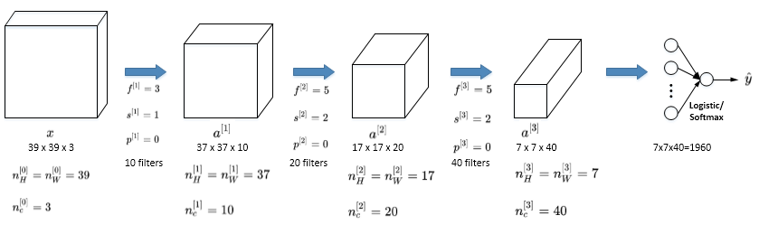

注：a[3] 的维度是 7x7x40，将 a[3]排列成1列，维度1960x1，然后连接最后一级输出层。输出层可以是一个神经元，即二元分类（logistic）；也可以是多个神经元，即多元分类（softmax）。最后得到预测输出y-hat 

CNN有三种类型的layer：

- **Convolution层（CONV）（卷积层）**
- **Pooling层（POOL）（池化层）**
- **Fully connected层（FC）（flatten层）**

CONV最为常见也最重要，关于POOL和FC我们之后再介绍。

## p114 池化层 Pooling Layers

池化层执行的池化操作和卷积类似，都是拿一个小矩阵盖在图像上，根据被小矩阵盖住的元素来算一个结果。因此，池化也有池化边长![[公式]](吴恩达深度学习P106-P130.assets/equation-1657704427476.svg)和池化步幅![[公式]](吴恩达深度学习P106-P130.assets/equation-1657704427431.svg)这两个参数。而与卷积不同的是，池化是一个没有可学习参数的操作，它的结果完全取决于输入。比如对于最大池化，每一步计算都会算出被覆盖区域的最大值。

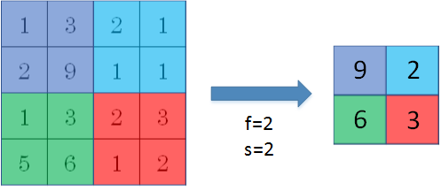

比如上图中，我们令池化边长为2，步幅为2。这样，就等于把一个![[公式]](吴恩达深度学习P106-P130.assets/equation-1657704387758.svg)的图像分成了![[公式]](https://www.zhihu.com/equation?tex=2+%5Ctimes+2)个等大的区域。对于每一个区域，我们算一个最大值。

一般情况下，最常用的池化就是这种边长为2，步幅为2的池化。做完该操作后，图像的边长会缩小至原来的![[公式]](吴恩达深度学习P106-P130.assets/equation-1657704387724.svg)。

除了最大池化，还有计算区域内所有数平均值的平均池化。但**现在几乎只用最大池化**，不用平均池化了。

没有人知道池化层究竟为什么这么有用。一种可能的解释是：池化层忽略了细节，保留了关键信息，使后续网络能够只关注之前输出的最值/平均值。

**如果是多个通道，那么就每个通道单独进行max pooling操作。所以池化后的通道数由输入的通道数决定**。

全连接层其实就是我们之前学的经典神经网络中的层。前一层的每一个神经元和后一层的每一个神经元直接都有连接。当然，在把**图像喂入全连接层之前，一定别忘了做flatten操作，把图像中所有数据平铺成一个一维向量**。

## p115 CNN示例

每个卷积层、池化层、全连接层都有那么多超参数，而且层与层之间可以随意地排列组合。该怎么搭建一个CNN呢？不急，让我们来看一个CNN的实例：

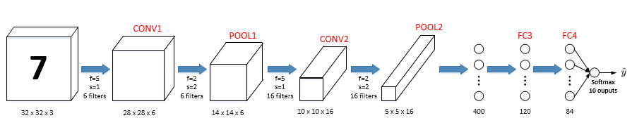

整个网络各层的尺寸和参数如下表格所示：

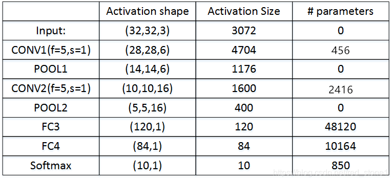

这个网络是经典网络LeNet-5的改进版，它被用于一个10-分类任务。现在，让我们通过概览这个网络来找出一些搭建CNN的规律。

网络按照“卷积-池化-卷积-池化-全连接-全连接-softmax”的顺序执行。通常情况下，CNN都是执行若干次卷积，后面跟一次池化。等所有卷积核池化做完，才会做全连接操作。全连接之后就是由softmax激活的输出层。

图像的形状也有一些规律。在卷积核池化的过程中，图像的边长不断变小，而通道数会不断变大。

## p116 **为什么用卷积？**

**优点**：

- 首先，卷积最大的优势就是**需要的参数量少**。

  ​		对于图像数据，如果用全连接网络的话，网络的参数会非常多。、而卷积的两个性质，使得需要的参数量大大降低。这两个性质是权重共享与稀疏连接。

- **权重共享**：**一个特征检测器（例如垂直边缘检测）对图片某块区域有用，同时也可能作用在图片其它区域**。

  ​		对于输入图像的所有位置来说，卷积核的参数是共享的。这种设计是十分合理的。

  ​		比如在边缘检测中，只要我们用同样一个`[[1, 0, -1], [1, 0, -1]， [1, 0, -1]]`的卷积核卷网络，就能检测出垂直方向的边缘。这样，卷积操作的参数量就只由卷积核参数决定，而与图像大小无关。

- **稀疏连接**：**卷积核的大小通常很小，也就是卷积操作的一个输出只会由少部分的输入决定**。

  ​		这样，相比一个输出要由所有输入决定的全连接网络，参数量得到进一步的减少。

- 除了减少参数量外，这两个特性还让网络更加**不容易过拟合**，由于CNN参数数目较小，所需的训练样本就相对较少。

- 另外，卷积操作还**适合捕捉平移不变性**（translation invariance)（区域位置偏移）。

  ​		不太受物体所处图片位置的影响。如果一张图里画了一个小猫，如果你把图片中小猫进行平移，那么图片里还是一个小猫。由于同样的卷积操作会用在所有像素上，这种平移后不变的特性非常容易被CNN捕捉。

# 课程四 第二周 深度卷积网络模型：案例研究

## p117 为什么要进行案例研究 Why look at case studies

本周课程将主要介绍几个典型的CNN案例。

通过对具体CNN模型及案例的研究，来帮助我们理解知识并训练实际的模型。

典型的CNN模型包括：

LeNet-5

AlexNet

VGG

除了这些性能良好的CNN模型之外，

还会介绍Residual Network（ResNet）。其特点是可以构建很深很深的神经网络（目前最深的好像有152层）。

另外，还会介绍Inception Neural Network（Inception网络又叫做GoogLeNet,之所以不叫GoogleNet,是为了向LeNet致敬）。

## p118 经典网络  Classic Networks

### LeNet

LeNet-5模型是Yann LeCun教授于1998年提出来的，它是第一个成功应用于数字识别问题的[卷积神经网络](https://so.csdn.net/so/search?q=卷积神经网络&spm=1001.2101.3001.7020)。在MNIST数据集中，它的准确率达到大约99.2%。

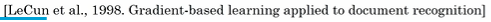

**LeNet论文比较难懂**

典型的 `LeNet-5` 结构包含CONV layer，POOL layer 和 FC layer

- 顺序一般是 `CONV layer->POOL layer->CONV layer->POOL layer->FC layer->FC layer->OUTPUT layer`。`卷积-池化-卷积-池化-全连接-全连接-输出`
- 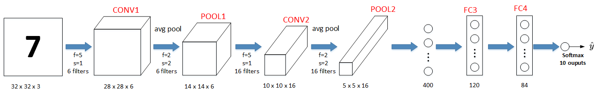  

**LeNet模型** 总共包含了大约6万个参数。

- Yann LeCun提出的 **LeNet-5模型** 池化层使用的是：**average pool**
- 各层激活函数一般是Sigmoid和tanh。现在，我们可以根据需要，做出改进，使用 max pool 和 激活函数ReLU。

### AlexNet

AlexNet模型是由Alex Krizhevsky、Ilya Sutskever和Geoffrey Hinton共同提出的。使用ImageNet数据集。

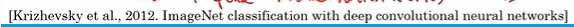

**该论文易懂**

**AlexNet模型** 其结构如下所示：

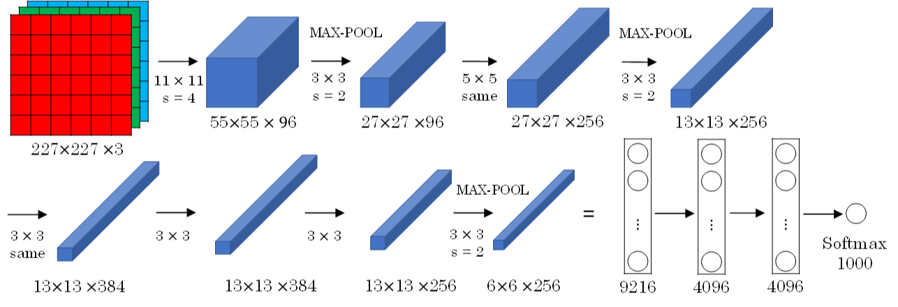

- AlexNet模型与LeNet-5模型类似，更加复杂，共包含了大约6千万个参数。
- AlexNet使用了多个gpu，可以互相通信并行计算。
- 同样可以根据实际情况使用 激活函数ReLU。有一个优化技巧，叫做局部相应归一层Local Response Normalization(LRN)。 而在实际应用中，LRN的效果并不突出。

### **VGG or VGG-16**

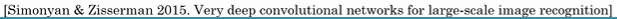

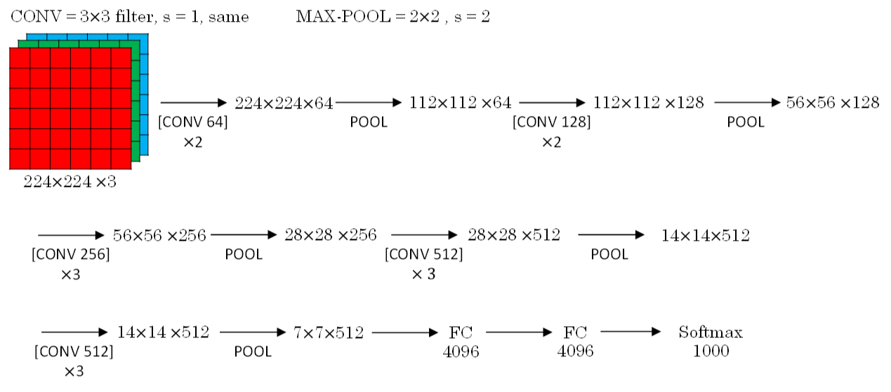VGG-16的参数多达1亿3千万。

## p119  残差网络 ResNets

网络层数越多，网络越深，源于梯度消失和梯度爆炸的影响，整个模型难以训练成功。

解决的方法之一是人为地让神经网络某些层跳过下一层神经元的连接，隔层相连，弱化每层之间的强联系。这种神经网络被称为Residual Networks(ResNets)。

### Residual block

Residual Networks由许多隔层相连的神经元子模块组成，我们称之为Residual block。单个Residual block的结构如下图所示：

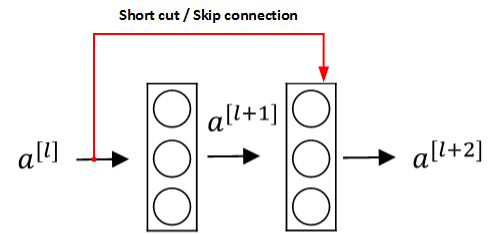

图中红色部分就是skip connection。直接建立a[l]与a[l+2]之间的隔层联系。

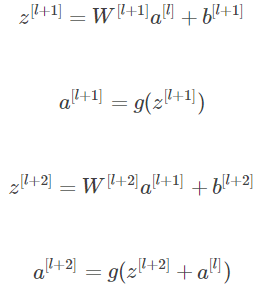

a[l]直接隔层 与 下一层的线性输出相连，与 z[l+2]共同通过激活函数 (Relu) 输出 a[l+2]

### Residual Network

由多个Residual block组成的神经网络就是Residual Network。

实验表明，这种模型结构对于 **训练非常深的神经网络**，效果很好。另外，为了便于区分，我们把 **非Residual Networks称为 Plain Network。**

Residual Network的结构如图所示

- 与Plain Network相比，Residual Network能够训练更深层的神经网络，**有效避免发生发生梯度消失和梯度爆炸**。
- 下图对比中可看出，随着神经网络层数增加，Plain Network实际性能会变差，training error甚至会变大。然而，Residual Network的训练效果却很好，training error一直呈下降趋势。

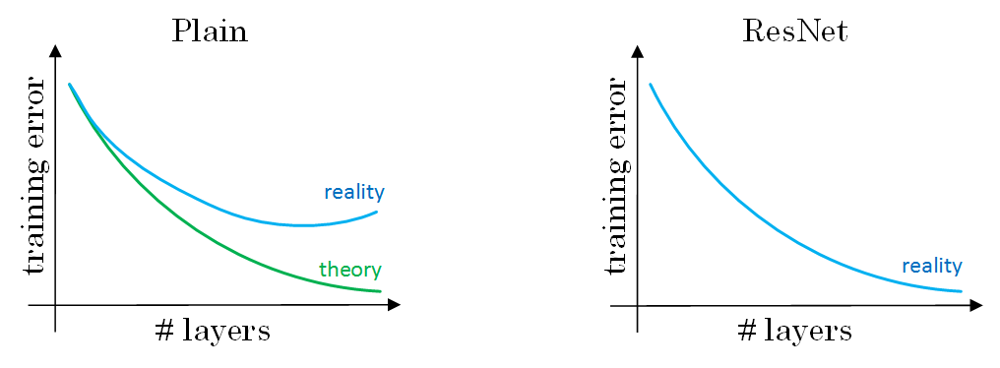

## p120 为什么使用残差网络 Why ResNets Work

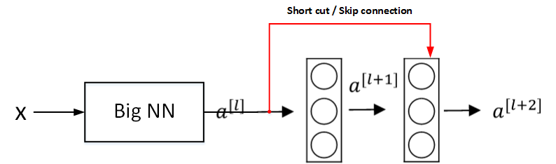

如上图所示，输入x经过很多层神经网络后输出a[l]，a[l]经过一个Residual block输出a[l+2]。a[l+2]的表达式为：
$$
a^{[l+2]}=g(z^{[l+2]}+a^{[l]})=g(W^{[l+2]}a^{[l+1]}+b^{[l+2]}+a^{[l]})
$$
输入x经过Big NN后，若W[l+2]≈0，b[l+2]≈0，则有：
$$
a^{[l+2]}=g(a^{[l]})=ReLU(a^{[l]})=a^{[l]}\ \ \ \ when\ a^{[l]}\geq0
$$
即使发生梯度消失，W[l+2]≈0，b[l+2]≈0，a[l+2]与a[l]之间也有线性关系。即：identity function

从效果来说，相当于直接忽略了a[l] 之后的**两层神经层**.

看似很深的神经网络，其实由于许多Residual blocks的存在，弱化削减了某些神经层之间的联系，实现隔层线性传递，而不是一味追求非线性关系.

**注意：**

- 如果Residual blocks中 a[l] 和 a[l+2] 的维度不同，通常可以引入矩阵 Ws 与 a[l] 相乘，使得 Ws∗a[l]的维度与 a[l+2]一致。
- 参数矩阵 Ws 有来两种方法得到：
  - 一种是将 Ws 作为学习参数，通过模型训练得到.
  - 一种是固定 Ws 值（类似单位矩阵），不需要训练，Ws 与 a[l] 的乘积仅使得 a[l] 截断或者补零。
- 如图，CNN中 ResNets 的结构：

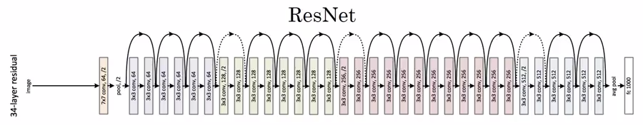

- ResNets同类型层之间，例如CONV layers，大多使用same卷积，保持维度相同。
- 如果是不同类型层之间的连接，例如CONV layer与POOL layer之间，如果维度不同，则引入矩阵 Ws 

## p121 网络中的网络与1×1卷积

1x1 Convolutions可以用来缩减输入图片的通道数目。

!这里写图片描述](吴恩达深度学习P106-P130.assets/20171212145859683)

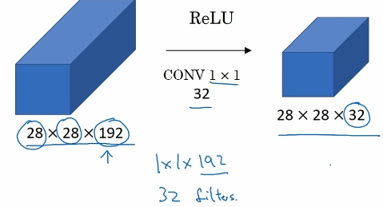

1×1卷积对构建 Inception Network有很大作用

## p122 初始网络动机 Inception Network Motivation

**Inception Network** (初始网络)

- 在 单层网络 上可以 使用多个 **不同尺寸的filters**，进行same convolutions，把各filter下得到的输出拼接起来。
- 除此之外，还可以将CONV layer与POOL layer混合，同时实现各种效果。但是要注意使用same pool。

总结： Inception Network使用不同尺寸的filters，并**将CONV和POOL混合起来，将所有功能输出组合拼接，再由神经网络本身去学习参数并选择最好的模块**

Inception Network在提升性能的同时，会带来计算量大的问题。例如：

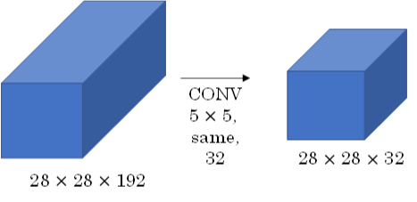

- 此CONV layer需要的计算量为：28x28x32x5x5x192=120m，其中m表示百万单位。
- 可以看出但这一层的计算量都是很大的。
- 为此，我们可以引入1x1 Convolutions来减少其计算量，结构如下图所示

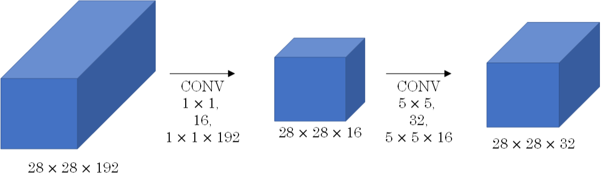

- 通常把该1x1 Convolution称为“瓶颈层”（bottleneck layer）。
- 引入bottleneck layer之后，总共需要的计算量为：28x28x16x192 + 28x28x32x5x5x16=12.4m。
- 明显地，虽然多引入了1x1 Convolution层，但是总共的计算量减少了近90%。由此可见，1x1 Convolutions还可以有效减少CONV layer的计算量。

## p123 初始网络 Inception Network

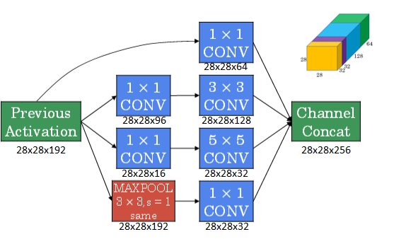

多个Inception modules组成Inception Network

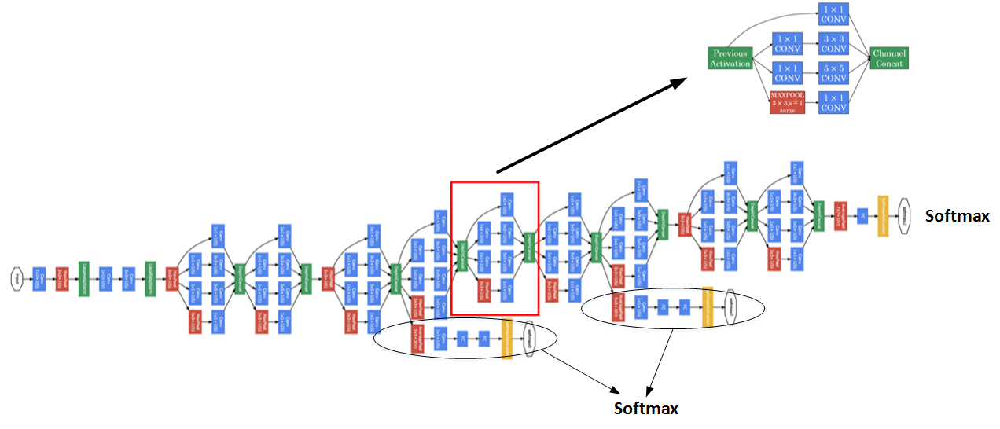

网络中间隐藏层也可以作为输出层Softmax，防止发生过拟合。

## **p124 MobileNet**	

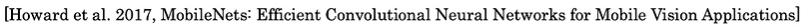

### **MobileNet 特点**

- **low computational cost at deployment**  低计算成本

- **useful for mobile and embedded vision applications** 适用于手机和嵌入视觉应用
- **Key idea :Normal vs. depthwise-separable convolution works**  核心思想：深度可分离卷积

### **普通卷积计算成本**

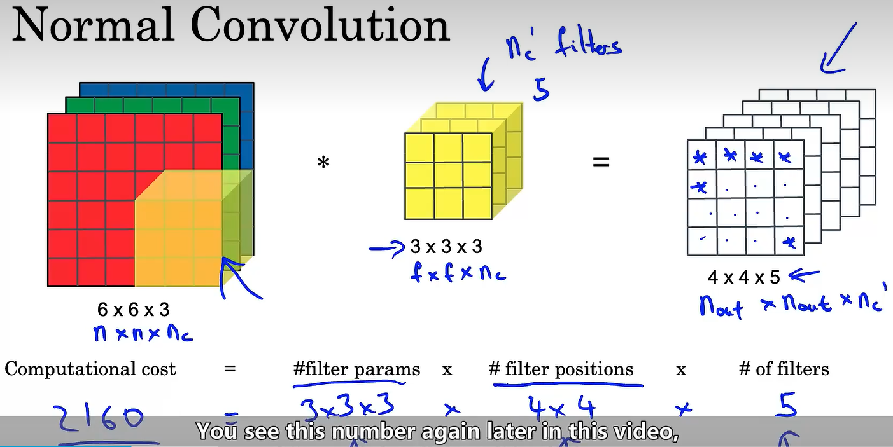

### **depthwise-separable convolution计算成本**

#### 第一步深度卷积

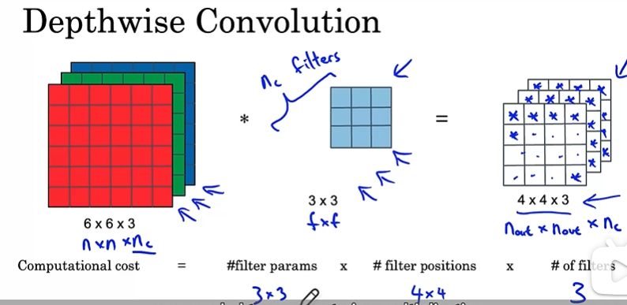

计算成本为 432相比2160节省n‘c倍

**理解 对于结果4×4×3矩阵的每个输出，都需计算3×3次**

计算过程 ：

- 单个**卷积核大小**由之前的**3×3×nc** 变为了 **3×3**
- **卷积核个数**由之前的 **n’c** 变为了 **nc** 因此输出的channel与输入的channel一致
- 计算方法：
- - 之前是一个卷积核就与输入的所有channel对应计算。
  - **深度可分离卷积**是一个卷积核只与输入对应的一层channel的输入计算。

#### 第二步逐点卷积

由于经过第一步深度卷积后，输出维度的channel由5变为了3，需要经过逐点卷积再变回5.

计算过程 ：

- 单个**卷积核大小** 1×1×3
- **卷积核个数**为**n’c** 此处是5 即输出结果的channel为5
- 计算方法：同1×1卷积

------

因此总的计算成本：432 + 240 = 672 

### 成本总结

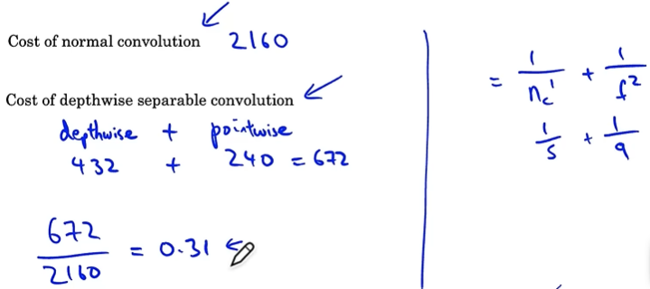

**成本比率**：使用深度可分离卷积后成本/正常计算成本 比率为0.31

上图中

- n‘c是最后的输出channel数目。此处是5 
-  f是深度卷积的卷积核边长。     此处是3

由于卷积核大小一般不大 而n’c很大 几百几千， 因此Mobile Net主要由**深度卷积卷积核大小**决定**成本比率**

------

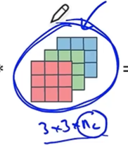

tips：只要看到这个图案就是使用了深度卷积。不论nc是不是等于3，同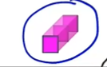逐点卷积 1×1 × n 无论n是几

## p125 MobileNet 架构

### MobileNet v1

十三层深度可分离卷积-1池化-1全连接-1softmax

### MobileNet v2

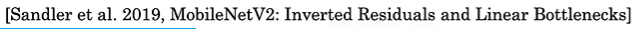

v2变化：

- 1：**添加residual connection**
- 2：在**深度可分离卷积前添加一层expansion**，并将**逐点卷积改名为projection投射**

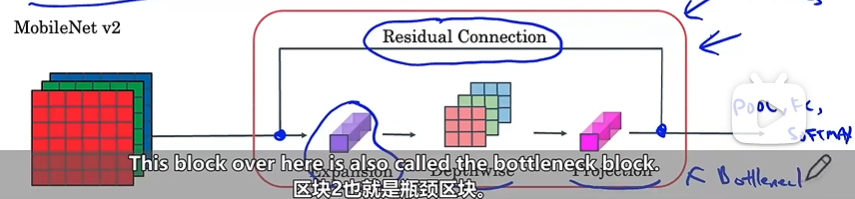

17层block2 - 1池化 - 1 全连接 - 1softmax  

block2也叫做瓶颈区块

#### 瓶颈区块 bottleneck block

第一步 将输入扩展  通道数变为原来的6倍

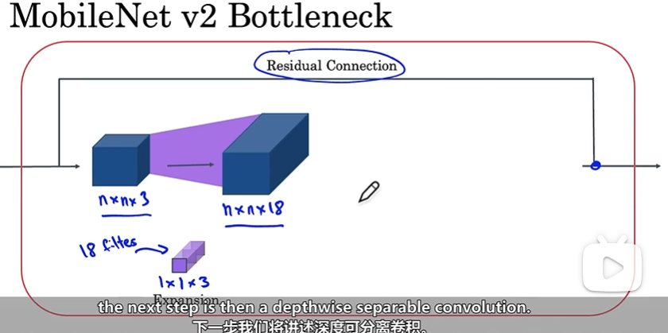

第二步 通过深度卷积和padding 保持维度为n×n×18不变

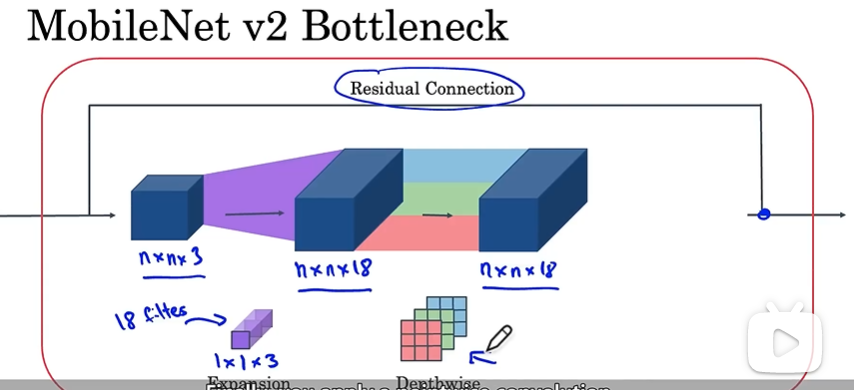

第三步 逐点卷积 结果维度为n×n×3

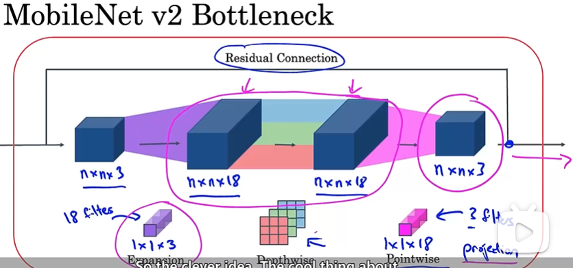

#### bottleneck block优势：

- 1 可以实现更多的计算（不是计算量而是更多的计算方式）使神经网络具备更丰富更复杂的功能
- 2 同时保存内存容量（层与层之间传递的激活量）相对较小

## p126 EfficientNet

**需要**：对MobileNets 或 其它架构进行调整来适用到特定设备

**解决思路**：根据特定设备自动地放大或缩小神经网络

如下图：一个基础的神经万网络

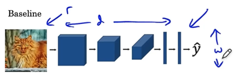

**三种方法**：

1. 变更图片分辨率 **r**
2. 使网络变得更深或更浅 **d**
3. 或者使网络变得更宽或窄 **w**

**如何确定r d w 的放缩比率?**

通过 EfficientNet 来确定

## p127 使用开源代码

## p128 迁移学习

根据开源已经训练好的模型为基础，进行二次开发。可以节省相当多的时间。

**应用场景如**：现有数据集很小，无法从零开始训练。此时就可以用别人的模型拿过来进行迁移学习。

**迁移学习方法**：

1. 将开源的千分类模型下载后 去掉他的softmax层，加上自己的softmax层。

   

2. 若**数据集很少**，冻结softmax前的**所有层**参数，只训练**自己的softmax层**的参数（一般会有**可训练参数=0** 或 **freeze = 1 只冻结第一层**的超参数方便调整）

3. **若数据集很多**，可以只冻结softmax前的**部分层**参数。使用最后几层做初始化参数并开始训练。或者去掉后面几层使用新的神经元和softmax

4. **若数据集特别特别大**，还有一种方法就是**不冻结参数**，只改softmax。然后将下载的参数作为初始值直接进行训练。

## p129 Data Augmentation(数据增强)

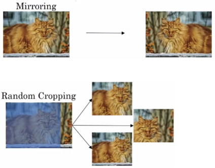

- 常用的Data Augmentation方法是对已有的样本集进行Mirroring和Random Cropping

- 另一种Data Augmentation的方法是color shifting。
  - color shifting就是对图片的RGB通道数值进行随意增加或者减少，改变图片色调。

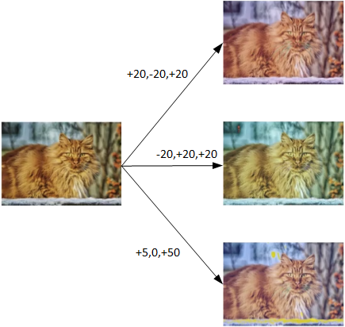

除了随意改变RGB通道数值外，还可以更有针对性地对图片的RGB通道进行PCA color augmentation，也就是对图片颜色进行主成分分析，对主要的通道颜色进行增加或减少，可以采用高斯扰动做法。这样也能增加有效的样本数量。具体的PCA color augmentation做法可以查阅AlexNet的相关论文。

最后提一下，在构建大型神经网络的时候，data augmentation和training可以由两个不同的线程来进行。

## p130 **计算机视觉状态 State of Computer Vision**

神经网络需要数据，不同的网络模型所需的数据量是不同的。

Object dection，Image recognition，Speech recognition所需的数据量依次增加。

- 如果data较少，那么就需要更多的hand-engineering，对已有data进行处理，比如上一节介绍的data augmentation

值得一提的是hand-engineering是一项非常重要也比较困难的工作。很多时候，hand-engineering对模型训练效果影响很大，特别是在数据量不多的情况下。

在模型研究或者竞赛方面，有一些方法能够有助于提升神经网络模型的性能：(计算成本太大，不适用实际项目开发)：

- **Ensembling融合: Train several networks independently and average their outputs.**训练多个网络输出后取平均
- **Multi-crop at test time多作物: Run classifier on multiple versions of test images and average results.**在不同的测试集上多次运行取平均结果

