# Deep Residual Learning for Image Recognition阅读笔记

## 第一遍

### 标题

**Deep Residual Learning for Image Recognition**

基于 深度残差学习  的  图像识别

### 摘要

深层次的神经网络更难训练，因此我们**提出了一个*residual*（残差）学习框架**来**简化非常深层次的网络的训练** 。我们明确地将层 重新定义为 学习**相对于 层输入的** **残差函数**，而不是 学习  **无关（层输入）**的函数。我们**提供了全面的证据**来说明这种残差网络**在显著增加层数后更加容易进行优化并能获取很好的精度**。在*ImageNet*的数据集中，我们评估了在深度达到152层的残差网络上(相当于*VGG net*的8倍)，网络仍然有着较低的复杂度。这些残差网络的合集在*ImageNet*的测试集上进行评测，达到了3.57%的错误率，这一结果赢得 *ILSVRC 2015* 分类比赛的第一名。我们同时也提供了在*CIFAR-10*数据集上对于100层和1000层残差网络的分析。

对于许多的视觉检测目标来说，网络的深度是一个非常重要的因素。*Solely* （仅由）我们对深度的显著提升，就获得了在*COCO*目标检测数据集上28%的相对提升。深度的残差网络是我们在 *ILSVRC 和 COCO 2015*两个比赛中所提交的模型的基础。我们也同时获得了*ImageNet* 检测，*COCO*检测和分割比赛的第一名。

------

大概总结：本文提出了残差学习框架，简化了深层次网络的训练过程，并且在很多数据集上取得了显著成果。

### 结论

该论文没有结论部分。*CVPR*要求正文不能超过八页。这篇论文的实验结果很多就没有结论（不被建议的写法）。

## 第二遍

### 图表

#### 图1

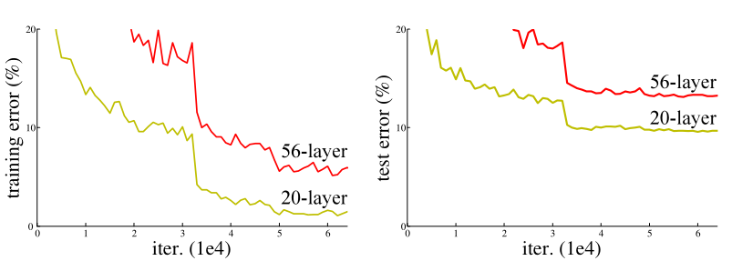

上图表示当没有使用残差网络时，在*CIFAR-10*上的训练误差（左图）和测试误差（右图）。

可见，更深的网络会带来更高的训练误差和测试误差。在*ImageNet*上的结果也是一样。

**这张图说明这篇文章观察到的现象，以及需要解决的问题。即深层次的网络更加难以训练。**

------

图2

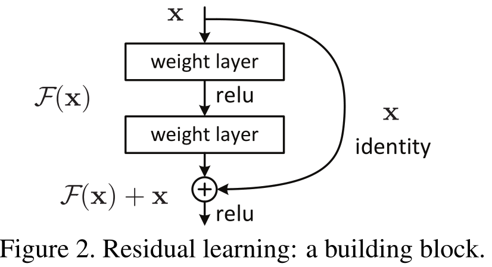

一个building block块，暂时看不出什么意思先往下面看

------

图3

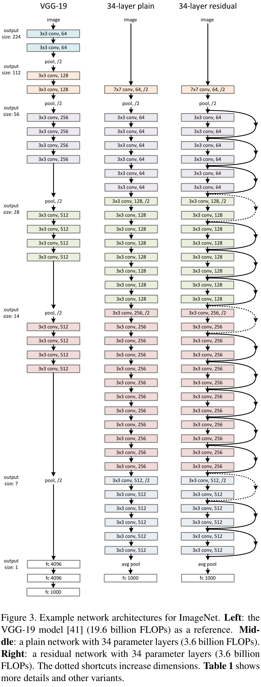

左边VGG-19网络架构，中间是普通的34层神经网络架构，右边是34层残差网络架构图

说明了本文使用的模型的架构图。

------

#### 图4

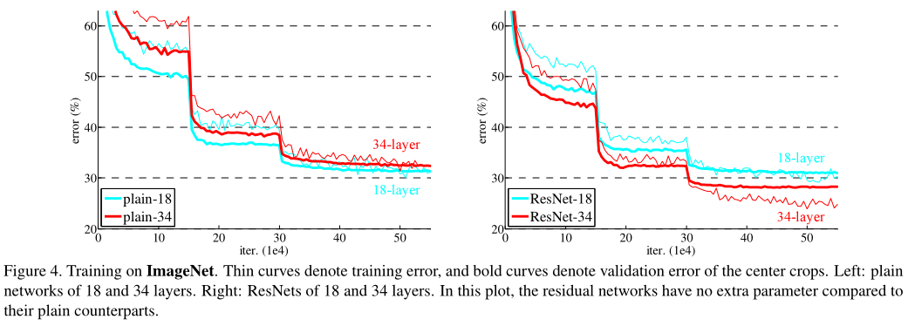

第四张图，展示了在ImageNet上使用残差网络的结果。可以看到层数深后反而误差减小了。

------

图5

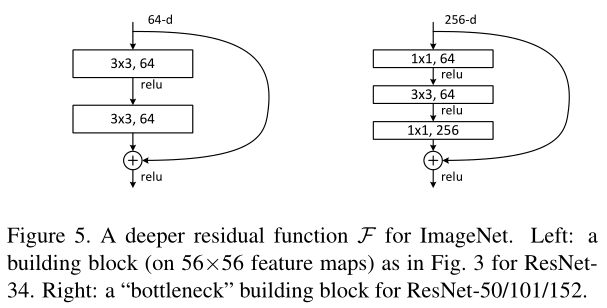

对于ImageNet的深层的残差函数，左图是一个如图3中ResNet-34 使用的buildinng block，右图是一个ResNet-50/101/152使用的 bottleneck building block 

也是暂时看不懂。

------

图6

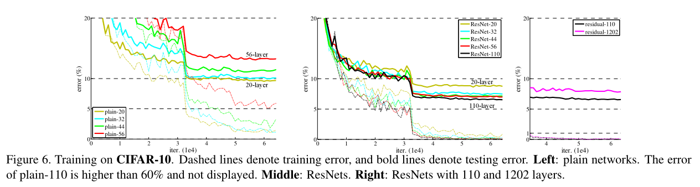

在CIFAR-10上的结果  左：普通网络。110层网络的训练误差高达60%，这里没有显示。中:ResNet。右: 100层和1202层的ResNet

还是在说ResNet效果好

------

#### 图7

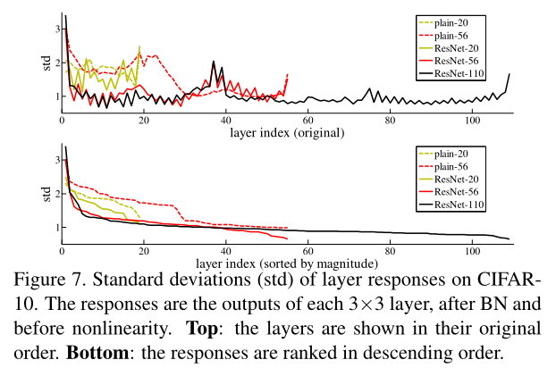

图7.CIFAIR-10数据集上模型层间相应的标准差。这里的响应指的是每一个3x3的卷积层在经过批量标准化后，但是在激活函数（非线性函数nonlinearity）之前的值。上图是原始的顺序；下图是经过降序后的顺序。

残差网络相对于普通网络有着更小的响应强度。残差函数可能相对于非残差函数更加接近于0.更深的网络有着更小的响应幅度。

## 第三遍

### 1 introduction部分

深度神经网络好在可以加很多层把网络变得特别深，然后不同程度的层会得到不同等级的特征，比如低级的视觉特征或者是高级的语义特征。

#### 提出问题：学习一个好的网络就是简单叠加更多层吗？

堆叠更多层带来的问题

**问题1**：随着网络越来越深，会出现**梯度爆炸**或**梯度消失** 。

**解决办法**就是：

1. 权重在随机初始化的时候，不要特别大也不要特别小。
2. 在中间加入一些**标准化normalization**，包括**BN（batch normalization）**可以使得校验每个层之间的那些输出和他的梯度的均值和方差相对来说比较深的网络是可以训练的，避免有一些层特别大，有一些层特别小。

使用了这些技术之后使得包含很多层的网络开始可以基于**随机梯度下降(Stochastic Gradient Decent)**的优化器进行反向传播收敛了

虽然能够收敛了，但是当网络变深的时候，一个**退化问题（degradation problem）** 出现。

**问题2**：退化问题：随着深度增加，精度开始饱和（saturated），然后迅速下降。

发生退化问题**不是**因为层数变多，模型变复杂导致的**过拟合**（训练误差低，测试误差高），添加更多层会导致更高的训练误差 。如图1所示。

------

**理论上**：如果浅的网络效果还不错的话，再多加几层应该也不会变差，大不了也只是和没有添加这些层的结果一样，即直接跳过这些层输出结果，这个映射过程称为**恒等映射（identity mapping）**。

**实际上**：现有的方案无法解决。因此提出新的方案。

#### 提出解决方案：深度残差学习框架 deep residual learning framework

文章提出**显式地构造出一个identity mapping** ，使得深层的神经网络不会变的比相对较浅的神经网络更差，它将其称为**deep residual learning framework** 。

要学的东西叫做$H(x)$，假设现在已经有了一个浅的神经网络，他的学习结果输出是$x$，然后要在这个浅的神经网络上面再新加一些层，让它变得更深。

新加的那些层不要直接去学$H(x)$，而是学习$H(x)$与$x$的残差$F(x) = H(x) - x$（让残差变为0应该比通过堆叠非

线性层去拟合H(x)要容易的多），即转换为$H(x) = F(x) + x$.

如图2所示

**好处：**这一结构不会增加任何额外的参数数量以及复杂的运算，一样可以被SGD端到端地训练，且容易实现。

在实验中也表明，在较深的神经网络中，文章提出的**深度残差学习框架**很容易优化，而随着网络的深度加深，通过简单堆叠若干层的网络会产生更大的训练误差，本文的新网络却可以学习到更多的内容并提高精度。

接下来又讲了使用residual net后在各个数据集上取得的好结果

introduction是摘要的扩充版本，也是对整个工作比较完整的描述 。**如果是非自己领域内的研究，读完Intro就可以撤了。**

### 2 相关工作Related Work部分

这部分介绍前人工作，不详细展开

**残差表示**Residual Representations.

**捷径连接**Shortcut Connections.

### 3 深度残差学习 Deep Residual Learning部分

#### 3.1 残差学习 Residual learning

我们把$H(x)$当成在**截取的一小段网络**中的**最基础的映射underlying mapping**，即假如没有加入残差网络，计算结果为$H(x) $。$x$表示这小段网络最顶层的输入。

假设通过多个非线性层可以**渐近地（asymptotically）** 近似为复杂的函数$H(x)$，

所以也可以假设多个非线性层可以渐进地近似残差函数$F(x) = H(x)-x $（假设输入和输出是相同纬度）。则$H(x) = F(x) + x$.

**尽管两种形式 $H(x)$ 和  $F(x) + x$ 都可以渐进近似预期结果。但是学习的容易程度可能不同。**

这种变换方式的灵感来自于对于**退化问题(层数增加反而导致训练误差增加**)的反直觉现象（如图1,左侧）。如果所添加的层可以被构造成恒等映射，那么更深的网络的训练误差应该不会高于浅层网络的训练误差。但是退化问题让我们了解到**网络很难通过非线性层训练为恒等映射。**

在残差网络的框架下，**如果恒等映射是最优的结果**，那么网络应该可以**直接把新增的非线性层的权重都变为0**，即$F(x)=0$，从而达到拟合恒等映射$H(x) = 0 + x$的目的。

在实际的例子中，**恒等映射或许并不是最优的结果**，但是我们的方法却有助于**解决训练退化问题**。如果最优函数相对于一个全是0的映射($H(x) =0$)更接近一个恒等映射$H(x) = x$，那么相对于去拟合一个新的函数$H_2(x)$，**恒等映射更容易让网络找到较优解**。(**矮子里挑高个，如果不能得到最好的，起码不能是更差的)**

实验（图7)表明通常情况下学习残差网络会比学习普通的网络有更小的调整标准差，这也表明我们使用的恒等映射提供了很好的模型预处理(precondition)。

#### 3.2 通过捷径连接实现恒等映射 Identity Mapping by Shortcuts

我们将残差学习应用到每一个小的模块中。一个模块的示例如图2所示。

使用公式表示这个小模块的话：$y = F(x, \{Wi\} ) + x                      $       公式1

x和F的维度一定要一样，如果不一样（例如当我们改变了输入/输出的通道数），我们可以通过线性投影的方式来让他们的维度相互匹配：$y = F(x, \{Wi\}) + W_sx$  公式2

函数F的形式是非常灵活的。在本文的实验中，我们分别使用了2层和3层网络来进行（如图5所示），更多的层数也是可以的。当然如果F只有一层的话,那么公式1则近似为一个线性层: $y =W_1x + x$, 对此我们还没有观察到他的优点。

我们需要说明的是尽管上面的所有的表述都是用的全连接层举例，但是这是为了方便起见，他们是可以被部署在卷积层上的。元素的相加是被应用在两个特征图像上的，他们在对应的通道上进行加和操作。

#### 3.3 网络结构 Network Architectures

##### **普通网络：**

我们的普通网络的架构(图3，中间)主要受到VGG-net(图3，左)的启发。其中的卷积层更多的使用3x3的过滤器，并且紧跟着两个简单的设计规则:

- **对于输出和输入相同的特征图，那么层具有相同数量的过滤器**；
- **如果特征图的尺寸减半，那么过滤器的数量则需要翻倍，用来保证层的时间复杂性**。

我们的下采样直接通过使用步长为2的卷积来实现。在网络的末尾连接了一个全局平均池化层和经过softmax的1000个参数的全连接层。网络的总体层数是34层(如图3，中间)所示。相对于VGGnet有更少的过滤器和更小的复杂度。

------

##### **残差网络:** 

基于上述的普通网络，我们在其中插入残差部分(如图3,右)，则把该网络转换成了他的对照组残差网络。

**当输入和输出的尺寸一致的时候**，捷径(公式1)可以被直接使用(图3中实线部分)。

**当维度增加的时候**(图3中虚线部分)，有两种方案:

- 捷径部分**仍然使用恒等映射**，但是对于新增加的维度则全部使用0来代替。这种方案不增加任何的参数。
- 通过公式2中所提供的**线性投影的方式**来匹配增加的维度(**通过使用1x1的卷积的方式来实现**)。如下图

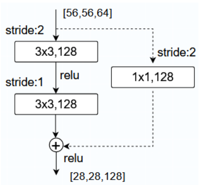

对于这两种方案，当两个特征图的尺寸不一致时，都使用步长为2的卷积来让他们统一。

- 在ResNet中，如果把输出通道数翻了两倍，那么输入的高和宽通常都会减半，因此使用步长为2的卷积。

#### 3.4 部署 Implementation

介绍他们部署时，具体方法细节，图片处理方法，和学习率等一些超参数设置。

### 4 实验Experiments 部分

#### 4.1 ImageNet 分类评估

------

##### 普通网络：

首先评估了18层和34层的普通网络。**表1是详细的网络结构。**

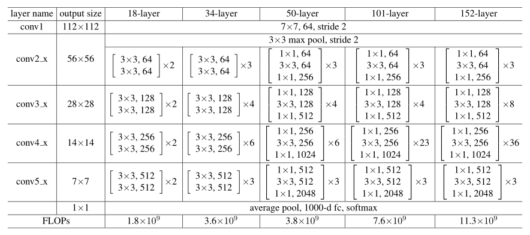

Table 1. Architectures for ImageNet. **Building blocks are shown in brackets** (see also Fig. 5), with the numbers of blocks stacked. Down-sampling is performed by conv3_1, conv4_1, and conv5_1 with a stride of 2.

***表一 中 34层 层数计算：第一层 + 最后一层 +（3+4+6+3）× 2 = 34***

表2中的结果表明了更深的34层的网络相比如18层的网络有着更高的验证误差。

**PS：上图4中误差骤降原因是学习率过大无法收敛，将学习率乘了0.1继续梯度下降**，

(如图4, 左)观察到训练退化的问题，在整个训练过程中34层网络表现出了更高的训练误差。**下图为表2**

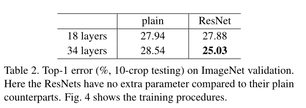

或许是由于本身更深的普通网络就具有指数级的更低的收敛速度，这或许影响了训练误差的减小。这种优化困难的原因将在未来进行研究。

------

##### 残差网络：

接下来，验证18层和34层的残差网络(ResNets). 同样，网络的基础架构跟上面的普通网络是类似的，于此同时在每一对3x3的过滤器中添加了捷径连接(如图3,右). 

在**第一组比较中(表2和图4 右)**, **所有捷径使用恒等映射**，对于所增加的维度，我们**使用了0进行填充(方案A).** 相对于普通网络，并没有增加新的参数。

在表2和图4中，我们有3个主要的发现。

- **34层的残差网络**相比**18层残差网络**错误率低2.8%。且34层残差网络有相当低的训练误差，并且可以泛化（is generalizable to）到验证集。这表明了**更深的残差网络很好的解决了训练退化问题**，这使得我们**可以通过增加网络深度来获得准确率**。
- 第二，**34层残差网络**相比**34层的普通网络**减少了错误率3.5%。说明了**残差在极度深的网络上的有效性**。
- 第三，**18层的普通网络/残差网络**的准确率是**相当的**，但是**18层残差网络的收敛更加迅速(图4 右VS左)**。网络不深的情况下，**即使普通网络和残差网络 误差差不多，残差网络还可以可以比较快的在早期的阶段就找到结果。**

------

##### 恒等捷径VS投影捷径

在表3中，对比了三种方案：

- (A)所有捷径都使用恒等捷径，**使用0来填充捷径中所增加的维度**，那么这种方法无需增加任何参数(**和表2，图4右，所说的一致，参考上文已经比较**)；
- (B)**投影捷径用于所增加的那部分维度**，而其他的部分保持恒等映射不变；
- (C)**所有的捷径都采用投影捷径**。

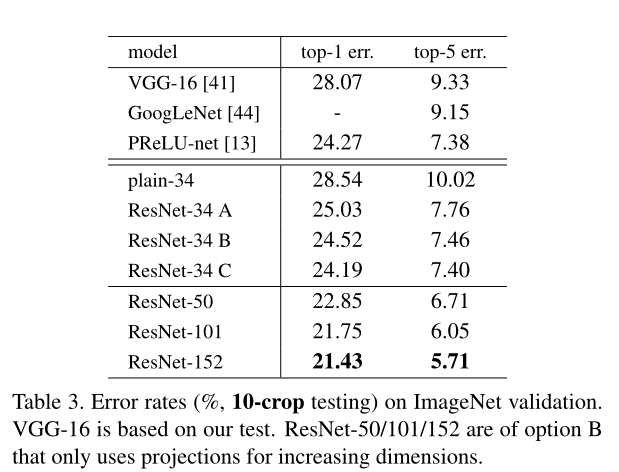

表3

这三种方式都要优于普通网络。

**方案B稍微好于方案A.** 我们认为这是由于通过0填充的维度确实没有进行残差学习所造成的。

**方案C勉强比方案B好一些**。我们把它归因于通过投影映射引入了额外的参数。实际上**成本很高很少使用。**

**恒等映射**对于下面这种没有增加复杂性的**瓶颈（bottleneck）结构**是非常重要的。

------

##### 更深的瓶颈结构 Deeper Bottleneck Architectures.

当网络特别深时，可以学到更多的模式，因此输入的维度会扩大。

64 - 256扩大了4倍，计算量扩大了4×4 = 16倍，因此投影回64维简化计算，再投影回256维。

无参数的恒等映射对于瓶颈结构来说尤其重要。

因为**如果恒等映射(图5,右)被替换成投影映射，那么时间复杂度和模型的大小将成倍增加**。因为捷径连接到的是两个高维度的末端（如[(56-1)/2+1]×28×1×1×（d1=256）×56×56×（d2=256））。所以恒等映射的捷径对于瓶颈模块来说更加高效。

表4

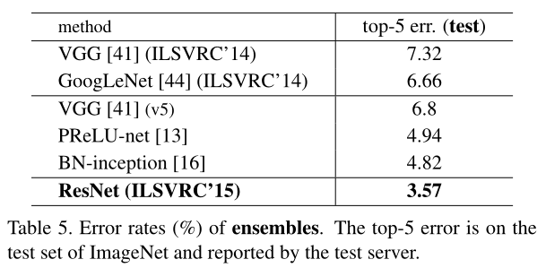

表5

在将2层残差块结构换成3层残差块结构之后，模型的网络层总数就变成了50层（ResNet-50, 如表1所示）。然后增加残差块就构建了ResNet-101和ResNet-152，两种网络结构的复杂度仍然比VGG-16/19低。

**与最先进方法的比较.** **在表4**中，我们对比了之前最好的单一模型的结果。我们的34层基准模型已经可以获得非常有竞争力的准确率了。我们152层的残差网络的单模型具有4.49%的top-5验证错误率。

这个单模型的性能已经超过了之前所有模型的综合结果**(表5)**。我们将六种不同深度的模型组合到一起(当时提交的时候只有两个152层的模型)。这个组合在测试集上获得了3.57%的top-5错误(表5)。这个模型获得了ILSVRC 2015比赛的第一名。

### 4.2 CIFAR-10数据集测试和分析

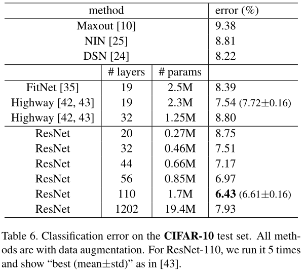

表6

CIFAR是一个很小的数据集，使用到了1202层ResNet，但是错误率反而不如110层，出现了过拟合。**作者想告诉我们，1200层中只有前100层是有用的**，后1000层因为有残差连接已经学不到任何东西。

### 5 resnet有效的合理性解释

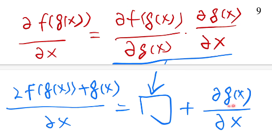

不添加残差块时，因为梯度比较小，一般是在0附近的高斯分布，所以就会导致在很深的时候就会比较小（梯度消失）。

虽然batch normalization或者其他东西能够对这种状况进行改善，但是实际上相对来说还是比较小。

但是如果加了一个ResNet的话，它的好处就是在原有的基础上加上了浅层网络的梯度，深层的网络梯度很小没有关系，浅层网络可以进行训练，变成了加法，一个小的数加上一个大的数，相对来说梯度还是会比较大的。也就是说，不管后面新加的层数有多少，前面浅层网络的梯度始终是有用的，这就是从误差反向传播的角度来解释为什么训练的比较快。

**为什么ResNet在CIFAR-10那么小的数据集上他的过拟合不那么明显？**

虽然模型很深，参数很多，但是因为模型是这么构造的，所以使得他内在的模型复杂度其实不是很高，也就是说，很有可能加了残差链接之后，使得模型的复杂度降低了，一旦模型的复杂度降低了，其实过拟合就没那么严重了 

- 所谓的模型复杂度降低了不是说不能够表示别的东西了，而是能够找到一个不那么复杂的模型去拟合数据，就如作者所说，不加残差连接的时候，理论上也能够学出一个有一个identity的东西（不要后面的东西），但是实际上做不到，因为没有引导整个网络这么走的话，其实理论上的结果它根本过不去，所以一定是得手动的把这个结果加进去，使得它更容易训练出一个简单的模型来拟合数据的情况下，等价于把模型的复杂度降低了。

# 参考资料

[撑起计算机视觉半边天的ResNet【论文精读】_哔哩哔哩_bilibili](https://www.bilibili.com/video/BV1Fb4y1h73E/?spm_id_from=333.788&vd_source=0ae30021dc2ca3e5667ea157a3453ddb)

[ResNet-论文全文完整翻译+注解 - 知乎 (zhihu.com)](https://zhuanlan.zhihu.com/p/159162779)