# 课程五 序列模型 

## 第一周：循环神经网络 Recurrent Neural Networks

### p156 为什么使用序列模型Why sequence models

- **语音识别**：将输入的语音信号直接输出相应的语音文本信息。无论是语音信号还是文本信息均是序列数据。
- **音乐生成**：生成音乐乐谱。只有输出的音乐乐谱是序列数据，输入可以是空或者一个整数。
- **情感分类**：将输入的评论句子转换为相应的等级或评分。输入是一个序列，输出则是一个单独的类别。
- **DNA序列分析**：找到输入的DNA序列的蛋白质表达的子序列。
- **机器翻译**：两种不同语言之间的想换转换。输入和输出均为序列数据。
- **视频行为识别**：识别输入的视频帧序列中的人物行为。
- **命名实体识别**：从输入的句子中识别实体的名字。

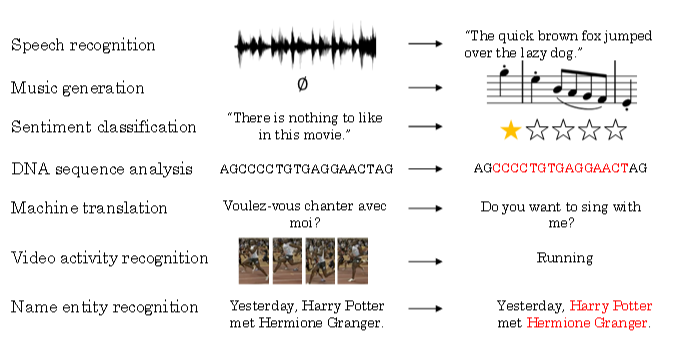

### p157 符号 Notation

下面以命名实体识别为例，介绍序列模型的命名规则。示例语句输入为：

**Harry Potter and Hermione Granger invented a new spell.**

该句话包含9个单词，输出y即为1 x 9向量。1表示是人名，0表示否。其中“Harry”，“Potter”，“Hermione”，“Granger”均是人名成分，所以，对应的输出y可表示为：$y=[1  1  0  1  1  0  0  0  0]$

- 输入$x$： $x^{(t)}$ 表示输入$x$中的第$t$个符号。
- 输入$y$：如“1 1 0 1 1 0 0 0 0”，$有y^{(t)}$表示输入$y$中的第$t$个符号。
- $T_x$用来表示输入$x$的长度；
- $T_y$用来表示输入$y$的长度；
- $x^{(i)(t)}$ 表示第$i$个输入样本的第$t$个符号，其余同理。

想要表示一个词语，需要先建立一个**词汇表（Vocabulary）**，或者叫**字典（Dictionary）**。将需要表示的所有词语变为一个列向量，可以根据字母顺序排列，然后根据单词在向量中的位置，用 **one-hot 向量（one-hot vector）**来表示该单词的标签：将每个单词编码成一个 $R^{|V| \times 1}$向量，其中 $|V|$是词汇表中单词的数量。

一个单词在词汇表中的索引在该向量对应的元素为 1，其余元素均为 0。

例如，'zebra'排在词汇表的最后一位，因此它的词向量表示为：$w^{zebra} = \left [ 0, 0, 0, ..., 1\right ]^T$

------

**补充：one-hot 向量是最简单的词向量**。

**缺点**:由于**每个单词被表示为完全独立的个体**，因此**单词间的相似度无法体现**。

例如单词 hotel 和 motel 意思相近，而与 cat 不相似，但是$(w^{hotel})^Tw^{motel} = (w^{hotel})^Tw^{cat} = 0$

### p158 循环神经网络模型Recurrent Neural Network Model

**标准的神经网络：**

对于序列模型，如果使用标准的神经网络

标准的神经网络存在下面一些问题：

- 输入和输出数据在不同的例子中可以有不同的长度，因此**输入层和输出层的神经元数量无法固定。**
- 这种朴素的神经网络结果并**不能共享从文本不同位置所学习到的特征**。例如，如果某个即“Harry”是人名成分，那么句子其它位置出现了“Harry”，也很可能也是人名。这是共享特征的结果。（卷积神经网络中学到的特征的快速地推广到图片其他位置）
- **模型中的参数太多，计算量太大**。（共享特征还有助于减少神经网络中的参数数量，一定程度上减小了模型的计算复杂度）

**循环神经网络：**

为了解决这些问题，引入**循环神经网络（Recurrent Neural Network，RNN）**。

网络的结构如下图所示：

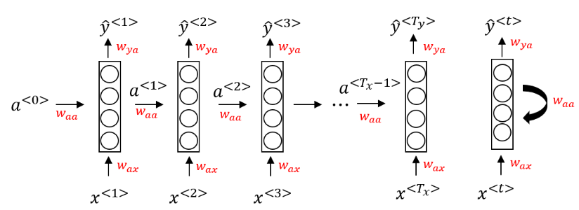

当元素 $x^{⟨t⟩}$ 输入对应**时间步（Time Step）**的隐藏层的同时，该隐藏层也会**接收来自上一时间步的隐藏层的激活值 $a^{⟨t-1⟩}$**，

其中 零时刻，需要编造一个激活值**$a^{⟨0⟩}$ 一般直接初始化为零向量**。**一个时间步输出一个对应的预测结果 $\hat y^{⟨t⟩}$。**

同时，上图中右边的循环神经网络的绘制结构与左边是等价的。

循环神经网络是**从左到右扫描数据**的，同时**共享每个时间步的参数**。

输入、激活、输出的参数对应为 $W_{ax}$、$W_{aa}$、$W_{ya}$。

下图是一个 RNN 神经元的结构：

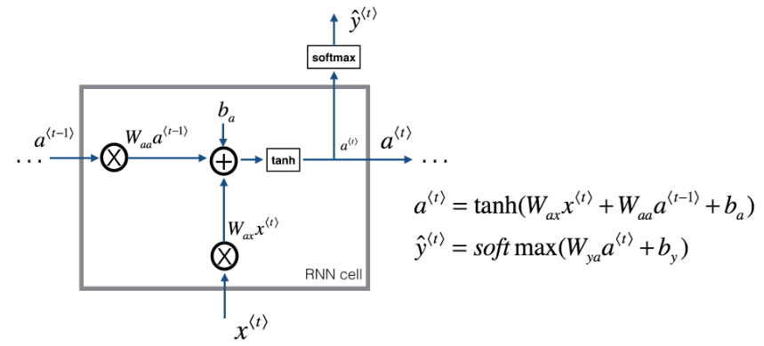

**循环神经网络的前向传播：**

前向传播过程的公式如下：

$$a^{⟨0⟩} = \vec{0}$$

$$a^{⟨t⟩} = g_1(W_{aa}a^{⟨t-1⟩} + W_{ax}x^{⟨t⟩} + b_a)$$

$$\hat y^{⟨t⟩} = g_2(W_{ya}a^{⟨t⟩} + b_y)$$

激活函数 $g_1$通常选择 tanh，有时也用 ReLU；$g_2$可选 sigmoid 或 softmax，取决于需要的输出类型。

**上式是RNN的一般前向传播公式，还可以对上式进行简化：**可以将 $W_{aa}$、$W_{ax}$ **水平并列**为一个矩阵 $W_a$，同时 $a^{⟨t-1⟩}$和 $ x^{⟨t⟩}$ **堆叠**成一个矩阵。则有：

$$W_a = [W_{aa}, W_{ax}]$$

$$a^{⟨t⟩} = g_1(W_a[a^{⟨t-1⟩}, x^{⟨t⟩}] + b_a)$$

$$\hat y^{⟨t⟩} = g_2(W_{ya}a^{⟨t⟩} + b_y)$$

------

**PS:**以上所述的RNN为单向RNN，即按照从左到右顺序，单向进行，只与左边的元素有关。但是，有时候也可能与右边元素有关。

例如下面两个句子中，单凭前三个单词，无法确定“Teddy”是否为人名，必须根据右边单词进行判断。                                                                                                                                                                                                                                                                                                                                                                                                                                                                     

**He said, “Teddy Roosevelt was a great President.”**

**He said, “Teddy bears are on sale!”**

因此，有另外一种RNN结构是双向RNN，简称为**BRNN。与左右元素均有关系**，我们之后再详细介绍。

### p159 通过时间反向传播Backpropagation through time

**单个时间步上**某个单词的预测值的损失函数采用**交叉熵损失函数**，如下所示：

$$L^{⟨t⟩}(\hat y^{⟨t⟩}, y^{⟨t⟩}) = -y^{⟨t⟩}log\hat y^{⟨t⟩} - (1 - y^{⟨t⟩})log(1-\hat y^{⟨t⟩})$$

将单个位置上的损失函数相加，得到整个序列的成本函数如下：

$$J = L(\hat y, y) = \sum^{T_x}_{t=1} L^{⟨t⟩}(\hat y^{⟨t⟩}, y^{⟨t⟩})$$

循环神经网络的反向传播被称为**通过时间反向传播（Backpropagation through time）**，因为从右向左计算的过程就像是时间倒流。

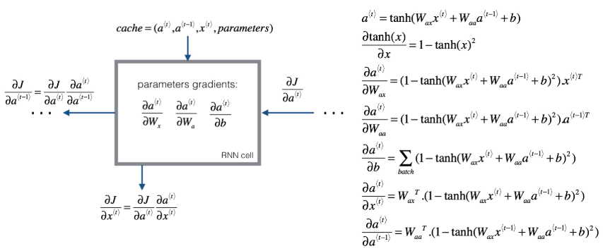

### p160 不同类型的RNN

某些情况下，输入长度和输出长度不一致。根据所需的输入及输出长度，循环神经网络可分为“一对一”、“多对一”、“多对多”等结构：

**one-to-many：**

如在音乐生成的例子中，输入一个音乐的类型或者空值，直接生成一段音乐序列或者音符序列。在这种情况下，就是输入是一个值，但输出是一个序列：

**many-to-one：**

如在情感分类问题中，需要对某个序列进行正负判别或者打星操作。在这种情况下，就是输入是一个序列，但输出只有一个值：

**many-to-many( $T_x = T_y$ ):**

输入和输出的长度相同

**many-to-many( $T_x  \ne T_y$ )：**

机器翻译这种类似的应用来说，输入和输出都是序列，但长度却不相同，这是另外一种多对多的结构：

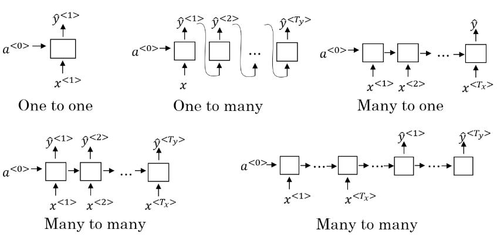

### p161 语言模型和序列生成Language model and sequence generation

在NLP中，构建语言模型是最基础也是最重要的工作之一，可以通过RNN来很好的实现。

**什么是语言模型？**

**语言模型（Language Model）**是根据语言客观事实而进行的语言抽象数学建模，能够估计某个序列中各元素出现的可能性。

例如，在一个语音识别系统中，语言模型能够计算两个读音相近的句子为正确结果的概率，以此为依据作出准确判断。很明显，第二句话更有可能是正确的翻译

- **The apple and pair salad.**
- **The apple and pear salad.**

概率计算的表达式为：

$$P(y^{<1>},y^{<2>},⋯,y^{<Ty>})$$

对于语料库中部分特殊的、不包含在字典中的词汇，例如人名、地名，可以不必针对这些具体的词，而是在词典中加入一个 UNK（Unique Token）标记来表示。

**使用RNN构建语言模型：**

- 训练集：建立语言模型所采用的训练集是一个大型的**语料库（Corpus），指数量众多的句子组成的文本**
- Tokenize：将句子使用字典库标记化；
- 然后将语料库中的每个词表示为对应的 one-hot 向量。
- 需要增加一个额外的标记 EOS（End of Sentence）来表示一个句子的结尾，未出现在字典库中的词使用UNK来表示；标点符号可以忽略，也可以加入字典后用 one-hot 向量表示。
- 第一步：**使用零向量对输出进行预测**，即预测第一个单词是某个单词的可能性；
- 第二步：通过前面的输入，逐步预测后面一个单词出现的概率；
- 训练网络：使用softmax损失函数$L(\hat y^{⟨t⟩}, y^{⟨t⟩}) = -\sum_t y_i^{⟨t⟩} log \hat y^{⟨t⟩}$计算损失，对网络进行参数更新，提升语言模型的准确率。

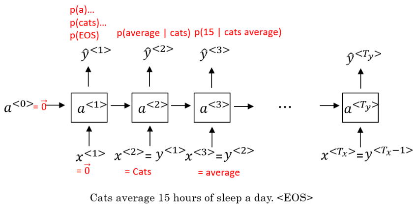

------

**PS:**整个语句出现的概率等于语句中所有元素出现的条件概率乘积。例如某个语句包含，则整个语句出现的概率为：

$P(y^{<1>},y^{<2>},y^{<3>})=P(y^{<1>})\cdot P(y^{<2>}|y^{<1>})\cdot P(y^{<3>}|y^{<1>},y^{<2>})$

### p162 采样新序列 Sampling novel sequences

在训练好一个语言模型后，可以通过**采样（Sample）**新的序列来了解这个模型中都学习到了一些什么。

对于一个序列模型，其模拟了任意特定单词序列的概率，如$P(y^{<1>}, \dots,y^{<T_y>})$  ，而要做的就是对这个概率分布进行采样，来生成一个新的单词序列。

如下面的一个已经训练好的RNN结构，这是为了进行采样需要做的：

- 首先输入 $x^{<1>} = 0,a^{<0>} = 0$，在这第一个时间步，得到所有可能的输出经过$softmax$层后可能的概率，根据这个$softmax$的分布，进行随机采样，获取第一个随机采样单词$\hat{y}^{<1>}$
- 然后继续下一个时间步，以刚刚采样得到的$\hat{y}^{<1>}$作为下一个时间步的输入，进而
$softmax$层会预测下一个输出$\hat{y}^{<2>}$，依次类推
- 如果字典中有结束的标志如：“EOS”，那么输出是该符号时则表示结束；若没有这种标志，则可以自行设置结束的时间步。

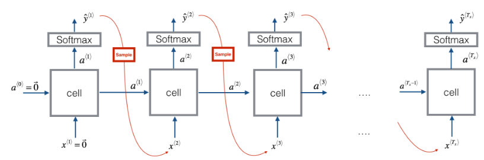

这里建立的是**基于词汇构建的语言模型**。

根据需要也可以构建**基于字符的语言模型**，其优点是不必担心出现未知标识（UNK），其缺点是得到的序列过多过长，并且训练成本高昂。因此，基于词汇构建的语言模型更为常用。

目前的趋势和常见的均是基于词汇的语言模型。但随着计算机运算能力的增强，在一些特定的情况下，也会开始使用基于字符的语言模型。

### p163 RNN的梯度消失

RNN在NLP中具有很大的应用价值，但是其存在一个很大的缺陷，那就是梯度消失的问题。例如下面的例句中：
- **The cat, which already ate ...........，was full；**
- **The cats, which already ate ...........，were full.**

对于以上两个句子，后面的动词单复数形式由前面的名词的单复数形式决定。句子中存在长期依赖（long-term dependencies），前面的单词对后面的单词有很重要的影响。，但是**基本的 RNN 不擅长捕获这种长期依赖关系**。

究其原因，由于梯度消失，在反向传播时，后面层的输出误差很难影响到较靠前层的计算，网络很难调整靠前的计算。很难让网络记住前面的单词是单数或者复数，进而对后面的输出产生影响。

在反向传播时，随着层数的增多，梯度不仅可能指数型下降，也有可能指数型上升，即梯度爆炸。

不过梯度爆炸比较容易发现，因为参数会急剧膨胀到数值溢出（可能显示为 NaN）。这时可以采用**梯度修剪（Gradient Clipping）**来解决：观察梯度向量，如果它大于某个阈值，则缩放梯度向量以保证其不会太大。相比之下，梯度消失问题更难解决。**GRU 和 LSTM 都可以作为缓解梯度消失问题的方案**。

### p164 门控循环单元 GRU

**GRU（Gated Recurrent Units, 门控循环单元）**改善了 RNN 的隐藏层，使其可以更好地捕捉深层连接，并改善了梯度消失问题。

RNN的隐藏层单元结构如下图所示：

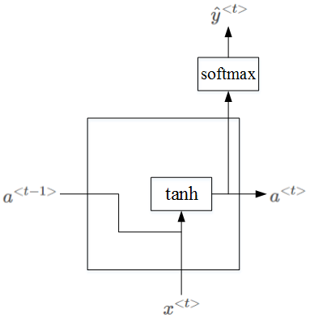

**GRU 单元：**

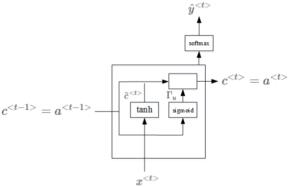

**The cat, which already ate a bunch of food was full.**

当我们从左到右读上面这个句子时，GRU 单元有一个新的变量称为 $c$，代表**记忆细胞（Memory Cell）**，其作用是提供记忆的能力，记住例如前文主语是单数还是复数等信息。在时间 t，记忆细胞的值 $c^{⟨t⟩}$等于输出的激活值 $a^{⟨t⟩}$；$\tilde c^{⟨t⟩}$ 代表下一个 $c$ 的候选值。$Γ_u$ 代表**更新门（Update Gate）**，用于决定什么时候更新记忆细胞的值。以上结构的具体公式为：

​         $$\tilde c^{⟨t⟩} = tanh(W_c[c^{⟨t-1⟩}, x^{⟨t⟩}] + b_c)$$

​         $$Γ_u = \sigma(W_u[c^{⟨t-1⟩}, x^{⟨t⟩}] + b_u)$$

​         $$c^{⟨t⟩} = Γ_u \times \tilde c^{⟨t⟩} + (1 - Γ_u) \times c^{⟨t-1⟩}$$

​         $$a^{⟨t⟩} = c^{⟨t⟩}$$

当使用 sigmoid 作为激活函数 $\sigma$ 来得到 $Γ_u$时，$Γ_u$ 的值在 0 到 1 的范围内，且大多数时间非常接近于 0 或 1。当 $Γ_u = 1$时，$c^{⟨t⟩}$被更新为 $\tilde c^{⟨t⟩}$，否则保持为 $c^{⟨t-1⟩}$。因为 $Γ_u$ 可以很接近 0，因此 $c^{⟨t⟩}$几乎就等于 $c^{⟨t-1⟩}$。在经过很长的序列后，$c$ 的值依然被维持，从而实现“记忆”的功能。

------

以上实际上是简化过的 GRU 单元，但是蕴涵了 GRU 最重要的思想。

**完整的 GRU 单元**添加了一个新的**相关门（Relevance Gate）** $Γ_r$，表示 $\tilde c^{⟨t⟩}$和 $c^{⟨t⟩}$的相关性。

$$\tilde c^{⟨t⟩} = tanh(W_c[c^{⟨t-1⟩}, x^{⟨t⟩}] + b_c)$$

$$Γ_u = \sigma(W_u[c^{⟨t-1⟩}, x^{⟨t⟩}] + b_u)$$

$$Γ_r = \sigma(W_r[c^{⟨t-1⟩}, x^{⟨t⟩}] + b\_r)$$

$$c^{⟨t⟩} = Γ_u \times \tilde c^{⟨t⟩} + (1 - Γ_u) \times c^{⟨t-1⟩}$$

$$a^{⟨t⟩} = c^{⟨t⟩}$$

### p165 长短期记忆LSTM

LSTM（Long Short Term Memory，长短期记忆）网络比 GRU 更加灵活和强大，它额外引入了**遗忘门（Forget Gate） $Γ_f$和输出门（Output Gate） $Γ_o$**。

LSTM单元的可视化图如下所示：

将多个 LSTM 单元按时间次序连接起来，就得到一个 LSTM 网络。

GRU可以看成是简化的LSTM，两种方法都具有各自的优势。

### p166 双向RNN Bidirectional RNN

单向的循环神经网络在某一时刻的预测结果只能使用之前输入的序列信息。**双向循环神经网络（Bidirectional RNN，BRNN）**可以在序列的任意位置使用之前和之后的数据。

其工作原理是增加一个反向循环层，结构如下图所示：双向RNN（bidirectional RNNs）模型能够让我们在序列的某处，不仅可以获取之间的信息，还可以获取未来的信息。

这个改进的方法不仅能用于基本的 RNN，也可以用于 GRU 或 LSTM。

**缺点**是需要完整的序列数据，才能预测任意位置的结果。**例如构建语音识别系统**，**需要等待用户说完并获取整个语音表达，才能处理这段语音并进一步做语音识别。**因此，实际应用会有更加复杂的模块。

在NLP问题中，常用的就是使用双向RNN的LSTM。

### p167 深度循环神经网络DRNN

与深层的基本神经网络结构相似，深层RNNs模型具有多层的循环结构，但不同的是，在传统的神经网络中，可能会拥有很多层，几十层上百层，但是**对与RNN来说，三层的网络结构就已经很多了**，因为RNN存在时间的维度，所以其结构已经足够的庞大。如下图所示：

以 $a^{[2]⟨3⟩}$为例，有 $a^{[2]⟨3⟩} = g(W_a^{[2]}[a^{[2]⟨2⟩}, a^{[1]⟨3⟩}] + b_a^{[2]})$。

另外一种Deep RNNs结构是每个输出层上还有一些垂直单元，如下图所示：

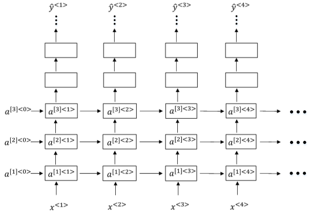

## 第二周：自然语言处理与词嵌入NLP and Word Embeddings

### p168 词汇表征Word Representation

为了让计算机能够能更好地理解人类的语言，建立更好的语言模型，需要将词汇进行表征。下面是几种不同的词汇表征方式：

**one-hot 表征：**

对应单词的位置用1表示，其余位置用0表示

one-hot表征的缺点：one-hot 向量将每个单词表示为完全独立的个体，不同词向量都是正交的，因此**单词间的相似度无法体现**。

在NLP中，我们更希望能掌握不同单词之间的相似程度。

**特征表征：词嵌入**

因此，我们可以使用**特征表征（Featurized representation）**的方法对每个单词进行编码。也就是使用一个特征向量表征单词，特征向量的每个元素都是对该单词某一特征的量化描述，量化范围可以是[-1,1]之间。特征表征的例子如下图所示：

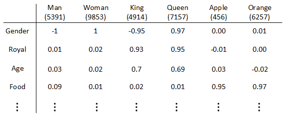

特征向量的长度依情况而定，特征元素越多则对单词表征得越全面。这里的特征向量长度设定为300。使用特征表征之后，词汇表中的每个单词都可以使用对应的300 x 1的向量来表示，该向量的每个元素表示该单词对应的某个特征值。**每个单词用 e + 词汇表索引** 的方式标记，例如$e5391,e9853,e4914,e7157,e456,e6257$。

这种特征表征的优点是根据特征向量能清晰知道不同单词之间的相似程度，例如Apple和Orange之间的相似度较高，很可能属于同一类别。这种单词“类别”化的方式，大大提高了有限词汇量的泛化能力。这种特征化单词的操作被称为Word Embeddings，即单词嵌入。

这里特征向量的每个特征元素含义是具体的，对应到实际特征，例如性别、年龄等。

而在实际应用中，特征向量很多特征元素并不一定对应到有物理意义的特征，是比较抽象的。但是，这并不影响对每个单词的有效表征，同样能比较不同单词之间的相似性。

每个单词都由高维特征向量表征，为了可视化不同单词之间的相似性，可以使用降维操作，例如t-SNE算法，在通过复杂而非线性的方法映射到二维空间后，每个词会根据语义和相关程度聚在一起。相关论文：[van der Maaten and Hinton., 2008. Visualizing Data using t-SNE](https://www.seas.harvard.edu/courses/cs281/papers/tsne.pdf)

将300D降到2D平面上。如下图所示：

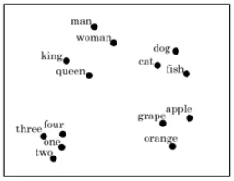

词嵌入（Word Embedding）**是 NLP 中语言模型与表征学习技术的统称，概念上而言，它是指把一个维数为所有词的数量的高维空间（one-hot 形式表示的词）“嵌入”到一个维数低得多的连续向量空间中，每个单词或词组被映射为实数域上的向量。对大量词汇进行词嵌入后获得的词向量，可用于完成命名实体识别（Named Entity Recognition）**等任务。

### p169 使用词嵌入Use Word Embeddings

Word Embeddings对不同单词进行了实现了特征化的表示。

**名字实体识别的例子：**

如下面的一个句子中名字实体的定位识别问题，假如有一个比较小的数据集，可能不包含durain（榴莲）和cultivator（培育家）这样的词汇，那么就很难从包含这两个词汇的句子中识别名字实体。

但是如果可以从网上的其他地方获取了一个学习好的word Embedding，它将告诉我们榴莲是一种水果，并且培育家和农民相似，那么就有可能从少量的训练集中，归纳出没有见过的词汇中的名字实体。

**词嵌入的迁移学习：**

词嵌入迁移学习的步骤：
- 从大量的文本集中学习词嵌入，或者下载网上开源的、预训练好的词嵌入模型；
- 将这些词嵌入模型迁移到新的、只有少量标注训练集的任务中；
- 可以选择是否微调词嵌入。当标记数据集不是很大时可以省下这一步。

**词嵌入和人脸编码：**

词嵌入和人脸编码之间有很奇妙的联系。在人脸识别领域，通常会将人脸图片预编码成不同的编码向量，以表示不同的人脸，进而在识别的过程中使用编码来进行比对识别。词嵌入则和人脸编码有一定的相似性。

二者不同的是Siamese网络输入的人脸图片可以是数据库之外的；而word embedding一般都是已建立的词汇库中的单词，非词汇库单词统一用< UNK >表示。

### p170 词嵌入的特性

**类比推理特性：**

词嵌入可用于类比推理。例如，给定对应关系“男性（Man）”对“女性（Woman）”，想要类比出“国王（King）”对应的词汇。则可以有 $e_{man} - e_{woman} \approx e_{king} - e_? $ ，之后的目标就是找到词向量 $w$，来找到使相似度 $sim(e_w, e_{king} - e_{man} + e_{woman})$ 最大。

一个最常用的相似度计算函数是**余弦相似度（cosine similarity）**。公式为：

$$sim(u, v) = \frac{u^T v}{|| u || ·|| v ||}$$

还可以计算Euclidian distance来比较相似性，即$||u−v||^2$。距离越大，相似性越小。

### p171  嵌入矩阵Embedding matrix

不同的词嵌入方法能够用不同的方式学习到一个**嵌入矩阵（Embedding Matrix）** $E$。将字典中位置为 $i$ 的词的 one-hot 向量表示为 $o_i$，词嵌入后生成的词向量用 $e_i$表示，则有：

$$E \cdot o_i = e_i$$

但在实际情况下一般不这么做。因为 one-hot 向量维度很高，且几乎所有元素都是 0，这样做的效率太低。因此，实践中直接用专门的函数查找矩阵 $E$ 的特定列。

### p172 学习词嵌入Learning word embeddings

通过这句话的前6个单词，预测最后的单词“juice”。$E$未知待求，每个单词可用embedding vector $e_w$表示。构建的神经网络模型结构如下图所示：

神经网络输入层包含6个embedding vactors，每个embedding vector维度是300，则输入层总共有1800个输入。Softmax层有10000个概率输出，与词汇表包含的单词数目一致。正确的输出label是“juice”。

其中$E,W^{[1]},b^{[1]},W^{[2]},b^{[2]}$为待求值。对足够的训练例句样本，运用梯度下降算法，迭代优化，最终求出embedding matrix $E$

为了让神经网络输入层数目固定，可以选择**只取预测单词的前4个单词作为输入**，例如该句中只选择“a glass of orange”四个单词作为输入。当然，**这里的4是超参数**，可调。

**上下文和目标词：**

将要预测的单词称为**target目标词**，其是通过一些**context上下文**推导预测出来的。对于不同的问题，上下文的大小和长度以及选择的方法有所不同。

对应到上面这句话：

- **context: a glass of orange**
- **target: juice**

关于context的选择有多种方法：

- **target前n个单词或后n个单词，n可调**
- **target前1个单词**
- **target附近某1个单词（Skip-Gram）**

事实证明，不同的context选择方法都能计算出较准确的embedding matrix $E$。

### p173 词转向量 Word2Vec

Word2Vec算法是一种简单的计算更加高效的方式来实现对词嵌入的学习。上一小节我们介绍了context和target的选择方法，比较流行的是采用Skip-Gram模型。以下面这句话为例：

**I want a glass of orange juice to go along with my cereal.**

**Skip-grams：**

Skip-Gram模型的做法是：首先随机选择一个单词作为context，例如“orange”；然后使用一个宽度为5或10（自定义）的滑动窗，在context附近选择一个单词作为target，可以是“juice”、“glass”、“my”等等。最终得到了多个context—target对作为监督式学习样本。

**模型流程：**

从上图可以看到，从左到右

- **是 One-hot 向量，**
- **乘以 center word 的矩阵 $W$即嵌入矩阵， 于是找到词向量，**
- **乘以另一个 context word 的矩阵 $W'$ 得到对每个词语的“相似度”，**
- **对相似度取 Softmax 得到概率，**
- **与答案对比计算损失。**

设某个词为 $c$，该词的一定词距内选取一些配对的目标上下文 $t$，则该网络仅有的一个 Softmax 单元输出条件概率：

$$p(t|c) = \frac{exp(\theta_t^T e_c)}{\sum^m_{j=1}exp(\theta_j^T e_c)}$$

$\theta_t$ 是一个与输出 $t$ target 有关的参数，其中省略了用以纠正偏差的参数。$e_c$为context的embedding vector，且$e_c=E⋅O_c$。损失函数仍选用交叉熵：

$$L(\hat y, y) = -\sum^m_{i=1}y_ilog\hat y_i$$

在此 Softmax 分类中，每次计算条件概率时，需要对词典中所有词做求和操作，因此计算量很大。解决方案之一是使用一个**分级的 Softmax 分类器（Hierarchical Softmax Classifier）**，形如二叉树。在实践中，一般采用霍夫曼树（Huffman Tree）而非平衡二叉树，常用词在顶部。

**如何采样上下文：**

​	关于context的采样，需要注意的是如果使用均匀采样，那么一些常用的介词、冠词，例如the, of, a, and, to等出现的概率更大一些。但是，这些单词的embedding vectors	通常不是我们最关心的，我们更关心例如orange, apple， juice等这些名词等。

​	所以，实际应用中，一般不选择随机均匀采样的方式来选择context，而是使用其它算法来处理这类问题。

**CBOW 模型**的工作方式与 Skip-gram 相反，通过**采样上下文来预测中间的词**。

吴恩达老师没有深入去讲 CBOW。

### p174 负采样Negative Sampling

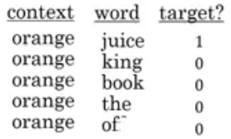

Negative sampling是另外一种有效的求解embedding matrix $E$的方法。

**做法:**

- 判断选取的context word和target word是否构成一组正确的context-target对，一般包含一个正样本和k个负样本。

- 使用k次相同的上下文，随机选择不同的目标词，并对相应的词对进行正负样本的标记，生成训练集。
- 建议：小数据集，k=5 ~ 20；大数据集，k=2 ~ 5。
- 最后学习$x-y$的映射关系。

**模型：**

在负采样模型中，可以使用logistic回归模型：

$P(y=1|c,t) = \sigma(\theta_t^Te_c)$

negative sampling某个正样本对应k个负样本，即模型总共包含了k+1个binary classification。对比Skip-grams模型的10000个输出单元的softmax分类，negative sampling转化为k+1个二分类问题，计算量要小很多，大大提高了模型运算速度.

相比与，负采样不再使用一个具有词汇表大小时间复杂度高的庞大维度的Softmax，而是将其转换为词汇表大小个二分类问题。每个二分类任务都很容易解决，因为每个的训练样本均是1个正样本，外加k个负样本。

**如何选择负样本：**

可以使用随机选择的方法。但有资料提出一个更实用、效果更好的方法，就是根据该词出现的频率进行选择，相应的概率公式为：

$$P(w_i)=\frac{f(w_i)^{\frac34}}{\sum_j^{10000}f(w_j)^{\frac34}}$$

$f(w_i)$表示单词$w_i$在单词表中出现的概率。

### p175 GloVe（Global Vectors）

**GloVe（Global Vectors）**是另一种流行的词嵌入算法。GloVe算法引入了一个新的参数**共现矩阵**：

- $X_{ij}$: 表示i出现在j之前的次数，即**i和j同时出现的次数**。

其中，**i表示context，j表示target**。一般地，如果不限定context一定在target的前面，则有对称关系$X_{ij} = X_{ji} $；如果有限定先后，则$X_{ij} ≠X_{ji} $。接下来的讨论中，我们默认存在对称关系。

**GloVe模型的loss function**为：

$$J = \sum^N_{i=1}\sum^N_{j=1}f(X_{ij})(\theta^t_i e_j + b_i + b_j - log(X_{ij}))^2$$

其中，$\theta_i$、$e_j$是单词 $i$ 和单词 $j$ 的词向量；$b_i$、$b_j$；$f()$ 是一个用来避免 $X_{ij}=0$时$log(X_{ij})$为负无穷大、并在其他情况下调整权重的函数。$X_{ij}=0$时，$f(X_{ij}) = 0$。

从上式可以看出，若两个词的embedding vector越相近，同时出现的次数越多，则对应的loss越小。
值得注意的是，参数θi和ej是对称的。使用优化算法得到所有参数之后，最终的$e_w$可表示为：
$$
e_w=\frac{e_w+θ_w}{2}
$$
最后提一点的是，无论使用Skip-Gram模型还是GloVe模型等等，计算得到的embedding matrix $E$的每一个特征值不一定对应有实际物理意义的特征值，如gender，age等。

### p176 情感分类 Sentiment Classification

情感分类是指分析一段文本对某个对象的情感是正面的还是负面的，实际应用包括舆情分析、民意调查、产品意见调查等等。

**情感分类问题:**

- 数据集很小，缺乏训练样本。

但是有了词嵌入得到的词向量，中等规模的标记训练数据也能构建出一个效果不错的情感分类器。

------

**平均或求和模型**:

首先介绍使用word embedding解决情感分类问题的一个简单模型算法：。

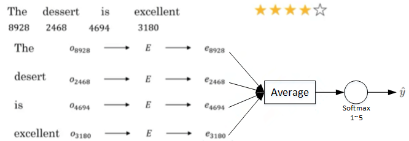

如上图所示，这句话的4个单词分别用embedding vector表示。$e_{8928},e_{2468},e_{4694},e_{3180}$**计算均值**，这样得到的平均向量的维度仍是300。最后经过softmax输出1～5星。这种模型结构简单，计算量不大，不论句子长度多长，都使用平均的方式得到300D的embedding vector。该模型实际表现较好。

**优点**:

- 是适用于任何长度的文本

**缺点:**

- 是没有考虑词的顺序，对于包含了多个正面评价词的负面评价，很容易预测到错误结果。

**Completely lacking in good taste, good service, and good ambience.**

虽然这句话中包含了3个“good”，但是其前面出现了“lacking”，很明显这句话句意是negative的。如果使用平均算法，则很可能会错误识别为positive的，因为忽略了单词出现的次序。

**RNN模型：**

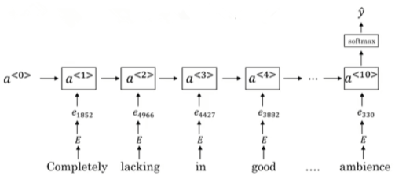

- 取一个训练好的词嵌入矩阵$E$
- 得到每个词的词嵌入向量，输入到many-to-one的RNN模型中
- 通过最后的softmax分类器，得到最后的输出$\hat{y}$

**优点**：考虑了词序，效果好很多

### p177 词嵌入消除偏见 Debiasing word embeddings

**目前的偏见问题：**

以一些预料库中学习到的词嵌入向量，会发现学习到的词向量存在下面一些具有性别、种族等偏见。

例如，使用未除偏的词嵌入结果进行类比推理时，"Man" 对 "Computer Programmer" 可能得到 "Woman" 对 "Housemaker" 等带有性别偏见的结果。

**词嵌入消除偏见方法：**

- 定义偏见的方向：如性别

- 对所有性别对立的单词求差值，再平均$bias\ direction=\frac1N ((e_{he}-e_{she})+(e_{male}-e_{female})+\cdots)$

- 然后，单词中立化（Neutralize）。将需要消除性别偏见的单词投影到non-bias direction上去，消除bias维度，例如babysitter，doctor等

  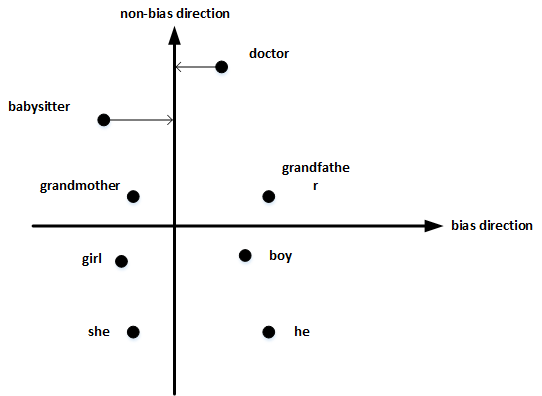

- 均衡对（Equalize pairs）:将如 grandmother 和 grandfather 这种对称词对调整至babysitter这类词汇平衡的位置上，使babysitter这类词汇处于一个中立的位置，进而消除偏见

  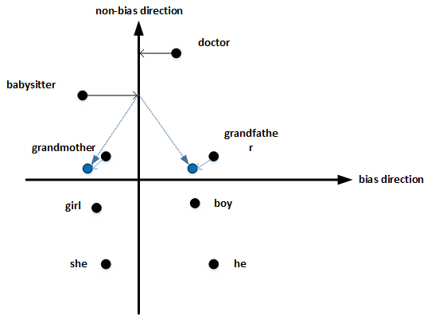

掌握哪些单词需要中立化非常重要。一般来说，大部分英文单词，例如职业、身份等都需要中立化，消除embedding vector中性别这一维度的影响。

