# 课程五 序列模型 

## 第三周：序列模型和注意力机制Sequence models & Attention mechanism

### p178 基础模型basic models

**Seq2Seq 模型**

Seq2Seq（Sequence-to-Sequence）**模型能够应用于机器翻译、语音识别等各种序列到序列的转换问题。一个 Seq2Seq 模型包含**编码器（Encoder）**和**解码器（Decoder）**两部分，它们通常是两个不同的 RNN。

如下图所示：

编码器的输出作为解码器的输入，由解码器负责输出正确的翻译结果。

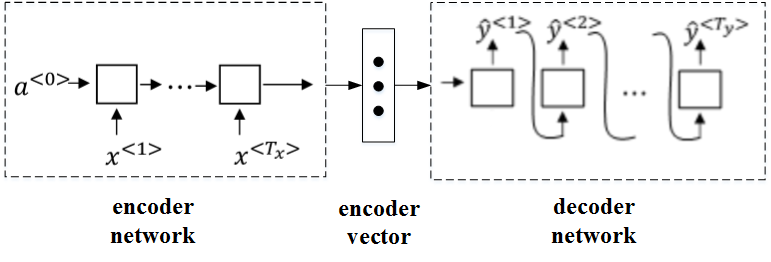

- encoder vector代表了输入语句的编码特征。
- encoder network和decoder network都是RNN模型，可使用GRU或LSTM单元。

这种模型也可以应用到图像捕捉领域。图像捕捉，即捕捉图像中主体动作和行为，描述图像内容。例如下面这个例子，根据图像，捕捉图像内容。

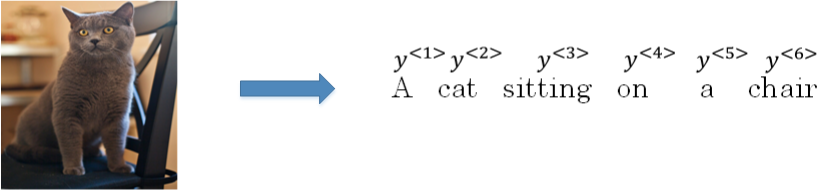

首先，可以将图片输入到CNN，例如使用预训练好的AlexNet，删去最后的softmax层，保留至最后的全连接层。则该全连接层就构成了一个图片的特征向量（编码向量），表征了图片特征信息。

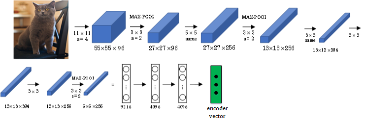

然后，将encoder vector输入至RNN，即decoder network中，进行解码翻译

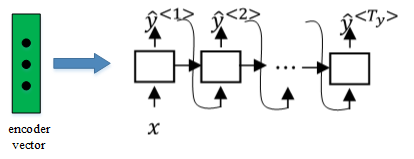

### p179 选择最可能的句子 Picking the most likely sentence

Sequence to sequence machine translation模型与我们第一节课介绍的language模型有一些相似，但也存在不同之处。二者模型结构如下所示：

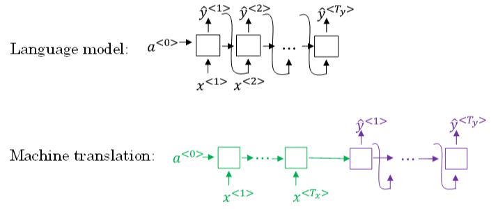

- Language [model](https://so.csdn.net/so/search?q=model&spm=1001.2101.3001.7020)是自动生成一条完整语句，语句是随机的。
- 而machine translation model是根据输入语句，进行翻译，生成另外一条完整语句。

上图中，**绿色部分表示encoder network**，**紫色部分表示decoder network**。decoder network与language model是相似的，encoder network可以看成是language model的$a^{<0>}$，是模型的一个条件。

由于解码器进行随机采样过程，输出的翻译结果可能有好有坏。因此需要找到能使条件概率最大化的翻译，即

$$max\ P(y^{<1>},y^{<2>},\cdots,y^{}|x^{<1>},x^{<2>},\cdots,x^{})$$。

例如，本节笔记开始介绍的例子，列举几个模型可能得到的翻译：

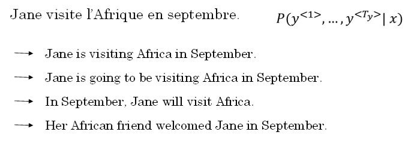

显然，第一条翻译“Jane is visiting Africa in September.”最为准确。那我们的优化目标就是要让这条翻译对应的P最大化。

**greedy search每次只搜索一个单词，没有考虑该单词前后关系**，概率选择上有可能会出错。例如，上面翻译语句中，第三个单词“going”比“visiting”更常见，模型很可能会错误地选择了“going”，而错失最佳翻译语句。其次，**greedy search大大增加了运算成本，降低运算速度。**

鉴于贪心搜索算法得到的结果显然难以不符合上述要求，解决此问题最常使用的算法是**集束搜索（Beam Search）使用近似最优的查找方式，最大化输出概率，寻找最佳的翻译语句。**

### p180 集束搜索（Beam Search）

Greedy search每次是找出预测概率最大的单词，而

**beam search**则是**每次找出预测概率最大的B个单词**。其中，参数B表示取概率最大的单词个数，可调。本例中，令B=3。

**搜索原理**：

- 首先，先从词汇表中找出翻译的第一个单词概率最大的B个预测单词。例如上面的例子中，预测得到的第一个单词为：in，jane，september。

  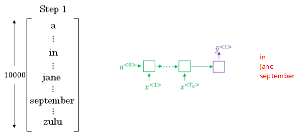概率表示为：$P(y^{<1>}|x)$

- 然后，再分别以in，jane，september为条件，计算每个词汇表单词作为预测第二个单词的概率。

  从中选择概率最大的3个作为第二个单词的预测值，得到：in september，jane is，jane visits。

  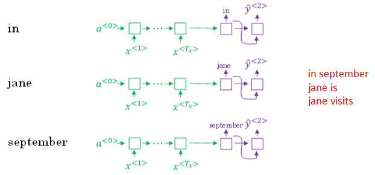

  概率表示为：$P(\hat y^{<2>}|x,\hat y^{<1>})$

  此时，得到的前两个单词的3种情况的概率为：

  $P(\hat y^{<1>},\hat y^{<2>}|x)=P(\hat y^{<1>} | x)\cdot P(\hat y^{<2>}|x,\hat y^{<1>})$

- 接着，再预测第三个单词。方法一样，分别以in september，jane is，jane visits为条件，计算每个词汇表单词作为预测第三个单词的概率。

  从中选择概率最大的3个作为第三个单词的预测值，得到：in september jane，jane is visiting，jane visits africa。

  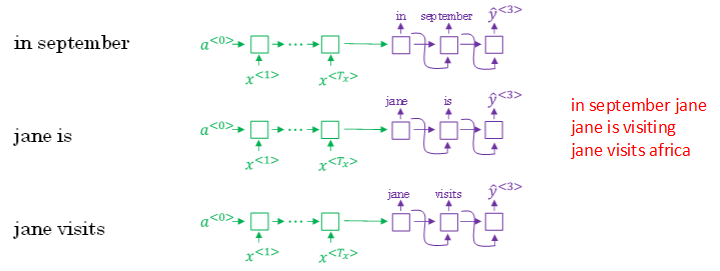

  概率表示为：$P(\hat y^{<3>}|x,\hat y^{<1>},\hat y^{<2>})$

  此时，得到的前三个单词的3种情况的概率为：

  $P(\hat y^{<1>},\hat y^{<2>},\hat y^{<3>}|x)=P(\hat y^{<1>} | x)\cdot P(\hat y^{<2>}|x,\hat y^{<1>})\cdot P(\hat y^{<3>}|x,\hat y^{<1>},\hat y^{<2>})$

- **以此类推，每次都取概率最大的三种预测**。最后，选择概率最大的那一组作为最终的翻译语句。

如果参数B=1，则就等同于greedy search。实际应用中，可以根据不同的需要设置B为不同的值。一般B越大，机器翻译越准确，但同时也会增加计算复杂度。

### p181 细化集束搜索Refinements to Beam Search

**Beam search中，最终机器翻译的概率是乘积的形式**

$$arg\ max\prod_{t=1}^{T_y} P(\hat y^{<t>}|x,\hat y^{<1>},\cdots,\hat y^{<t-1>})$$

当多个小于 1 的概率值相乘后，会造成**数值下溢（Numerical Underflow）**，得到的结果将会是一个电脑不能精确表示的极小浮点数。

因此，我们**取 $log$ 值**：

$$arg\ max\sum_{t=1}^{T_y} logP(\hat y^{<t>}|x,\hat y^{<1>},\cdots,\hat y^{<t-1>})$$

这种概率表达式还存在一个问题，**就是机器翻译的单词越多，乘积形式或求和形式得到的概率就越小**，这样会**造成模型倾向于选择单词数更少的翻译语句**，使机器翻译受单词数目的影响，这显然是不太合适的。

一种改进方式是进行长度归一化，消除语句长度影响：

$$arg\ max\ \frac{1}{T_y}\sum_{t=1}^{T_y} P(\hat y^{<t>}|x,\hat y^{<1>},\cdots,\hat y^{<t-1>})$$

实际应用中，通常会引入归一化因子α：$arg\ max\ \frac{1}{T_y^{\alpha}}\sum_{t=1}^{T_y} P(\hat y^{<t>}|x,\hat y^{<1>},\cdots,\hat y^{<t-1>})$

若α=1，则完全进行长度归一化；若α=0，则不进行长度归一化。一般令α=0.7，效果不错。

关于集束宽 $B$ 的取值，较大的 $B$ 值意味着可能更好的结果和巨大的计算成本；而较小的 $B$ 值代表较小的计算成本和可能表现较差的结果。通常来说，$B$ 可以取一个 10 以下的值。

和 BFS、DFS 等精确的查找算法相比，**集束搜索算法运行速度更快，但是不能保证一定找到 $arg \ max$ 准确的最大值。**

### p182 集束搜索的误差分析Error analysis in beam search

集束搜索是一种启发式搜索算法，其输出结果不总为最优。当结合 Seq2Seq 模型和集束搜索算法所构建的系统出错（没有输出最佳翻译结果）时，我们通过误差分析来分析错误出现在 RNN 模型还是集束搜索算法中。

例如，对于下述两个由人工和算法得到的翻译结果：

**$$Jane\ visite\ l’Afrique\ en\ septembre.$$**

$$Human:\ Jane\ visits\ Africa\ in\ September.\ (y^*)$$

$$Algorithm:\ Jane\ visited\ Africa\ last\ September.\ (y^*)$$

将翻译中没有太大差别的前三个单词作为解码器前三个时间步的输入，得到第四个时间步的条件概率 $P(y^* | x)$ 和 $P(\hat y | x)$，比较其大小并分析：

- 如果 $P(y^* | x) > P(\hat y | x)$，**说明是集束搜索算法出现错误，没有选择到概率最大的词**；
- 如果 $P(y^* | x) \le P(\hat y | x)$，说明是 **RNN 模型的效果不佳**，预测的第四个词为“in”的概率小于“last”。

如果**beam search算法表现不佳，可以调试参数B**；

若**RNN模型不好**，则可以增加网络层数，使用正则化，增加训练样本数目等方法来优化。

### p183 Bleu 得分Bleu Score(optional)

**Bleu（Bilingual Evaluation Understudy）得分**用于对机器翻译进行打分。

首先，对原语句建立人工翻译参考，一般有多个人工翻译。例如下面这个例子：

**French: Le chat est sur le tapis.**

**Reference 1: The cat is on the mat.**

**Reference 2: There is a cat on the mat.**

上述两个人工翻译都是正确的，作为参考。相应的机器翻译如下所示：

**MT output: the the the the the the the.**
如上所示，机器翻译为“the the the the the the the.”，效果很差。

Bleu Score的宗旨是机器翻译越接近参考的人工翻译，其得分越高，方法原理就是看机器翻译的各个单词是否出现在参考翻译中。

**1最简单的准确度评价方法是看机器翻译的每个单词是否出现在参考翻译中。**

- 显然，上述机器翻译的每个单词都出现在参考翻译里，准确率为7/7=1，其中，分母为机器翻译单词数目，分子为相应单词是否出现在参考翻译中。但是，**这种方法很不科学，并不可取。**

**2看机器翻译单词出现在参考翻译单个语句中的次数，取最大次数。**

- 上述例子对应的准确率为2/7,其中，分母为机器翻译单词数目，分子为相应单词出现在参考翻译中的次数（分子为2是因为“the”在参考1中出现了两次）。**这种评价方法较为准确。**以单个词为单位的集合称为**unigram（一元组）**

**3 bleu score on bigrams（二元组），即同时对两个连续单词进行打分**

- 对每个二元组，可以统计其在机器翻译结果（$count$）和人工翻译结果（$count\_{clip}$）出现的次数，计算 Bleu 得分。

  MT output: The cat the cat on the mat.**

  对MIT output进行分解，得到的bigrams及其出现在MIT output中的次数count为：

  **the cat: 2**

  **cat the: 1**

  **cat on: 1**

  **on the: 1**

  **the mat: 1**

  然后，统计上述bigrams出现在参考翻译单个语句中的次数（取最大次数）为：**the cat: 1**

  **cat the: 0**

  **cat on: 1**

  **on the: 1**

  **the mat: 1**

  相应的bigrams precision为：4/6 = 2/3

**4 以此类推，以 n 个单词为单位的集合称为n-gram（多元组）**

- 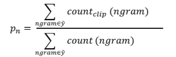

总结一下，可以同时计算p1,⋯,pn，再对其求平均：

$$p=\frac1n\sum_{i=1}^np_i$$

通常，对上式进行指数处理，并引入参数因子**简短惩罚brevity penalty，记为BP**。顾名思义，BP是为了“惩罚”机器翻译语句过短而造成的得分“虚高”的情况。

$$p=BP\cdot exp(\frac1n\sum_{i=1}^np_i)$$

BP值由机器翻译长度和参考翻译长度共同决定。

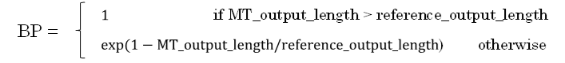

因此，最后得到的 Bleu 得分为：

$$Blue = BP \times exp(\frac{1}{N}\sum^N_{i=1}log{p_i})$$

Bleu 得分的贡献是提出了一个表现不错的**单一实数评估指标**，因此加快了整个机器翻译领域以及其他文本生成领域的进程。

### p184 注意力模型直觉 Attention Model Intuition

如果原语句很长，要对整个语句输入RNN的编码网络和解码网络进行翻译，则效果不佳。相应的bleu score会随着单词数目增加而逐渐降低。

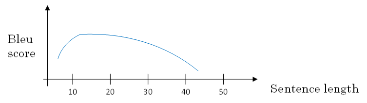

对待长语句，正确的翻译方法是将长语句分段，每次只对长语句的一部分进行翻译。人工翻译也是采用这样的方法，高效准确。也就是说，每次翻译只注重一部分区域，这种方法使得bleu score不太受语句长度的影响。

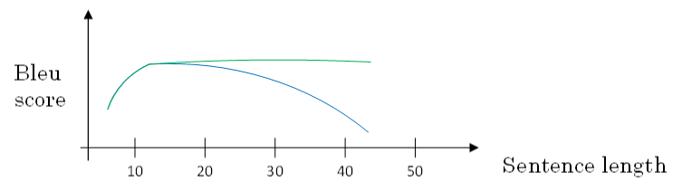

**根据这种“局部聚焦”的思想，建立相应的注意力模型（attention model）。**

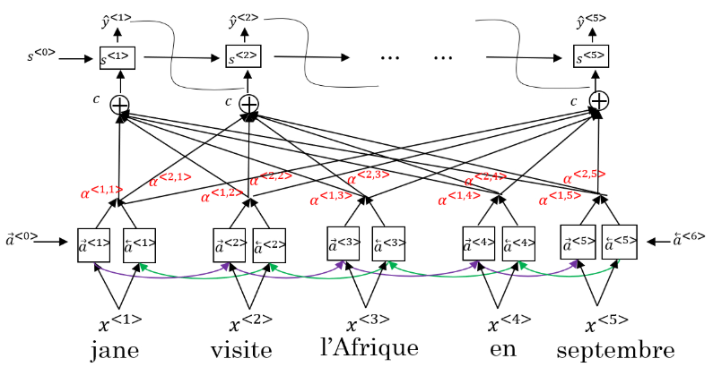

如上图所示，attention model仍由类似的**编码网络（下）和解码网络（上）**构成。其中，$S^{<t>}$由原语句附近单元共同决定，原则上说，离得越近，注意力权重（attention weights）越大，相当于在你当前的注意力区域有个滑动窗。

### p185 注意力模型Attention Models

底层是一个双向循环神经网络（BRNN），该网络中每个时间步的激活都包含前向传播和反向传播产生的激活，可以使用GRU单元或者LSTM。

由于是双向RNN，每个$$a^{\langle t’ \rangle} = ({\overrightarrow a}^{\langle t’ \rangle}, {\overleftarrow a}^{\langle t’ \rangle})$$

RNN编码生成特征，**注意力权重用$\alpha$表示**，**C是各个RNN神经元经过注意力权重得到的参数值**。例如，$\alpha^{<1,t'>}$表示机器翻译的第一个单词“jane”对应的第$t’$个RNN神经元$C^{<1>}$表示机器翻译第一个单词“jane”对应的**解码网络输入参数**。满足：

$$\sum_{t'}\alpha^{<1,t'>}=1$$

$$C^{<1>}=\sum_{t'}\alpha^{<1,t'>}\cdot a^{<t'>}$$

顶层是一个“多对多”结构的循环神经网络，第 $t$ 个时间步的输入包含该网络中前一个时间步的激活 $s^{\langle t-1 \rangle}$、输出 $y^{\langle t-1 \rangle}$ 以及底层的 BRNN 中多个时间步的激活 $c$，其中 $c$ 有（**注意分辨 $\alpha$ 和 $a$）**：

$$c^{\langle t \rangle} = \sum_{t’}\alpha^{\langle t,t’ \rangle}a^{\langle t’ \rangle}$$

其中，**参数 $\alpha^{\langle t,t’ \rangle}$ 即代表着 $y^{\langle t \rangle}$ 对 $a^{\langle t' \rangle}$ 的“注意力权重”**，总有：

$$\sum_{t’}\alpha^{\langle t,t’ \rangle} = 1$$

为了让上式成立，我们使用 Softmax 引入参数$e^{<t,t'>}$来确保，因此有：

$$\alpha^{\langle t,t’ \rangle} = \frac{exp(e^{\langle t,t’ \rangle})}{\sum^{T_x}_{t'=1}exp(e^{\langle t,t’ \rangle})}$$

而对于 $e^{\langle t,t’ \rangle}$，我们通过神经网络学习得到。输入为 $s^{\langle t-1 \rangle}$ 和 $a^{\langle t’ \rangle}$，如下图所示：

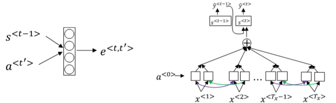

Attention model的一个缺点是其计算量较大，若输入句子长度为$T_x$，输出句子长度为$Ty$，则计算时间约为$T_x∗T_y$。但是，其性能提升很多，计算量大一些也是可以接受的。

### p186 语音识别Speech recognition

在语音识别任务中，输入是一段以时间为横轴的音频片段，输出是文本。

音频数据的常见预处理步骤是运行音频片段来生成一个声谱图，并将其作为特征。以前的语音识别系统通过语言学家人工设计的**音素（Phonemes）**来构建，音素指的是一种语言中能区别两个词的最小语音单位。**现在的端到端系统中，用深度学习就可以实现输入音频，直接输出文本。**

对于训练基于深度学习的语音识别系统，大规模的数据集是必要的。学术研究中通常使用 3000 小时长度的音频数据，而商业应用则需要超过一万小时的数据。

语音识别系统可以用注意力模型来构建，一个简单的图例如下：

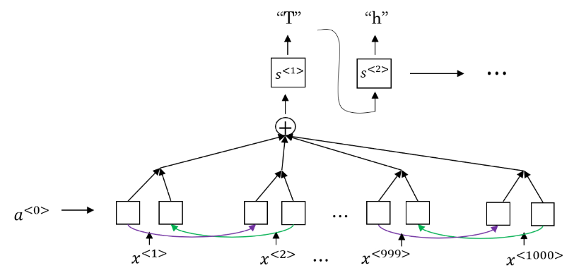

用 **CTC（Connectionist Temporal Classification）**损失函数来做语音识别的效果也不错。由于输入是音频数据，使用 RNN 所建立的系统含有很多个时间步，且输出数量往往小于输入。因此，不是每一个时间步都有对应的输出。CTC 允许 RNN 生成下图红字所示的输出，并将两个空白符（blank）中重复的字符折叠起来，再将空白符去掉，得到最终的输出文本。

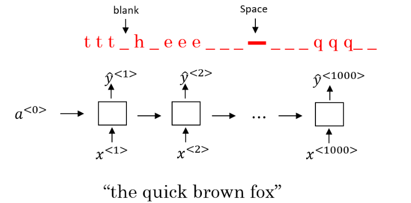

### p187 触发词检测Trigger Word Detection

触发词检测（Trigger Word Detection）**常用于各种智能设备，通过约定的触发词可以语音唤醒设备。

使用 RNN 来实现触发词检测时，可以将触发词对应的序列的标签设置为“1”，而将其他的标签设置为“0”。

但是这种模型有一个缺点，就是通常训练样本语音中的**触发字**较**非触发字数目少得多**，即正负样本分布不均。一种解决办法是在出现一个触发字时，将其附近的RNN都输出1。这样就简单粗暴地增加了正样本。

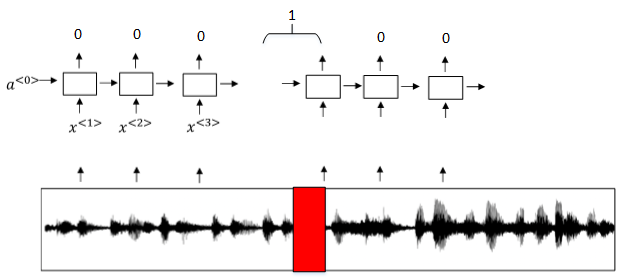

### p188 双向RNN Bidirectional RNN

单向的循环神经网络在某一时刻的预测结果只能使用之前输入的序列信息。**双向循环神经网络（Bidirectional RNN，BRNN）**可以在序列的任意位置使用之前和之后的数据。

其工作原理是增加一个反向循环层，结构如下图所示：双向RNN（bidirectional RNNs）模型能够让我们在序列的某处，不仅可以获取之间的信息，还可以获取未来的信息。

这个改进的方法不仅能用于基本的 RNN，也可以用于 GRU 或 LSTM。

**缺点**是需要完整的序列数据，才能预测任意位置的结果。**例如构建语音识别系统**，**需要等待用户说完并获取整个语音表达，才能处理这段语音并进一步做语音识别。**因此，实际应用会有更加复杂的模块。

在NLP问题中，常用的就是使用双向RNN的LSTM。

## 第四周：Transformer网络

### p189 Transformer网络直觉

Transformer是一种网络架构，它在自然语言处理领域大展风头，如今许多很有效的算法，都是基于Transformer架构而发展起来的。

RNN存在梯度消失的问题，因此RNN很难捕捉到远距离依赖和序列，后来研究了门控循环单元（GRU）和长短期记忆模型（LSTM）模型，在这两个模型中，使用门来控制信息流。

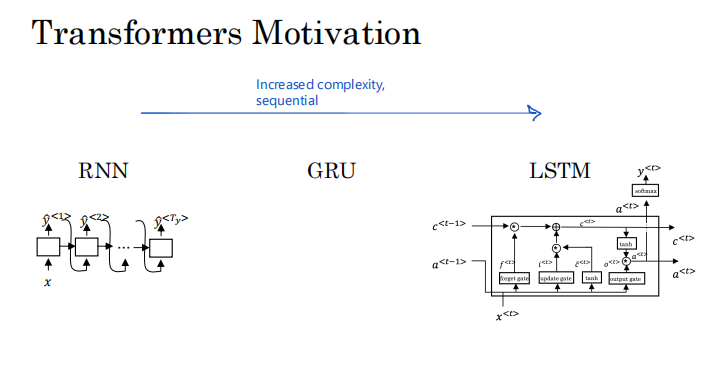

随着RNN 到 GRU 再到 LSTM，模型变得更加复杂**(见上图)**。所有这些模型仍然是**顺序模型**，因为它们摄取了输入，可能是当时输入的句子一个词或一个标记。因此，就好像每个单元都像是信息流的瓶颈。因为例如，要计算这个最终单元的输出，您首先必须计算之前出现的所有单元的输出。

Transformer 架构能够使**整个序列并行运行**计算。因此**可以同时处理整个句子**，而不是一次从左到右处理一个单词。

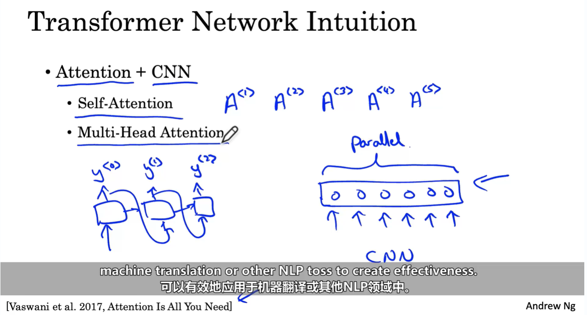

### p190 自注意力机制 self-attention

之前用到的示例，Jane、visite、l'Afrique、en、septembre，我们的目标是为每个单词计算这样的基于注意力的表示。最终会得到其中的五个，因为我们的句子有五个单词。 用**A1 到 A5 表示**

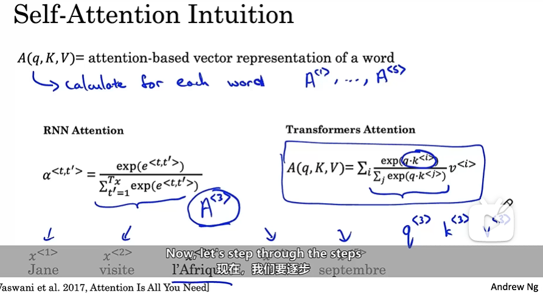

根据上下文 l'Afrique 或Africa可以是历史意义的地点，或者是世界第二大洲。

**根据对 l'Afrique 的看法，选择不同的方式表示，这就是 A(3) 的作用**。

它将查看周围的词，试图找出我们在这句话中谈论Africa的实际情况，并为此找到最合适的表示。

实际计算与之前看到的 RNN 上下文中应用的注意力机制类似。

主要区别在于，对于每个单词，比如 l'Afrique，都有三个值，称为**查询(q)、键(k)和值(v)( query, key, and value)**。这些向量是计算每个词的注意力值的关键输入。

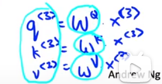

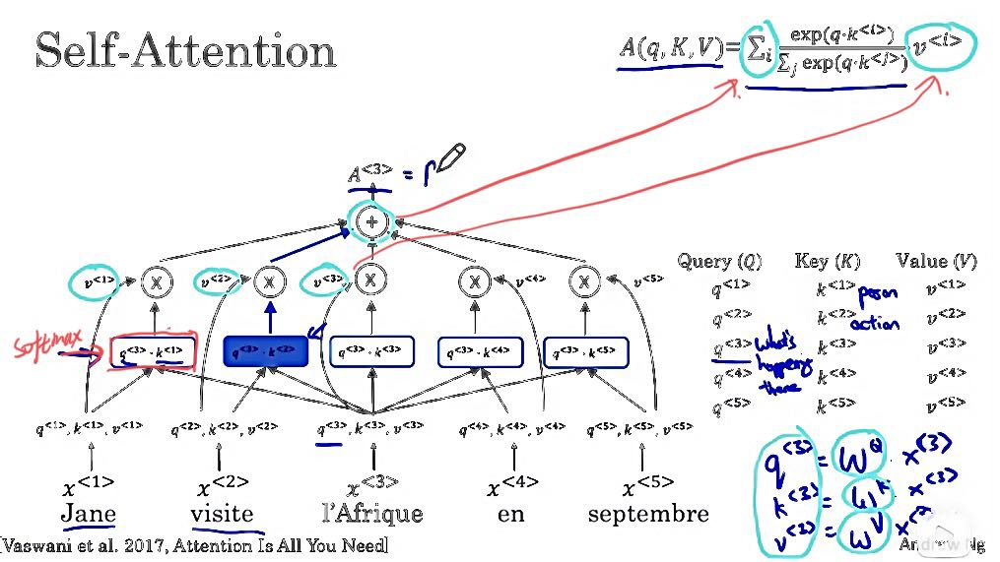

### p191 多头注意力机制 Multi-Head Attention

在实践中，当给定相同的查询、键和值的集合时，通常希望模型可以基于相同的注意力机制学习到不同的行为，然后将不同的行为作为知识组合起来， 捕获序列内各种范围的依赖关系 （例如，短距离依赖和长距离依赖关系）。

为此，多头注意力使用 h 个独立的注意力池化，通过合并各个头的输出，并且通过另一个可以学习的线性投影进行变换，得到最终输出。(类似于CNN使用多个卷积核试图提取图片的不同特征)

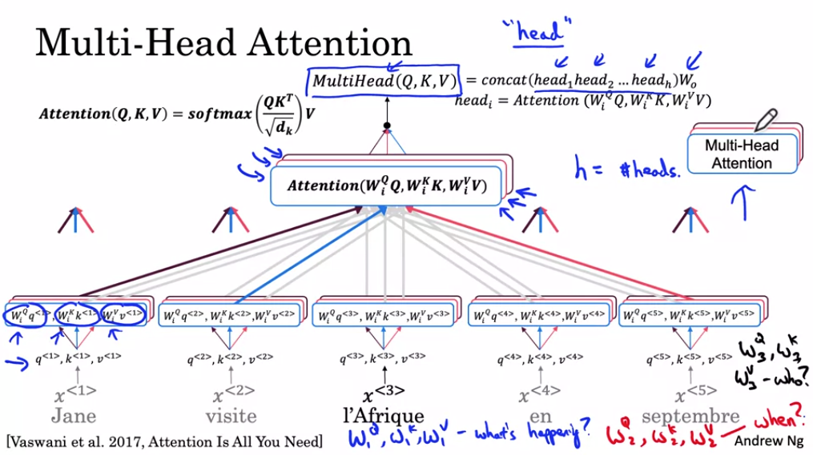

### p192 Transformer网络

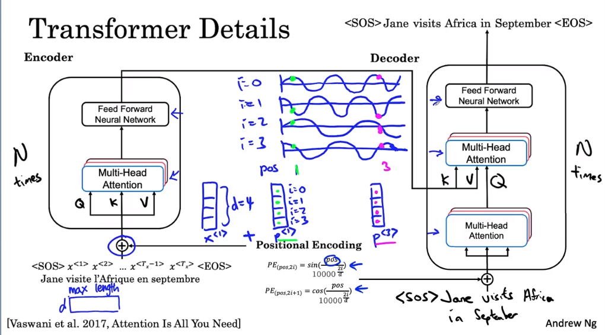

Transformer这的笔记看不懂，以后再详细了解下