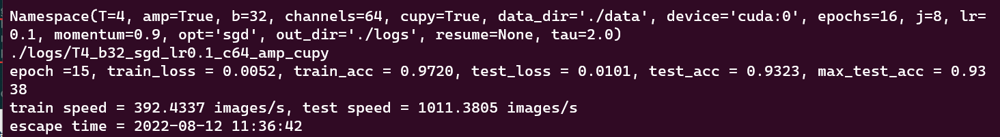
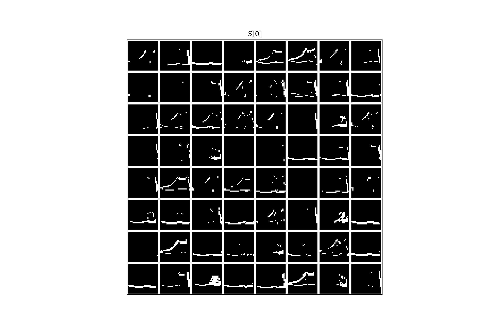
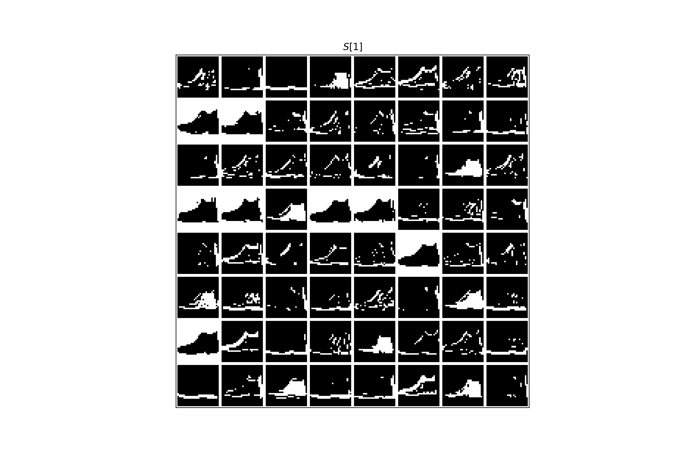
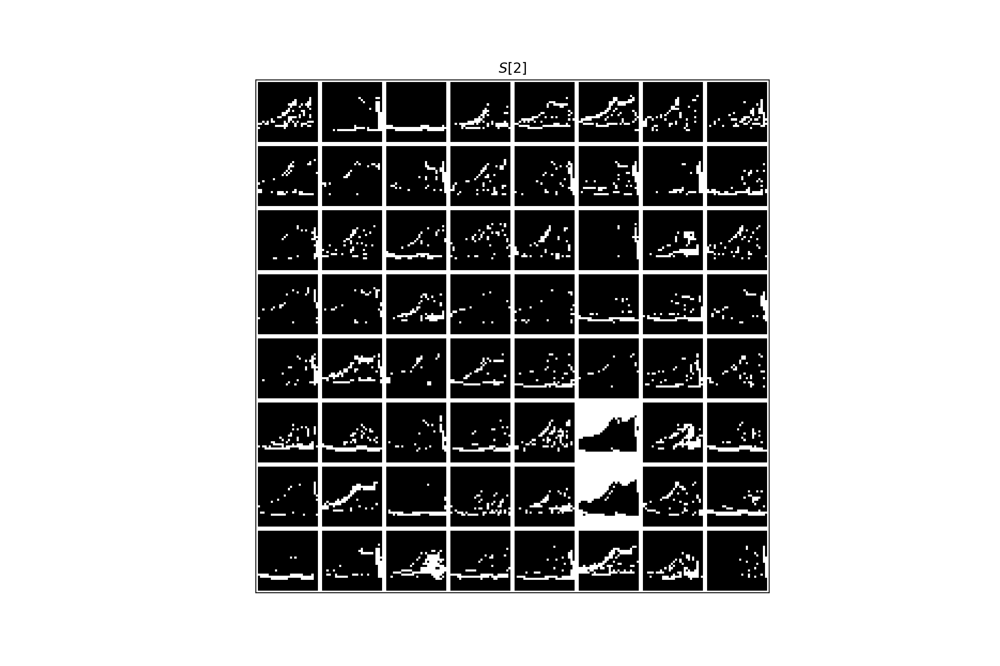
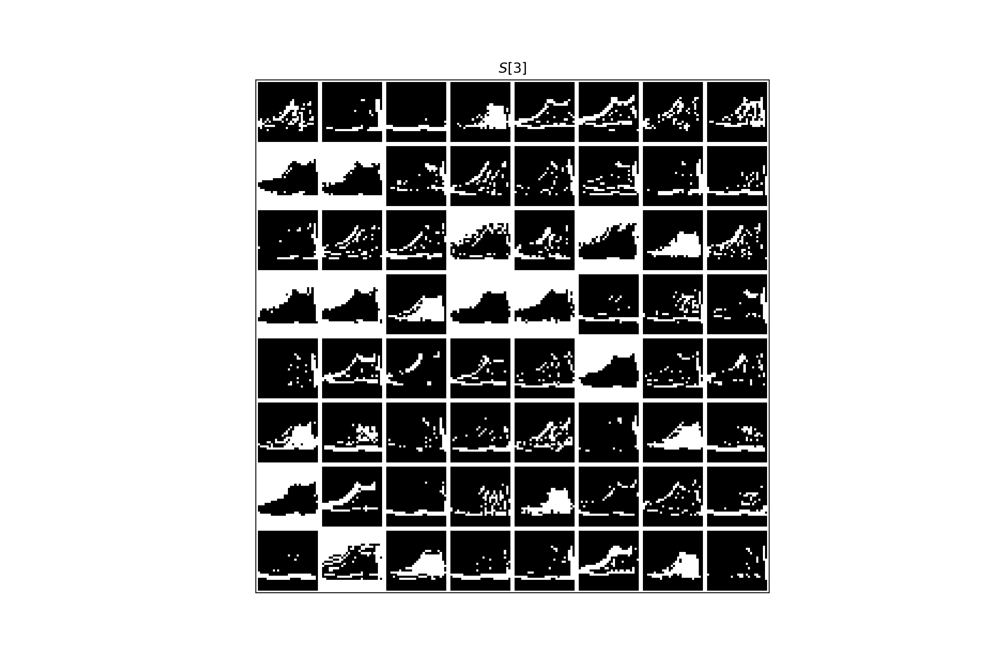
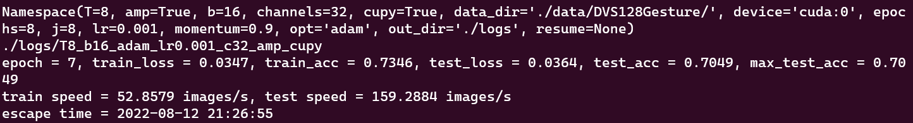
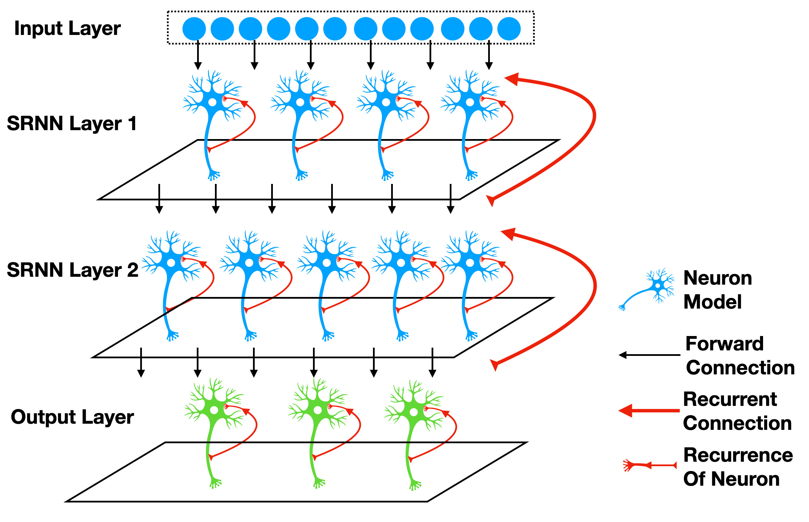
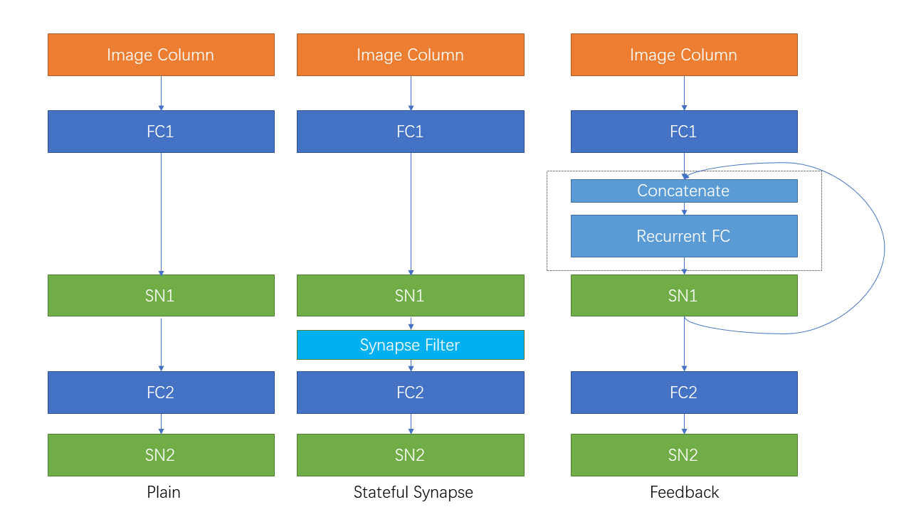

<style>pre {overflow-y: auto;max-height: 300px;}</style>

> 本笔记基于spikingjelly**-Latest**教程https://spikingjelly.readthedocs.io/zh_CN/latest

# 2 spikingjelly 学习笔记2

## 2.1 使用卷积SNN识别Fashion-MNIST

**目标：**搭建一个卷积脉冲神经网络，对 [Fashion-MNIST](https://github.com/zalandoresearch/fashion-mnist) 数据集进行分类。

**Fashion-MNIST数据集**：与MNIST数据集的格式相同，均为 `1 * 28 * 28` 的灰度图片

### 2.1.1定义网络结构

`{Conv2d-BatchNorm2d-IFNode-MaxPool2d}-{Conv2d-BatchNorm2d-IFNode-MaxPool2d}-{Linear-IFNode}`

#### 初始化网络结构

```python
class CSNN(nn.Module):
    def __init__(self, T: int, channels: int, use_cupy=False):
        super().__init__()
        self.T = T

        self.conv_fc = nn.Sequential(
        layer.Conv2d(1, channels, kernel_size=3, padding=1, bias=False),
        layer.BatchNorm2d(channels),
        neuron.IFNode(surrogate_function=surrogate.ATan()),
        layer.MaxPool2d(2, 2),  # 14 * 14

        layer.Conv2d(channels, channels, kernel_size=3, padding=1, bias=False),
        layer.BatchNorm2d(channels),
        neuron.IFNode(surrogate_function=surrogate.ATan()),
        layer.MaxPool2d(2, 2),  # 7 * 7

        layer.Flatten(),
        layer.Linear(channels * 7 * 7, channels * 4 * 4, bias=False),
        neuron.IFNode(surrogate_function=surrogate.ATan()),

        layer.Linear(channels * 4 * 4, 10, bias=False),
        neuron.IFNode(surrogate_function=surrogate.ATan()),
        )
```

**为了更快的训练速度，我们将网络设置成多步模式**，并根据构造函数的要求，决定是否使用 `cupy` 后端：

```python
class CSNN(nn.Module):
    def __init__(self, T: int, channels: int, use_cupy=False):
        # ...
        functional.set_step_mode(self, step_mode='m')

        if use_cupy:
            functional.set_backend(self, backend='cupy')
```

将图片**直接输入到SNN**，**而不是编码后在输入**，是近年来深度SNN的常见做法。

实际的 `图片-脉冲` 编码是由网络中的前三层，也就是 `{Conv2d-BatchNorm2d-IFNode}` 完成。

#### 前向传播

网络的输入直接是 `shape=[N, C, H, W]` 的图片，我们将其添加时间维度，并复制 `T` 次，得到 `shape=[T, N, C, H, W]` 的序列，然后送入到网络层。网络的输出定义为最后一层脉冲神经元的脉冲发放频率。因而，网络的前向传播定义为：

```python
class CSNN(nn.Module):
    def forward(self, x: torch.Tensor):
    # x.shape = [N, C, H, W]
    x_seq = x.unsqueeze(0).repeat(self.T, 1, 1, 1, 1)  # [N, C, H, W] -> [T, N, C, H, W]
    x_seq = self.conv_fc(x_seq)
    fr = x_seq.mean(0)
    return fr
```

### 2.1.2 训练网络

训练过程与上小节MNIST相同。

区别：

- 数据集换成Fashion MNIST

- 启用cupy 运行命令换为

  ```python
  python -m ConvFashionMnist -T 4 -device cuda:0 -b 32 -epochs 16 -data-dir ./data -amp -cupy -opt sgd -lr 0.1 -j 8 -channels 64
  ```

将batch 128 --> 32，epoch  64 --> 16，channels 128 --> 64，运行速度还是十分缓慢，一轮迭代要5分钟左右。



训练准确率0.9720，测试准确率0.9338

```python
tensorboard --logdir logs/T4_b32_sgd_lr0.1_c64_amp_cupy
```

### 2.1.3 可视化编码器

如前所述，我们将图片直接送入网络，实际的编码过程是由网络中的首个 `{Conv2d-BatchNorm2d-IFNode}` 实现的。现在让我们提取出网络中的编码器，输入图片，并将输出脉冲可视化，代码如下：

```python
class CSNN(nn.Module):
    # ...
    def spiking_encoder(self):
        return self.conv_fc[0:3]
def main():
    # ...
    if args.resume:
        checkpoint = torch.load(args.resume, map_location='cpu')
        net.load_state_dict(checkpoint['net'])
        optimizer.load_state_dict(checkpoint['optimizer'])
        lr_scheduler.load_state_dict(checkpoint['lr_scheduler'])
        start_epoch = checkpoint['epoch'] + 1
        max_test_acc = checkpoint['max_test_acc']
        if args.save_es is not None and args.save_es != '':
            encoder = net.spiking_encoder()
            with torch.no_grad():
                for img, label in test_data_loader:
                    img = img.to(args.device)
                    label = label.to(args.device)
                    # img.shape = [N, C, H, W]
                    img_seq = img.unsqueeze(0).repeat(net.T, 1, 1, 1, 1)  # [N, C, H, W] -> [T, N, C, H, W]
                    spike_seq = encoder(img_seq)
                    functional.reset_net(encoder)
                    to_pil_img = torchvision.transforms.ToPILImage()
                    vs_dir = os.path.join(args.save_es, 'visualization')
                    os.mkdir(vs_dir)

                    img = img.cpu()
                    spike_seq = spike_seq.cpu()

                    img = F.interpolate(img, scale_factor=4, mode='bilinear')
                    # 28 * 28 is too small to read. So, we interpolate it to a larger size

                    for i in range(label.shape[0]):
                        vs_dir_i = os.path.join(vs_dir, f'{i}')
                        os.mkdir(vs_dir_i)
                        to_pil_img(img[i]).save(os.path.join(vs_dir_i, f'input.png'))
                        for t in range(net.T):
                            print(f'saving {i}-th sample with t={t}...')
                            # spike_seq.shape = [T, N, C, H, W]

                            visualizing.plot_2d_feature_map(spike_seq[t][i], 8, spike_seq.shape[2] // 8, 2, f'$S[{t}]$')
                            plt.savefig(os.path.join(vs_dir_i, f's_{t}.png'))
                            plt.savefig(os.path.join(vs_dir_i, f's_{t}.pdf'))
                            plt.savefig(os.path.join(vs_dir_i, f's_{t}.svg'))
                            plt.clf()

                    exit()
    # ...
```

使用命令

```python
python -m ConvFashionMnist -T 4 -device cuda:0 -b 4 -epochs 16 -data-dir ./data -amp -cupy -opt sgd -lr 0.1 -j 8 -channels 64 -resume ./logs/T4_b32_sgd_lr0.1_c64_amp_cupy/checkpoint_max.pth -save-es ./logs
```

下面展示一张图片和对应的编码后的脉冲：


<div align = "center">图1 </div>



<div align = "center">图2 </div>



<div align = "center">图3 </div>



<div align = "center">图4</div>



<div align = "center">图5</div>

## 2.2 神经形态数据集处理

`spikingjelly.datasets` 中集成了常用的神经形态数据集，包括 N-MNIST [1](https://spikingjelly.readthedocs.io/zh_CN/latest/activation_based/neuromorphic_datasets.html#nmnist), CIFAR10-DVS [2](https://spikingjelly.readthedocs.io/zh_CN/latest/activation_based/neuromorphic_datasets.html#cifar10dvs), DVS128 Gesture [3](https://spikingjelly.readthedocs.io/zh_CN/latest/activation_based/neuromorphic_datasets.html#dvs128gesture), N-Caltech101 [1](https://spikingjelly.readthedocs.io/zh_CN/latest/activation_based/neuromorphic_datasets.html#nmnist), ASLDVS [4](https://spikingjelly.readthedocs.io/zh_CN/latest/activation_based/neuromorphic_datasets.html#asldvs) 等。所有数据集的处理都遵循类似的步骤，开发人员也可以很轻松的添加新数据集代码。在本节教程中，我 们将以 DVS128 Gesture 为例，展示**如何使用惊蜇框架处理神经形态数据集**。

### 2.2.1自动下载和手动下载

CIFAR10-DVS等数据集支持自动下载。

支持自动下载的数据集，在首次运行时原始数据集将会被下载到数据集根目录下的 `download` 文件夹。

每个数据集的 `downloadable()` 函数定义了该数据集是否能够自动下载，而 `resource_url_md5()` 函数定义了各个文件的下载链接和MD5。示例：

```python
from spikingjelly.datasets.cifar10_dvs import CIFAR10DVS
from spikingjelly.datasets.dvs128_gesture import DVS128Gesture

print('CIFAR10-DVS downloadable', CIFAR10DVS.downloadable())
print('resource, url, md5/n', CIFAR10DVS.resource_url_md5())

print('DVS128Gesture downloadable', DVS128Gesture.downloadable())
print('resource, url, md5/n', DVS128Gesture.resource_url_md5())
```

输出

```python
CIFAR10-DVS downloadable True
resource, url, md5
 [('airplane.zip', 'https://ndownloader.figshare.com/files/7712788', '0afd5c4bf9ae06af762a77b180354fdd'), ('automobile.zip', 'https://ndownloader.figshare.com/files/7712791', '8438dfeba3bc970c94962d995b1b9bdd'), ('bird.zip', 'https://ndownloader.figshare.com/files/7712794', 'a9c207c91c55b9dc2002dc21c684d785'), ('cat.zip',...),......]
DVS128Gesture downloadable False
resource, url, md5
 [('DvsGesture.tar.gz', 'https://ibm.ent.box.com/s/3hiq58ww1pbbjrinh367ykfdf60xsfm8/folder/50167556794', '8a5c71fb11e24e5ca5b11866ca6c00a1'), ('gesture_mapping.csv', 'https://ibm.ent.box.com/s/3hiq58ww1pbbjrinh367ykfdf60xsfm8/folder/50167556794', '109b2ae64a0e1f3ef535b18ad7367fd1'), ('LICENSE.txt', 'https://ibm.ent.box.com/s/3hiq58ww1pbbjrinh367ykfdf60xsfm8/folder/50167556794', '065e10099753156f18f51941e6e44b66'), ('README.txt', 'https://ibm.ent.box.com/s/3hiq58ww1pbbjrinh367ykfdf60xsfm8/folder/50167556794', 'a0663d3b1d8307c329a43d949ee32d19')]
```

DVS128 Gesture数据集不支持自动下载，但它的 `resource_url_md5()` 函数会打印出获取下载地址的网址。用户需要手动从网站上下载。将数据集下载到 `E:/datasets/DVS128Gesture/download`，下载完成后这个文件夹的目录结构为

```
.
|-- DvsGesture.tar.gz
|-- LICENSE.txt
|-- README.txt
`-- gesture_mapping.csv
```

### 2.2.2 获取Event数据

创建训练集和测试集，其中参数 `data_type='event'` 表示我们使用Event数据。

```python
from spikingjelly.datasets.dvs128_gesture import DVS128Gesture

root_dir = './datasets/DVS128Gesture'
train_set = DVS128Gesture(root_dir, train=True, data_type='event')
```

上述代码功能：

- 检测数据集是否存在，如果存在，则进行MD5校验，确认数据集无误后，开始进行解压。将原始数据解压到同级目录下的 `extract` 文件夹
- DVS128 Gesture中的每个样本，是在不同光照环境下，对不同表演者进行录制的手势视频。一个AER文件中包含了多个手势，对应的会有一个csv文件来标注整个视频内各个时间段内都是哪种手势。因此，单个的视频文件并不是一个类别，而是多个类别的集合。惊蜇框架会启动多线程进行划分，将每个视频中的每个手势类别文件单独提取出来

提取各个手势类别的速度较慢，需要耐心等待。运行完成后，同级目录下会多出一个 `events_np` 文件夹，其中包含训练集和测试集：

```
|-- events_np
|   |-- test
|   `-- train
```

打印一个数据：

```python
event, label = train_set[0]
for k in event.keys():
    print(k, event[k])
print('label', label)
```

得到输出为：

```
t [80048267 80048277 80048278 ... 85092406 85092538 85092700]
x [49 55 55 ... 60 85 45]
y [82 92 92 ... 96 86 90]
p [1 0 0 ... 1 0 0]
label 0
```

其中 `event` 使用字典格式存储Events数据，键为 `['t', 'x', 'y', 'p']`；`label` 是数据的标签，DVS128 Gesture共有11类。

### 2.2.3 获取Frame数据

采用 [5](https://spikingjelly.readthedocs.io/zh_CN/latest/activation_based/neuromorphic_datasets.html#plif) 的实现方式。

将原始的Event流积分成Frame数据，是常用的处理方法，将原始的Event数据记为$E(x_i,y_i,t_i,p_i),0≤i<N$

设置 `split_by='number'` 表示从Event数量N上进行划分，接近均匀地划分为 `frames_num=20`， 也就是T段。记积分后的Frame数据中的某一帧为$F(j)$，在$(p,x,y)$位置的像素值为$F(j,p,x,y)$；$F(j)$是从Event流中索引介于$j_l$和$j_r$的Event 积分而来：
$$
\begin{split}j_{l} & = \left\lfloor \frac{N}{T}\right \rfloor \cdot j \\
    j_{r} & = \begin{cases} \left \lfloor \frac{N}{T} \right \rfloor \cdot (j + 1), & \text{if}~~ j <  T - 1 \cr N, &  \text{if} ~~j = T - 1 \end{cases} \\
F(j, p, x, y) &= \sum_{i = j_{l}}^{j_{r} - 1} \mathcal{I}_{p, x, y}(p_{i}, x_{i}, y_{i})\end{split}
$$
其中$ \lfloor \cdot \rfloor $是向下取整，$\mathcal{I}_{p, x, y}(p_{i}, x_{i}, y_{i})$是示性函数，当且仅当 $(p, x, y) = (p_{i}, x_{i}, y_{i})$时取值为1，否则为0。

运行下列代码，惊蜇框架就会开始进行积分，创建Frame数据集：

```python
train_set = DVS128Gesture(root_dir, train=True, data_type='frame', frames_number=20, split_by='number')
```

运行后，同级目录下会出现 `frames_number_20_split_by_number` 文件夹，这里存放了积分生成的Frame数据。

打印一个数据：

```
frame, label = train_set[0]
print(frame.shape)
```

得到输出为：

```
(20, 2, 128, 128)
```

查看1个积分好的Frame数据：

```python
from spikingjelly.datasets import play_frame
frame, label = train_set[500]
play_frame(frame)
```

### 2.2.4 固定时间间隔积分

使用固定时间间隔积分，更符合实际物理系统。例如每 `10 ms` 积分一次，则长度为 `L ms` 的数据，可以得到 `math.floor(L / 10)` 帧。**但 神经形态数据集中每个样本的长度往往不相同，因此会得到不同长度的帧数据**。使用惊蜇框架提供的 [`spikingjelly.datasets.pad_sequence_collate`](https://spikingjelly.readthedocs.io/zh_CN/latest/spikingjelly.datasets.html#spikingjelly.datasets.pad_sequence_collate) 和 [`spikingjelly.datasets.padded_sequence_mask`](https://spikingjelly.readthedocs.io/zh_CN/latest/spikingjelly.datasets.html#spikingjelly.datasets.padded_sequence_mask) 可以很方便的**对不等长数据进行对齐和还原**。

示例代码：

```python
import torch
from torch.utils.data import DataLoader
from spikingjelly.datasets import pad_sequence_collate, padded_sequence_mask, dvs128_gesture
root='D:/datasets/DVS128Gesture'
train_set = dvs128_gesture.DVS128Gesture(root, data_type='frame', duration=1000000, train=True)
for i in range(5):
    x, y = train_set[i]
    print(f'x[{i}].shape=[T, C, H, W]={x.shape}')
train_data_loader = DataLoader(train_set, collate_fn=pad_sequence_collate, batch_size=5)
for x, y, x_len in train_data_loader:
    print(f'x.shape=[N, T, C, H, W]={tuple(x.shape)}')
    print(f'x_len={x_len}')
    mask = padded_sequence_mask(x_len)  # mask.shape = [T, N]
    print(f'mask=\n{mask.t().int()}')
    break
```

输出为：

```
The directory [D:/datasets/DVS128Gesture\duration_1000000] already exists.
x[0].shape=[T, C, H, W]=(6, 2, 128, 128)
x[1].shape=[T, C, H, W]=(6, 2, 128, 128)
x[2].shape=[T, C, H, W]=(5, 2, 128, 128)
x[3].shape=[T, C, H, W]=(5, 2, 128, 128)
x[4].shape=[T, C, H, W]=(7, 2, 128, 128)
x.shape=[N, T, C, H, W]=(5, 7, 2, 128, 128)
x_len=tensor([6, 6, 5, 5, 7])
mask=
tensor([[1, 1, 1, 1, 1, 1, 0],
        [1, 1, 1, 1, 1, 1, 0],
        [1, 1, 1, 1, 1, 0, 0],
        [1, 1, 1, 1, 1, 0, 0],
        [1, 1, 1, 1, 1, 1, 1]], dtype=torch.int32)
```

### 2.2.5 自定义积分方法

惊蜇框架支持用户自定义积分方法。用户只需要提供积分函数 `custom_integrate_function` 以及保存frames的文件夹名 `custom_integrated_frames_dir_name`。 

`custom_integrate_function` 是用户定义的函数，输入是 `events, H, W`，其中 `events` 是一个pythono字典，键为 `['t', 'x', 'y', 'p']` 值为 `numpy.ndarray` 类型。`H` 是数据高度，`W` 是数据宽度。例如，对于DVS手势数据集，H=128, W=128。 这个函数的返回值应该是frames。

`custom_integrated_frames_dir_name` 可以为 `None`，在这种情况下，保存frames的文件夹名会被设置成 `custom_integrate_function.__name__`。

例如，我们定义这样一种积分方式：随机将全部events一分为二，然后积分成2帧。我们可定义如下函数：

```python
import spikingjelly.datasets as sjds
def integrate_events_to_2_frames_randomly(events: Dict, H: int, W: int):
    index_split = np.random.randint(low=0, high=events['t'].__len__())
    frames = np.zeros([2, 2, H, W])
    t, x, y, p = (events[key] for key in ('t', 'x', 'y', 'p'))
    frames[0] = sjds.integrate_events_segment_to_frame(x, y, p, H, W, 0, index_split)
    frames[1] = sjds.integrate_events_segment_to_frame(x, y, p, H, W, index_split, events['t'].__len__())
    return frames
```

```python
train_set = DVS128Gesture(root_dir, train=True, data_type='frame', custom_integrate_function=integrate_events_to_2_frames_randomly)
```

运行完毕后，在 `root_dir` 目录下出现了 `integrate_events_to_2_frames_randomly` 文件夹，保存了我们的frame数据。

查看一下我们积分得到的数据：

```python
from spikingjelly.datasets import play_frame
frame, label = train_set[500]
play_frame(frame)
```

## 2.3 分类 DVS Gesture

先尝试运行

```
python -m ClassifyDVSGesture -T 16 -device cuda:0 -b 16 -epochs 8 -data-dir ./data/DVS128Gesture/ -amp -cupy -opt adam -lr 0.001 -j 8
```

**RuntimeError: CUDA out of memory.** gpu内存不够，不能按给定参数运行。降低各个参数大小 channel = 32   batch = 8   T=8  epoch = 8。调的过于简单了，5分钟不到就结束了，结果显然也不是很好。



再回头详细看代码：

### 2.3.1 网络结构


```python
class DVSGestureNet(nn.Module):
    def __init__(self, channels=128, spiking_neuron: callable = None, *args, **kwargs):
        super().__init__()
        
        conv = []
        for i in range(5):
            if conv.__len__() == 0:
                in_channels = 2
            else:
                in_channels = channels

            conv.append(layer.Conv2d(in_channels, channels, kernel_size=3, padding=1, bias=False))
            conv.append(layer.BatchNorm2d(channels))
            conv.append(spiking_neuron(*args, **kwargs))
            conv.append(layer.MaxPool2d(2, 2))


        self.conv_fc = nn.Sequential(
            *conv,

            layer.Flatten(),
            layer.Dropout(0.5),
            layer.Linear(channels * 4 * 4, 512),
            spiking_neuron(*args, **kwargs),

            layer.Dropout(0.5),
            layer.Linear(512, 110),
            spiking_neuron(*args, **kwargs),

            layer.VotingLayer(10)
        )

    def forward(self, x: torch.Tensor):
        return self.conv_fc(x)
```

### 2.3.2 训练

训练的代码与之前的教程 [使用卷积SNN识别Fashion-MNIST](https://spikingjelly.readthedocs.io/zh_CN/latest/activation_based/conv_fashion_mnist.html) 几乎相同，相同之处不再赘述，下面只介绍差异部分。

定义网络，使用多步模式。若使用 `CuPy` 则将所有的 `neuron.LIFNode` 设置为 `cupy` 后端

```python
# ...
    net = parametric_lif_net.DVSGestureNet(channels=args.channels, spiking_neuron=neuron.LIFNode, surrogate_function=surrogate.ATan(), detach_reset=True)

    functional.set_step_mode(net, 'm')
    if args.cupy:
        functional.set_backend(net, 'cupy', instance=neuron.LIFNode)
# ...
```

### 2.3.3 新建数据集：

```python
# spikingjelly.activation_based.examples.classify_dvsg

def main():
    # ...
    train_set = DVS128Gesture(root=args.data_dir, train=True, data_type='frame', frames_number=args.T, split_by='number')
    test_set = DVS128Gesture(root=args.data_dir, train=False, data_type='frame', frames_number=args.T, split_by='number')
    # ...
```

注意，由 `DataLoader` 打包的数据，第0维总是batch维度，因此我们从 `DataLoader` 读取的数据实际上是 `shape = [N, T, C, H, W]`，因此我们需要转换为SpikingJelly的多步模式使用的 `shape = [T, N, C, H, W]`：

```python
def main():
    # ...
    for epoch in range(start_epoch, args.epochs):
        for frame, label in train_data_loader:
            optimizer.zero_grad()
            frame = frame.to(args.device)
            frame = frame.transpose(0, 1)  # [N, T, C, H, W] -> [T, N, C, H, W]
            # ...

        with torch.no_grad():
        for frame, label in test_data_loader:
            frame = frame.to(args.device)
            frame = frame.transpose(0, 1)  # [N, T, C, H, W] -> [T, N, C, H, W]
            # ...

    # ...
```

DVS Gesture有11类，因此在生成one hot的target时别忘了设置为11类

```python
def main():
    # ...
    label_onehot = F.one_hot(label, 11).float()
    # ...
```

`DVSGestureNet` 输出的并不是脉冲发放频率，而是 `shape = [T, N, 11]` 的原始输出

```python
class DVSGestureNet(nn.Module):
    # ...
    def forward(self, x: torch.Tensor):
        return self.conv_fc(x)
```

因此，我们需要对输出在时间维度上求平均后，得到脉冲发放频率，然后才去计算损失和正确率：

```python
# spikingjelly.activation_based.examples.classify_dvsg

def main():
    # ...
    out_fr = net(frame).mean(0)
    loss = F.mse_loss(out_fr, label_onehot)
    # ...
```

## 2.4 自连接和有状态突触

### 2.4.1 自连接模块

自连接指的是**从输出到输入**的连接



考虑最简单的一种情况，我们给神经元增加一个回路，**使得它在 t 时刻的输出$ s[t]$，会与下一个时刻的外界输入 $x[t+1]$ 相加，共同作为输入**。这可以由 [`spikingjelly.activation_based.layer.ElementWiseRecurrentContainer`](https://spikingjelly.readthedocs.io/zh_CN/latest/sub_module/spikingjelly.activation_based.layer.html#spikingjelly.activation_based.layer.ElementWiseRecurrentContainer) 轻松实现。

[`ElementWiseRecurrentContainer`](https://spikingjelly.readthedocs.io/zh_CN/latest/sub_module/spikingjelly.activation_based.layer.html#spikingjelly.activation_based.layer.ElementWiseRecurrentContainer) 是一个包装器，给任意的 `sub_module` 增加一个额外的自连接。

连接的形式可以使用用户自定义的逐元素函数操作 $z=f(x,y)$ 来实现。

​		记 $x[t] $为 $t$时刻整个模块的输入，$i[t]$ 和 $y[t]$ 是 `sub_module` 的输入和输出（注意 y[t] 同时也是整个模块的输出），则
$$
i[t] = f(x[t], y[t-1])
$$
​		其中 f 是用户自定义的逐元素操作。默认 $y[−1]=0$。

含义 **当前子模块的输入   等于  t时刻整个模块输入   加上    上一时刻该模块的输出**

用 `ElementWiseRecurrentContainer` 来包装一个IF神经元，逐元素操作设置为加法，即
$$
i[t] = x[t] + y[t-1].
$$
给与 $x[t]=[1.5,0,...,0]$ 的输入：

```python
import torch
from spikingjelly.activation_based import layer, functional, neuron

T = 8
N = 1

def element_wise_add(x, y):
    return x + y

net = layer.ElementWiseRecurrentContainer(neuron.IFNode(), element_wise_add)
print(net)
x = torch.zeros([T, N])
x[0] = 1.5
for t in range(T):
    print(t, f'x[t]={x[t]}, s[t]={net(x[t])}')

functional.reset_net(net)
```

输出为：

```
ElementWiseRecurrentContainer(
element-wise function=<function element_wise_add at 0x00000158FC15ACA0>, step_mode=s
(sub_module): IFNode(
    v_threshold=1.0, v_reset=0.0, detach_reset=False, step_mode=s, backend=torch
    (surrogate_function): Sigmoid(alpha=4.0, spiking=True)
)
)
0 x[t]=tensor([1.5000]), s[t]=tensor([1.])
1 x[t]=tensor([0.]), s[t]=tensor([1.])
2 x[t]=tensor([0.]), s[t]=tensor([1.])
3 x[t]=tensor([0.]), s[t]=tensor([1.])
4 x[t]=tensor([0.]), s[t]=tensor([1.])
5 x[t]=tensor([0.]), s[t]=tensor([1.])
6 x[t]=tensor([0.]), s[t]=tensor([1.])
7 x[t]=tensor([0.]), s[t]=tensor([1.])
```

由于存在自连接，即便 t≥1 时 x[t]=0，由于输出的脉冲能传回到输入，神经元也能持续释放脉冲。

可以使用 [`spikingjelly.activation_based.layer.LinearRecurrentContainer`](https://spikingjelly.readthedocs.io/zh_CN/latest/sub_module/spikingjelly.activation_based.layer.html#spikingjelly.activation_based.layer.LinearRecurrentContainer) 实现更复杂的全连接形式的自连接。

### 2.4.2 有状态的突触

将 [`spikingjelly.activation_based.layer.SynapseFilter`](https://spikingjelly.readthedocs.io/zh_CN/latest/sub_module/spikingjelly.activation_based.layer.html#spikingjelly.activation_based.layer.SynapseFilter) 放在普通无状 态突触的后面，对突触输出的电流进行滤波，就可以得到有状态的突触，例如：

```python
import torch
import torch.nn as nn
from spikingjelly.activation_based import layer, functional, neuron

stateful_conv = nn.Sequential(
    layer.Conv2d(3, 16, kernel_size=3, padding=1, stride=1),
    layer.SynapseFilter(tau=100.)
)
```

### 2.4.3 Sequential FashionMNIST上的对比实验

接下来让我们在Sequential FashionMNIST上做一个简单的实验，**验证自连接和有状态突触是否有助于改善网络的记忆能力**。Sequential FashionMNIST指的是 将原始的FashionMNIST图片一行一行或者一列一列，而不是整个图片，作为输入。在这种情况下，网络必须具有一定的记忆能力，才能做出正确的分类。我们将会把 图片一列一列的输入，这样对网络而言，就像是从左到右“阅读”一样，如下图所示：


导入相关的包, 定义一个普通的前馈网络 `PlainNet`：

```python
import torch
import torch.nn as nn
import torch.nn.functional as F
import torchvision.datasets
from spikingjelly.activation_based import neuron, surrogate, layer, functional
from torch.cuda import amp
import os, argparse
from torch.utils.tensorboard import SummaryWriter
import time
import datetime
import sys
class PlainNet(nn.Module):
    def __init__(self):
        super().__init__()
        self.fc = nn.Sequential(
            layer.Linear(28, 32),
            neuron.IFNode(surrogate_function=surrogate.ATan()),
            layer.Linear(32, 10),
            neuron.IFNode(surrogate_function=surrogate.ATan())
        )

    def forward(self, x: torch.Tensor):
        return self.fc(x).mean(0)
```

在 `PlainNet` 的第一层脉冲神经元后增加一个 [`spikingjelly.activation_based.layer.SynapseFilter`](https://spikingjelly.readthedocs.io/zh_CN/latest/sub_module/spikingjelly.activation_based.layer.html#spikingjelly.activation_based.layer.SynapseFilter)，得到一个新的网络 `StatefulSynapseNet`

```python
class StatefulSynapseNet(nn.Module):
    def __init__(self):
        super().__init__()
        self.fc = nn.Sequential(
            layer.Linear(28, 32),
            neuron.IFNode(surrogate_function=surrogate.ATan()),
            layer.SynapseFilter(tau=2., learnable=True),
            layer.Linear(32, 10),
            neuron.IFNode(surrogate_function=surrogate.ATan())
        )

    def forward(self, x: torch.Tensor):
        return self.fc(x).mean(0)
```

给 `PlainNet` 的第一层脉冲神经元增加一个反馈连接 [`spikingjelly.activation_based.layer.LinearRecurrentContainer`](https://spikingjelly.readthedocs.io/zh_CN/latest/sub_module/spikingjelly.activation_based.layer.html#spikingjelly.activation_based.layer.LinearRecurrentContainer) 得到 `FeedBackNet`：

```python
class FeedBackNet(nn.Module):
    def __init__(self):
        super().__init__()

        self.fc = nn.Sequential(
            layer.Linear(28, 32),
            layer.LinearRecurrentContainer(
                neuron.IFNode(surrogate_function=surrogate.ATan(), detach_reset=True),
                in_features=32, out_features=32, bias=True
            ),
            layer.Linear(32, 10),
            neuron.IFNode(surrogate_function=surrogate.ATan())
        )

    def forward(self, x: torch.Tensor):
        return self.fc(x).mean(0)
```

下图展示了3种网络的结构：



分别训练3个模型：

```
python -m spikingjelly.activation_based.examples.rsnn_sequential_fmnist -device cuda:0 -b 256 -epochs 64 -data-dir /datasets/FashionMNIST/ -amp -cupy -opt sgd -lr 0.1 -j 8 -model plain

python -m spikingjelly.activation_based.examples.rsnn_sequential_fmnist -device cuda:0 -b 256 -epochs 64 -data-dir /datasets/FashionMNIST/ -amp -cupy -opt sgd -lr 0.1 -j 8 -model fb

python -m spikingjelly.activation_based.examples.rsnn_sequential_fmnist -device cuda:0 -b 256 -epochs 64 -data-dir /datasets/FashionMNIST/ -amp -cupy -opt sgd -lr 0.1 -j 8 -model ss
```

**不训练模型了，还要比较结果，电脑跑不动**

完整的代码位于 [spikingjelly.activation_based.examples.rsnn_sequential_fmnist](https://github.com/fangwei123456/spikingjelly/blob/master/spikingjelly/activation_based/examples/rsnn_sequential_fmnist.py)。

下图展示了3种网络的训练曲线：


可以发现， `StatefulSynapseNet` 和 `FeedBackNet` 的性能都高于 `PlainNet`，表明自连接和有状态突触都有助于提升网络的记忆能力。

## 2.5 训练大规模SNN

### 2.5.1 使用 activation_based.model

在 [`spikingjelly.activation_based.model`](https://spikingjelly.readthedocs.io/zh_CN/latest/spikingjelly.activation_based.model.html#module-spikingjelly.activation_based.model) 中定义了一些经典网络模型，可以直接拿来使用，使用方法与 `torchvision.models` 类似。以Spiking ResNet [1](https://spikingjelly.readthedocs.io/zh_CN/latest/activation_based/train_large_scale_snn.html#resnet) 为例：

```python
import torch
import torch.nn as nn
from spikingjelly.activation_based import surrogate, neuron, functional
from spikingjelly.activation_based.model import spiking_resnet

s_resnet18 = spiking_resnet.spiking_resnet18(pretrained=False, spiking_neuron=neuron.IFNode, surrogate_function=surrogate.ATan(), detach_reset=True)

print(f's_resnet18={s_resnet18}')

with torch.no_grad():
    T = 4
    N = 1
    x_seq = torch.rand([T, N, 3, 224, 224])
    functional.set_step_mode(s_resnet18, 'm')
    y_seq = s_resnet18(x_seq)
    print(f'y_seq.shape={y_seq.shape}')
    functional.reset_net(s_resnet18)
```

SpikingJelly按照 `torchvision` 中的ResNet结构搭建的Spiking ResNet，保持了 `state_dict().keys()` 相同，因此支持直接加载预训练权重，设置 `pretrained=True` 即可：

### 2.5.2使用 activation_based.model.train_classify

`spikingjelly.activation_based.model.train_classify` 是根据 [torchvision 0.12 references](https://github.com/pytorch/vision/tree/release/0.12/references) 的分类代码进行改动而来，使用这个模块可以很方便的进行训练。

`spikingjelly.activation_based.model.train_classify.Trainer` 提供了较为灵活的训练方式，预留了一些接口给用户改动。例如， `spikingjelly.activation_based.model.train_classify.Trainer.set_optimizer` 定义了如何设置优化器，**默认**为：

```python
class Trainer:
  # ...
  def set_optimizer(self, args, parameters):
      opt_name = args.opt.lower()
      if opt_name.startswith("sgd"):
          optimizer = torch.optim.SGD(
              parameters,
              lr=args.lr,
              momentum=args.momentum,
              weight_decay=args.weight_decay,
              nesterov="nesterov" in opt_name,
          )
      elif opt_name == "rmsprop":
          optimizer = torch.optim.RMSprop(
              parameters, lr=args.lr, momentum=args.momentum, weight_decay=args.weight_decay, eps=0.0316, alpha=0.9
          )
      elif opt_name == "adamw":
          optimizer = torch.optim.AdamW(parameters, lr=args.lr, weight_decay=args.weight_decay)
      else:
          raise RuntimeError(f"Invalid optimizer
           {args.opt}. Only SGD, RMSprop and AdamW are supported.")
      return optimizer

  def main(self, args):
    # ...
    optimizer = self.set_optimizer(args, parameters)
    # ...
```

如果我们增加一个优化器，例如 `Adamax` ，只需要继承并重写此方法，例如：

```python
class MyTrainer(train_classify.Trainer):
    def set_optimizer(self, args, parameters):
        opt_name = args.opt.lower()
        if opt_name.startswith("adamax"):
            optimizer = torch.optim.Adamax(parameters, lr=args.lr, weight_decay=args.weight_decay)
            return optimizer
        else:
            return super().set_optimizer(args, parameters)
```

默认的 `Trainer.get_args_parser` 已经包含了较多的参数设置：

如果想增加参数，仍然可以通过继承的方式实现：

```python
class MyTrainer(train_classify.Trainer):
    def get_args_parser(self, add_help=True):
        parser = super().get_args_parser()
        parser.add_argument('--do-something', type=str, help="do something")
```

`Trainer` 的许多其他函数都可以进行补充修改或覆盖，方法类似，不再赘述。

对于 `Trainer` 及用户自己继承实现的子类，可以通过如下方式调用并进行训练：

```python
trainer = Trainer()
args = trainer.get_args_parser().parse_args()
trainer.main(args)
```

`Trainer` 在训练中会自动计算训练集、测试集的 `Acc@1, Acc@5, loss` 并使用 `tensorboard` 保存为日志文件，**此外训练过程中的最新一个epoch的模型以及测试集性能最高的模型也会被保存下来**。 `Trainer` 支持Distributed Data Parallel训练。

### 2.5.3 在ImageNet上训练

`Trainer` 默认的数据加载函数 `load_data` 加载 ImageNet [2](https://spikingjelly.readthedocs.io/zh_CN/latest/activation_based/train_large_scale_snn.html#id3) 数据集。结合 `Trainer` 和 [`spikingjelly.activation_based.model.spiking_resnet`](https://spikingjelly.readthedocs.io/zh_CN/latest/spikingjelly.activation_based.model.html#module-spikingjelly.activation_based.model.spiking_resnet)，我们可以轻松训练大型深度SNN，示例代码如下：

```python
# spikingjelly.activation_based.model.train_imagenet_example
import torch
from spikingjelly.activation_based import surrogate, neuron, functional
from spikingjelly.activation_based.model import spiking_resnet, train_classify


class SResNetTrainer(train_classify.Trainer):
    def preprocess_train_sample(self, args, x: torch.Tensor):
        # define how to process train sample before send it to model
        return x.unsqueeze(0).repeat(args.T, 1, 1, 1, 1)  # [N, C, H, W] -> [T, N, C, H, W]

    def preprocess_test_sample(self, args, x: torch.Tensor):
        # define how to process test sample before send it to model
        return x.unsqueeze(0).repeat(args.T, 1, 1, 1, 1)  # [N, C, H, W] -> [T, N, C, H, W]

    def process_model_output(self, args, y: torch.Tensor):
        return y.mean(0)  # return firing rate

    def get_args_parser(self, add_help=True):
        parser = super().get_args_parser()
        parser.add_argument('--T', type=int, help="total time-steps")
        parser.add_argument('--cupy', action="store_true", help="set the neurons to use cupy backend")
        return parser

    def get_tb_logdir_name(self, args):
        return super().get_tb_logdir_name(args) + f'_T{args.T}'

    def load_model(self, args, num_classes):
        if args.model in spiking_resnet.__all__:
            model = spiking_resnet.__dict__[args.model](pretrained=args.pretrained, spiking_neuron=neuron.IFNode,
                                                        surrogate_function=surrogate.ATan(), detach_reset=True)
            functional.set_step_mode(model, step_mode='m')
            if args.cupy:
                functional.set_backend(model, 'cupy', neuron.IFNode)

            return model
        else:
            raise ValueError(f"args.model should be one of {spiking_resnet.__all__}")


if __name__ == "__main__":
    trainer = SResNetTrainer()
    args = trainer.get_args_parser().parse_args()
    trainer.main(args)
```

代码位于 `spikingjelly.activation_based.model.train_imagenet_example`，可以直接运行。 在单卡上进行训练：

```python
python -m spikingjelly.activation_based.model.train_imagenet_example --T 4 --model spiking_resnet18 --data-path /datasets/ImageNet0_03125 --batch-size 64 --lr 0.1 --lr-scheduler cosa --epochs 90
```

