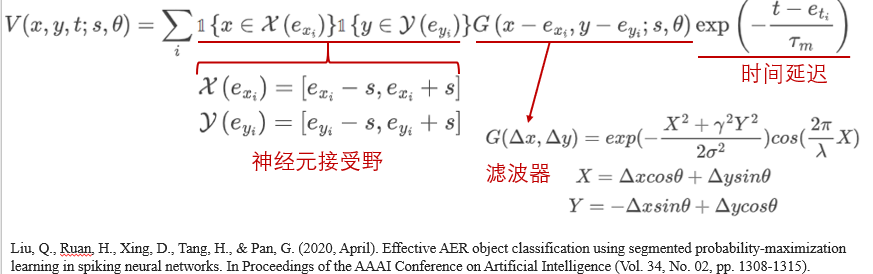
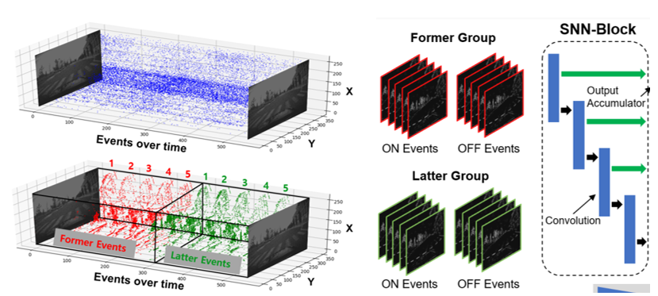
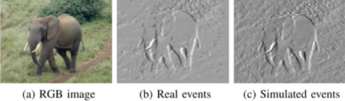

> 参考事件相机与SNN.pptx
>

# 事件相机与SNN

## 1 简要介绍

### 1.1 传统相机

基于帧（frame-based）的视觉传感器（称为“传统相机”）通过设定帧速率对场景进行采样。

传统相机的成像原理，光线透过镜头进入传感器进行感光。

这个过程中，传统相机记录的是从快门张开到闭合，这一段时间里物体所有状态的组合。

**传统相机缺陷：**

- **数据欠采样**：在帧与帧之间容易出现欠采样，遗失“关键”帧的问题；

- **数据冗余**：帧与帧的信息内容重合度较高，所获取的图像数据高度冗余；
- **运动模糊**：当物体运动的速度大于快门闭合速度时，会在成像上形成位移拖影甚至模糊不清，这种现象称为运动模糊。
- **光线敏感**：当光照明暗情况下快速变化时，传统相机需要一定的时间进行曝光度的调整，画面极容易产生过亮或过暗的现象；
- **数据处理延迟**：无论帧率多高，帧与帧之间都具有一定的时间间隔。

### **1.2 事件相机的原理**

事件相机（event-based camera）**异步地观测每个像素的亮度变化，并输出一系列事件**（event）。

对于每个像素点，当该点亮度变化累计超过设定阈值时，则以微秒级分辨率标记时间戳，记录一个事件。

一个事件由**事件发生时刻**、**发生该事件的像素坐标**和**事件发生的极性**（亮度升高或降低）三部分信息组成。

事件从像素阵列传输到外围，然后使用共享的数字输出总线从相机输出，**通常用address-event representation（AER）形式表示**。

**特点：**

- 高时间分辨率：时间刷新率为微秒量级，即百万帧率；
- 高动态范围：传统相机仅为60dB，事件相机高达140dB;
- 低功耗：所消耗的能耗仅为mW级。

### 1.3 事件生成模型 Event Generation Model

事件相机有独立的**像素能够响应他们光电流对数**$L=log⁡(I)$的变化，$I$为亮度。

在一个没有噪音的场景中，**在位置**$X_k=(x_k, y_k )^T$**处的像素亮度变化**为：

$$
ΔL(X_k,t_k )=L(X_k,t_k )-L(X_k,t_k-Δt_k )
$$

 $Δt_k$ 为该像素**上次发生事件**到**现在的时间间隔**。

当**亮度变化达到时间对比阈值 $± C$ 时**，一个**事件** $e_k=(X_k, t_k, p_k)$ 于 $t_k$ 时刻在位置 $X_k=(x_k, y_k )^T$ 处**被触发**，**极性** $p_k∈\{+1, -1\}$ **为亮度变化的标志**。

### **1.4 事件相机面临的挑战**

1. **不同的时空输出：**事件相机的输出与标准相机的输出有根本的不同：**事件是异步的**，**空间稀疏的**，**而图像是同步的，空间密集的**。因此，**针对图像序列设计的基于帧的视觉算法并不直接适用于事件数据**。
2. **不同的光度传感：**与标准相机提供的灰度信息不同，**每个事件包含二进制（增加/减少）亮度变化信息**。亮度的变化**不仅取决于场景的亮度**，还取决于**场景和相机之间当前和过去的相对运动**。
3. **噪声和动态效果：**所有的视觉传感器都是有噪声的，因为光子中存在固有的散粒噪声以及晶体管电路也存在噪声。这种**噪声在事件相机影响尤为明显**。

### **1.5 事件相机的算法与应用**

- 特征/角点/粒子检测与跟踪（Feature/Corner/Particle Detection and Tracking）
- 光流估计（Optical Flow Estimation）

- 视觉信息重建（Reconstruction of Visual Information）
  - 事件强度图像重建（Intensity-Image Reconstruction from events）
  - 视频合成（Video Synthesis）
  - 超分辨率（Super-resolution）

- 深度估计（3D重建）（Depth Estimation (3D Reconstruction)）

- 即时定位与地图构建（Simultaneous Localization And Mapping，SLAM）

- 分割（Segmentation）

  - 目标分割（Object Segmentation）

  - 运动分割（Motion Segmentation）

  - 姿态估计（Pose Estimation）

- 模式识别（Pattern Recognition）

- 信号处理（Signal Processing）

- 神经形态控制（Neuromorphic Control）

目标检测与跟踪在自动驾驶、视频监控、人体行为识别、姿态估计等领域被广泛应用。

**传统相机存在延迟高、易受光照影响、运动模糊等问题**，事件相机的出现很好地克服了上述问题。

但是**事件相机只能捕捉场景的相对亮度变化，不包含常见的纹理颜色**等信息，因此需要研究相关算法进行目标跟踪。

## 2 事件相机的SNN输入

### **2.1 输入编码方案一**

**SNN在S1层接收AER相机的输出**，S1层的尺寸与相机的像素尺寸一致，S1层中每个神经元都具有一个特定尺寸s的接受野，并且对特定方向theta做出响应。

**接受野中出现事件信息时，滤波器G则根据神经元位置与事件地址之间的偏移量，以及方向theta进行滤波，得到响应。最后乘以时间延迟exp以防止较久远的事件对现在产生过多影响。**

这是**唐华锦老师团队**中对事件相机输入的常用处理方案。**这种方案没有充分利用事件中正负极的概念，缺失了事物动态变化的方向；**

### 2.2 输入编码方案二

这种方法将事件数据**按时间划分为了T段**，之后累加事件段每个像素点的事件信息，得到T个正负双通道的图片。**缺点：直接将各时间步的事件累积起来，过多地损失了时间信息，没有充分利用时间相机的高时间分辨率优势，且容易造成局部活跃的像素与不活跃的像素差异过大**

### 2.3 输入编码方案三

**将时间窗口内的时间维度均匀划分为两组**（前组和后组），**每组包含N个事件帧**（图中为5个）。每个事件帧通过**前一帧的时间戳**到**当前时间戳的原始事件累积而成**，包含**正负极两个通道**。因此，**网络的输入由N帧序列组成**，**每帧都具有4个通道**（前组-正极，前组-负极，后组-正极，后组-负极）。

这个方案的每一帧，都混合了一定时间间隔后的事件，帧的内部和帧之间都具有时序关系，但在也**可能存在时间混乱的问题。**

## 3 SNN中的事件相机迁移学习

脉冲神经网络可以实现从**真实图像到事件相机图像的迁移学习**

