> 参考[【高翔】视觉SLAM十四讲_哔哩哔哩_bilibili](https://www.bilibili.com/video/BV16t411g7FR?spm_id_from=333.337.search-card.all.click&vd_source=0ae30021dc2ca3e5667ea157a3453ddb)
>
> [SLAM.pptx]()

# Slam 学习笔记

**Slam (Simultaneous Localization and Mapping) 同步定位与地图构建** 

## 1 简要介绍

- **SLAM：**通俗地来讲，就是**搭载传感器的移动设备**在**未知环境**里跑一圈，跑完之后就能够**同时构建出地图**并且知道自己跑的时候的**移动轨迹**；
- **应用场景：**扫地机器人，自动驾驶以及监控、勘探无人机等
- **分类：**根据传感器的不同，可将目前的研究分为雷达、激光以及视觉SLAM

**传感器选择**：分为**安装在环境中**的传感器与**携带于机器人本体**的

**环境中的传感器限制了应用环境**

- 需要环境能够使用GPS、贴二维码Marker等
- SLAM更强调未知环境

**更重视携带式传感器**

- 单目相机：必须通过相机运动时，根据场景和成像的几何关系来推断距离（近处物体像运动快，反之慢）

  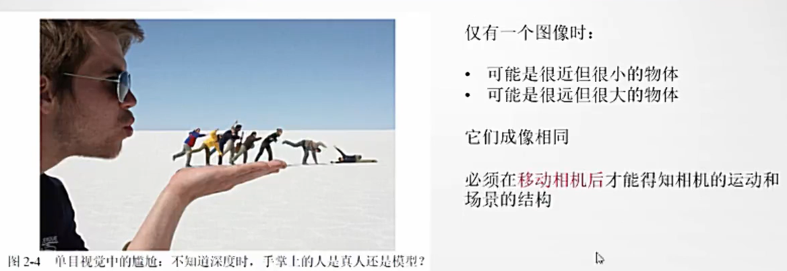

- 双目相机：可以通过左右成像的微小差异判断远近，同时也需要推算距离（计算量非常大）

  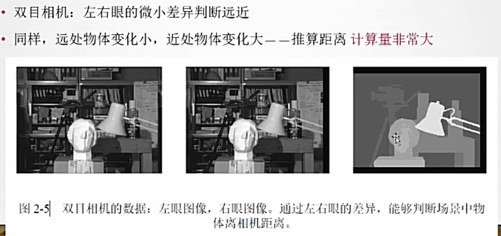

- 深度相机RGB-D：物理手段测量深度（如结构光飞行时间），优点是深度较准确，缺点是量程小且易受干扰

  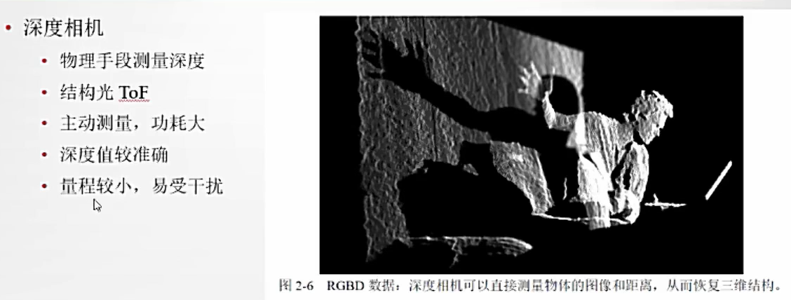

## 2 视觉SLAM框架

### **2.1视觉SLAM的处理过程**

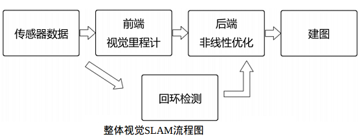

**视觉SLAM流程包括以下步骤：**

- **1.传感器信息读取:** 在视觉SLAM中主要为**相机图像信息的读取和预处理**。如果是在机器人中,还可能有码盘、惯性传感器等信息的读取和同步。

- **2.视觉里程计(Visual Odometry,VO)**: 视觉里程计的任务是**估算相邻图像间相机的运动,以及局部地图的样子**，VO又称为前端(Front End)。视觉里程计**不可避免地会出现累积漂移(Accumulating Drift)问题**。

  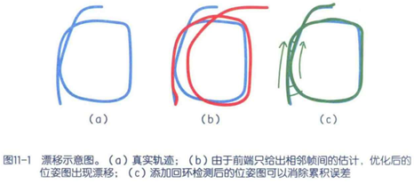

- **3.后端优化 (Optimization):** 后端**接受不同时刻视觉里程计测量的相机位姿**,**以及回环检测的信息**,对它们**进行优化,得到全局一致的轨迹和地图。**由于接在VO之后,又称为后端(Back End)。在视觉 SLAM中，**前端和计算机视觉研究领域更为相关**，比如图像的特征提取与匹配等，**后端则主要是滤波与非线性优化算法**。

- **4.回环检测 (Loop Closing):** 回环检测**判断机器人是否到达过先前的位置**，如果检测到回环,它会把信息提供给后端进行处理。

- **5.建图 (Mapping):** 它**根据估计的轨迹,建立与任务要求对应的地图**。

### **2.2 传感器数据读取**

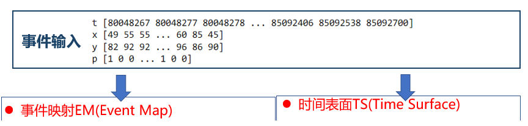

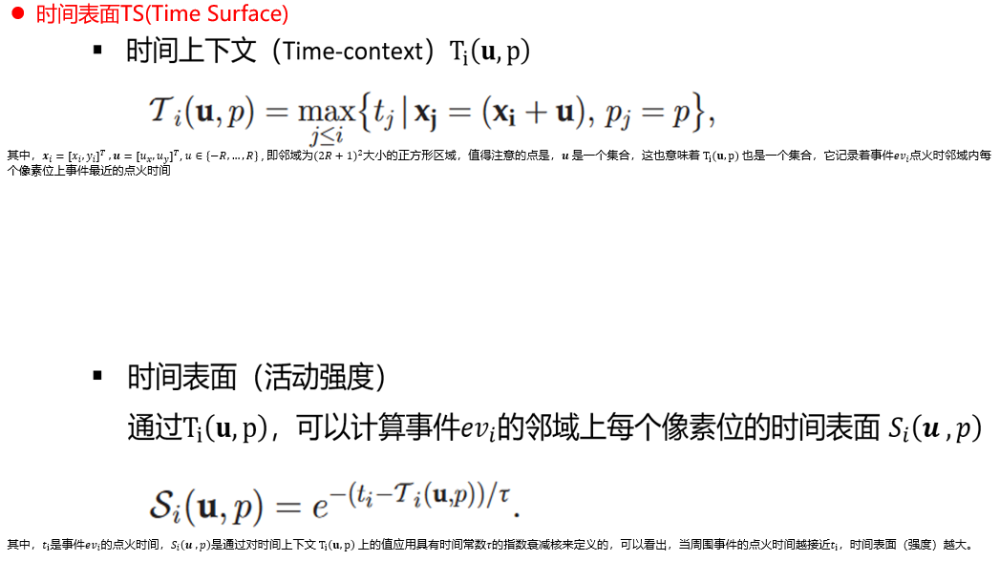

### 2.3 视觉里程计

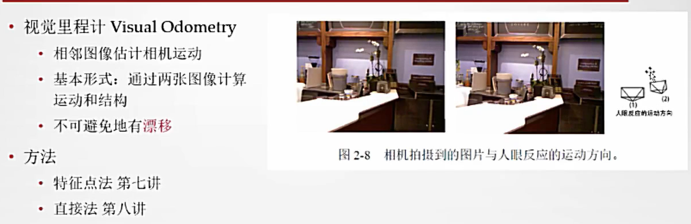

方法

- **特征点法**和**直接法**
  - 特征点法：用图像的特征代表图像（例如角点）来进行匹配，因为角点特征的一些局限，后来又提出了SIFT，SURF，ORB特征
  - 直接法：根据像素的亮度信息来估计相机运动
- 通过相机与空间点的几何关系定量估计运动，计算出运动信息
- 用**后端优化**和**回环检测**解决漂移

视觉里程计和实际里程计一样，他只计算相邻时刻的运动，和过去的信息没有关联。换句话说，VO是一种短时记忆的实现（可以不限于两帧，数量可以更多一些）。

搭载**事件相机**作为视觉里程计，新的问题需要被思考：除了面对复杂环境的优势，事件流的时间属性以及成像的边缘属性理论上能够使得前端对于运动估计更加高效准确，应该如何利用这些来完成编码和算法适配？

### 2.4 后端优化

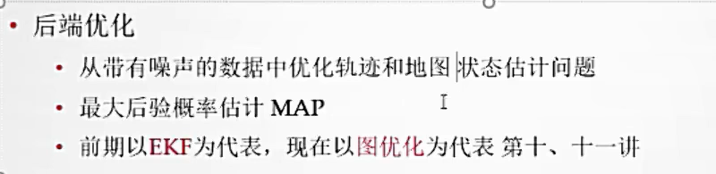

实际上，现在的后段优化，在很长一段时间内直接被称为“SLAM研究”。因为后端优化实际上是在解决一个状态估计问题：**如何从带有噪声的数据中估计整个系统的状态，以及这个状态估计的不确定性有多大（最大后验估计MAP）**。这里的状态包括搭载体自身的轨迹以及地图。该问题的求解跟方程是否为线性，噪声是否满足高斯分布有关。

SLAM问题的本质：对运动主体自身和周围环境空间不确定性的估计

### 2.5 回环检测

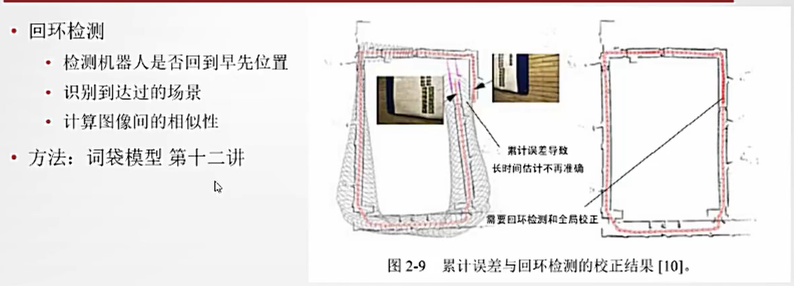

在事件传感器给出的事件数据下，回环检测将更容易实现，同时其实现的必要性也需要被讨论。

### 2.6 建图

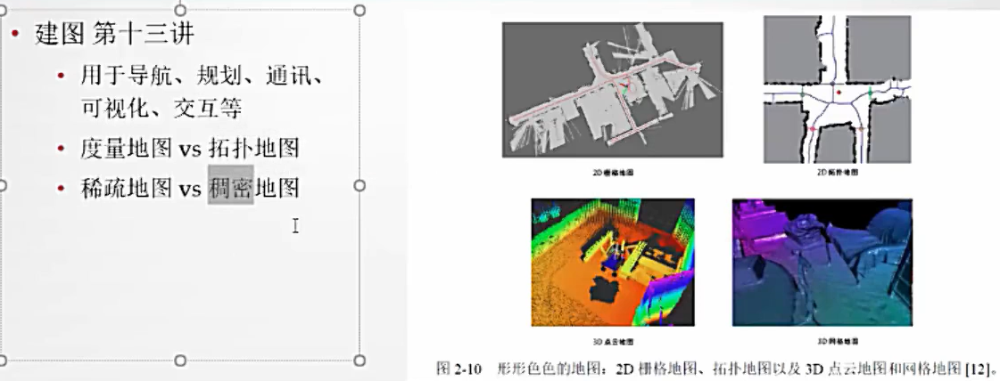

### 2.7 数学描述

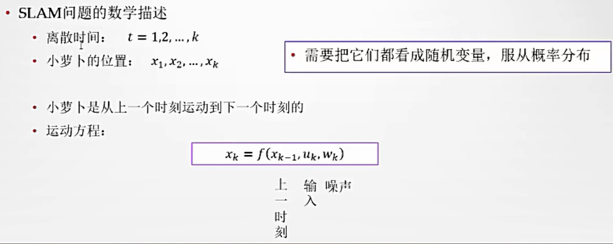

输入不是必需的，比如不会运动的相机

$u_k$ 表示运动传感器的读数(有时也叫输入)

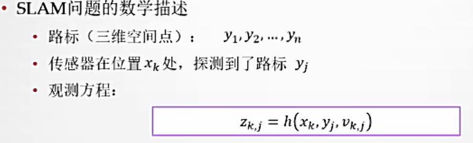

$v_{k,j}$是噪声

$z_{k,j }$表示小萝卜在$x_k $ 位置上看到路标点$y_j $j,产生的观测数据

由于在位置$x_k$处不一定看到所有路标$y$，因此观测方程可能不止一个

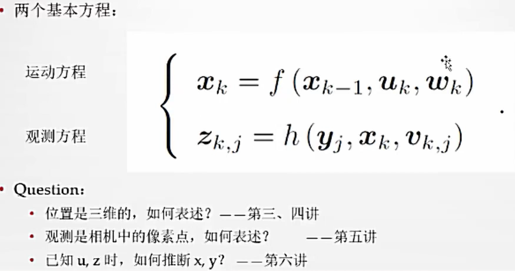

## 3 基于事件相机的SLAM

**EVO:Event-based Parallel Tracking and Mapping**

> Rebecq H, Horstschäfer T, Gallego G, et al. Evo: A geometric approach to event-based 6-dof parallel tracking and mapping in real time[J]. IEEE Robotics and Automation Letters, 2016, 2(2): 593-600.

EVO是16年该团队实现的一种基于事件的视觉里程计算法。算法成功地利用事件摄像机的出色特性来跟踪快速摄像机运动，同时恢复环境的半密集3D 地图

EVO

- EM事件编码
- 自由度位姿跟踪
- 局部建图

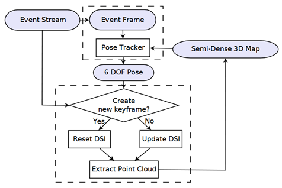

- DSI：视差空间图像，在传统建图中是利用双目视差信息计算深度。在基于事件的单目相机中，使用以参考视点 (RV) 中的虚拟相机为中心的体素网格作为DSI。每个体素值（蓝色）是穿过它的反向投影事件（红色光线）的数量。
- 点云的提取：通过DSI折叠获得深度图，通过体素值判断当前视角下最有可能是事件源的点，即置信度图，在通过置信图计算2D半密集深度图（一个直观的解释，通过在DSI不同切片上的事件源体素值），最后提取3D点云。

- 关键帧（KF）：RV观测的图像就是关键帧，显然，可以通过KF设置DSI，从而获得3D建图。所以随着机器人的探索，在合适的时机设置KF是高效建图的关键。
- 并行追踪和建图：半密集3D地图能够辅助更精确的位姿估计，所以为了能够并行运算，在现有地图不足以满足跟踪时就应创建KF。每当当前相机位姿和最后一个KF之间的距离除以平均场景深度达到阈值（例如 15%）时，系统就会创建一个KF。这可确保地图在相机移动时及时更新。

EMVS:Event-Based Multi-View Stereo基于事件相机的多立体视野3D环境重建