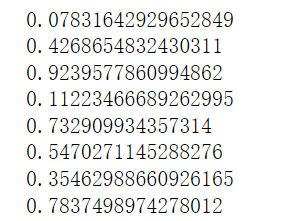

> 参考资料：[深度强化学习 DQN 纯白板逐行代码Python实现_哔哩哔哩_bilibili](https://www.bilibili.com/video/BV1hF411L7qu?spm_id_from=333.999.0.0)

# DQN

## 陌生函数

### numpy.interp()

**线性插值函数**

- **参数x**：为当前插入点横坐标

- **参数xp**：原始数据点的横坐标

- **参数fp**：原始数据点的纵坐标

- **返回值y**：以x为横坐标的插入点纵坐标

- **此方法目的**：使探索率$\epsilon$ 递减，在刚开始时探索性大一些，然后慢慢减小探索率。

  当x超出xp的范围时，保持不变，如下图保持在0。

```python
import numpy as np
import matplotlib.pyplot as plt

x = 50000
xp = [0, 10000]
fp = [1, 0]
y = np.interp(x, xp, fp)
plt.plot(xp, fp, '-o')
plt.plot(x, y, 'x')
plt.show()
```


### random.random()

**生成[0,1]区间的随机数**

**目的：**如果随机数小于等于$\epsilon$，就随机采样

```python
import random 
for i in range(15):
    n = random.random()
    print(n)
```



### random.sample()

从100内随机抽取8个不同的数。

**目的：**从经验集中随机抽取batch个数据

```python
n = random.sample(range(0，100),8)
print(n)
```


### np.random.randint()

**生成[low,high)内的随机整数**

**目的**：初始化经验集合中的动作集，CartPole-v0只有左右两个动作，取值为0，1

```python
import numpy as np
for i in range(15):
    n = np.random.randint(low=0,high=2,size=5,dtype=np.uint8)
    print(n)
```


### env = gym.make()

env = gym.make('CartPole-v0') 创建一个环境。

#### env.reset()

对环境进行重置,得到初始的observation

#### env.action_space.sample()

指从动作空间中**随机选取**一个动作

#### env.step(action)

指在环境中采取选择的动作，这里会返回reward等信息

```python
observation, reward, terminated, truncated, info= env.step(action)  
```

- **observation:**对下个状态的观测值
- **reward**：采取行动后获得的奖励
- **terminated, truncated**：是否game over 
  - **truncated**：指因物理因素，如内存超出导致 terminal state到来前game over。

### torch.gather

**目的：**根据动作集的下标找到使得eval_Q最大的Q值


[(24条消息) torch.gather()用法_飞呀飞呀飞呀的博客-CSDN博客_torch。gather](https://blog.csdn.net/yin_fei_0825/article/details/124785183?spm=1001.2101.3001.6650.2&utm_medium=distribute.pc_relevant.none-task-blog-2~default~ESLANDING~default-2-124785183-blog-90260550.relrec_prioritylanding&depth_1-utm_source=distribute.pc_relevant.none-task-blog-2~default~ESLANDING~default-2-124785183-blog-90260550.relrec_prioritylanding&utm_relevant_index=5)


