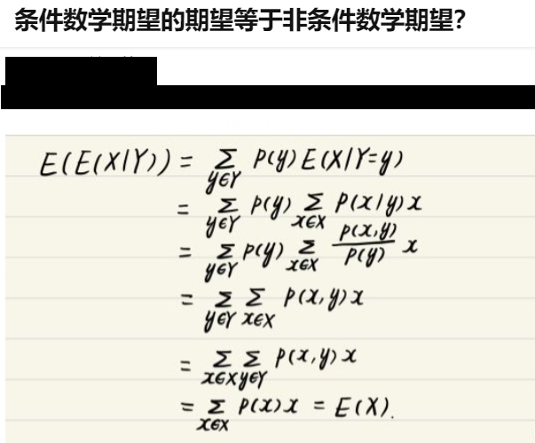
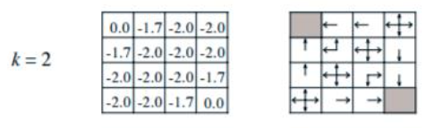
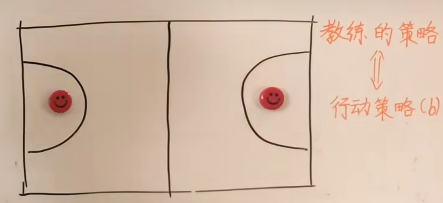
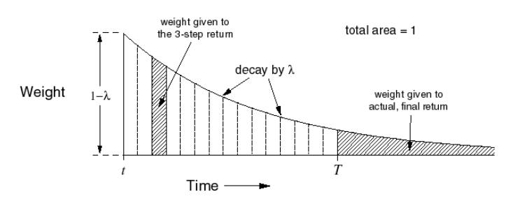
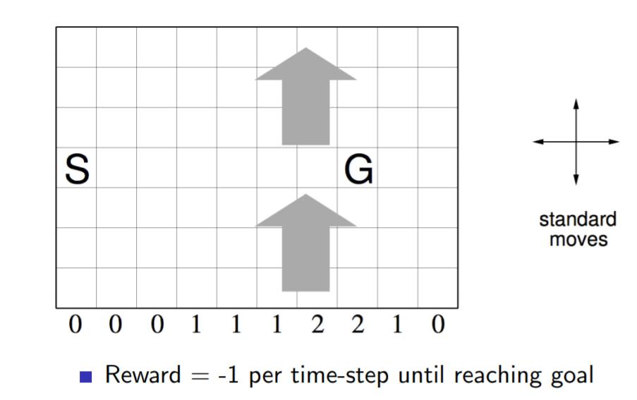
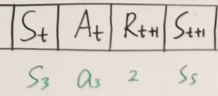
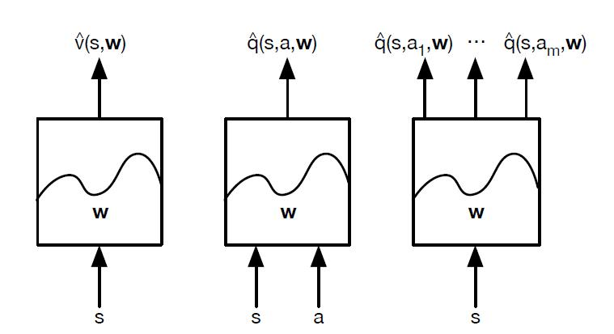

# 第一节 强化学习入门

## 1.1 基本概念

定义：与环境互动当中为了达成某个目标而进行的学习过程

**强化学习(Reinforcement Learning)**是和**监督学习**，**非监督学习**并列的第三种机器学习方法。

**强化学习来和监督学习最大的区别**：

- 它是没有监督学习已经准备好的训练数据输出值。
- **强化学习只有奖励值**，这个奖励值和监督学习的输出值不一样，它不是事先给出的，而是**延后给出的**。
- 强化学习的**每一步与时间顺序前后关系紧密**。而监督学习的训练数据之间一般都是独立的，没有这种前后的依赖关系

## 1.2 基本要素

**第一层结构：Basic Element 基本元素**

1. **Agent** 与环境互动的主体（玩家）
2. **Environment** 环境 （游戏本身）
3. **goal** 目标（根据游戏玩法确定）

玩家在与环境互动的过程中为了达成一个目标而进行的学习过程。

**第二层结构：Main Element 主要元素**

1. **State** 玩家和环境会处于某种状态 例如围棋棋盘有 3^361个状态
2. **Action** 在某一状态下，玩家做出的某种行动
3. **Reward** 奖励（通常为一个实数，可以为0） Agent 在某State下采取特定Action后所得到的**即时反馈**

**强化学习目的**：最大化奖励

**第三层结构：Core Element 核心元素**

1. **Policy** 策略 在某一状态下，玩家应该采取什么行动（某一函数，输入是状态，输出是行动）

2. **Value** 策略函数取决于价值函数。通常有两种。预期将来会得到的所有奖励之和。

   1. **State Value 状态价值函数**：输入是状态，输出一个实数，**即状态的价值。**

      **当前状态下玩家能得到的所有奖励的一个期望值**。玩家应该选择使价值尽可能大的状态。

   2. **State-Action Value 状态行动价值函数** ：**在特定状态下，采取某种行动所具有的价值。**

**两个特点：**

1. Trial and Error 试错
2. Delayed Reward 延迟奖励 

**核心问题：**exploration vs exploitation 类似 动态规划 vs 贪心算法

# **第二节 马尔可夫决策过程（MDP）**

## 2.1 名词解释

- **随机变量（Random Variable）**：如$X$。通常用大写字母来表示一个随机事件

- **随机过程（Stochastic Process）**：随机过程的研究对象不在是单个的随机变量，而是**一组随机变量**，并且这**一组随机变量之间存在着一种非常紧密的关系**（**不相互独立**）记为： $\{S_t\}^∞_{t=1}$ 

- **马尔科夫链（Markov Chain）**即马尔可夫过程：是一种特殊的随机过程——具备**马尔可夫性**的**随机过程**。

  - **马尔可夫性：**满足 $P(S_{t+1}∣S_t ,S_{t−1}...S_1)=P(S_{t+1}∣S_t)$

    **$S_{t+1}$与$S_t$之间存在关系，和以前的时刻的没有关系**，即只和“最近的状态” 有关系。

- **状态空间模型（State Space Model）**：指马尔可夫链 + 观测变量

  

  以$a_2$为例，$a_2$只和$s_2$有关和$s_1$, $s_3$无关。

- **马尔可夫奖励过程（Markov Reward Process）**:马尔可夫链+奖励

  

  $S_t$到$S_{t+1}$ 获得奖励$R_{t+1}$

- **马尔可夫决策过程（Markov Decision Process）**:马尔可夫链+奖励+行动。

  在马尔可夫决策过程中，所有的**状态**是我们看成离散的，有限的集合。所有的**行为**也是离散有限的集合。

  

  - $S_t$:某时刻的状态
  - $A_{(s)}$： **某一个状态**下的行为，$t$时刻状态$S$下的行动记作$A_t$
  - $R_{t+1}$：从状态$S_t$经过行动$A_{(s)}$ 到$S_{t+1}$状态的奖励。**注意记作了R t+1。**

  

## 2.2 动态特性

- **马尔科夫链**

  马尔可夫链只有一个量——**状态**。每个状态之间可以互相转化。

  

  把所有的状态写成矩阵的形式，就成了**状态转移矩阵**。

  **用状态转移矩阵**来描述马尔可夫链的**动态特性**。

  

  ⻢尔科夫过程是⼀个⼆元组（S， P） ， 且满⾜： **S是有限状态集合， P是状态转移概率矩阵。**

  

- **MRP奖励过程**：像是随波逐流的小船，没有人为的干预，小船在大海中随波逐流。

- **MDP马尔可夫决策过程**：相比较MRP中的小船来说，多了“人划船桨”的概念，可以控制船的走向。

  

  $s_1$**状态到$s_2$状态** : agent从$s_1$发出action $A_1$，使得$s_1$状态转移到$s_2$状态，并从$s_2$状态得到一个$R_2$的奖励。这是一个**动态的过程**。

  - **动态函数：**定义了**MDP**的**动态特性**。

    $$p(s^′ ,r∣s,a) = P_r\{S_{t+1} =s^′ ,R_{t+1} =r∣S_t  = s,A_t  =a\}$$

  - **状态转移函数**： 所有r对应的动态函数求和（去掉r）

    $$p(s ^′∣s,a) = P_r\{S_{t+1} =s^′∣S_t  = s,A_t  =a\} = \displaystyle \sum_{r∈R} p(s^′ ,r∣s,a) $$

  - **reward的动态性：** 在 s 和 a 选定后，r 也有可能是不同的，即 r 也是随机变量。但是，大多数情况在 s 和 a 选定后 r 是相同的。

## 2.3 策略，价值函数

- **策略**

  - **定义**：**即如何挑选下一步的行动，策略用$\pi$表示，**在策略中起主要作用的就是`action`，即$A_t$ 

  - **分类**：

    - **确定性策略**：和时间$t$没有关系，只和这个状态有关，只要遇到这个状态，就做出这样的选择。
    - **随机性策略：**与确定性策略相对，不同action的概率不同

    

- **最优策略**

  在所有的策略中一定存在至少一个**最优策略**。`reward`有**延迟性（delay），很多游戏只有到结束的时候才会知道是否赢了或者输了，才会得到反馈。**不能用当前的reward来衡量策略的好坏、优劣。这里引入了**回报**和**价值函数**的概念。

  - **回报（$G_t$）**

    回报是后续多个`reward`的加和，用$G_t$表示$t$时刻的回报，$G_t$**大的策略就好，反之**。

    回报可以表示为$G_t = R_{t+1} +R_{t+2}+ ...+R_T$，$T$可能是有限的，也有可能是无限的

    - **真正的回报**：$G_t = R_{t+1} +γR_{t+2}  +γ^2R_{t+3}  ... +γ ^{T−t−1} R_T  = {\displaystyle \sum_{i=0} ^∞ γ^iR_{t+i+1} },γ∈[0,1],(T→∞)$

    - **缺陷**：在给定一个状态后，选择一个确定的action后（这里还是在随机策略的角度），进入的下一个状态也是随机的。如图：

      

      如果还是用**回报（$G_t$）**对一个策略来进行评估的话，图中至少有9中情况（随机策略，3个action选一种）。**回报（$G_t$）**只能评估的是一个“分叉”而已，如下图绿色路径。

      

  - **价值函数**

    在**指定一个状态$s$，**采取一个**随机策略**$\pi$，然后加权平均。以上图为例，把9 个分叉的**回报（$G_t$）**加权平均，即期望$E$ 。

    得出**价值函数(状态价值函数)**：$$V_π (s)=E_π  [G_t ∣S_t =s]$$

# 第三节 MDP贝尔曼期望方程

**贝尔曼期望方程公式形式**：
$$
v_π(s)=E_π(R_{t+1}+γv_π(S_{t+1})|S_t = s )
$$

$$
q_π(s,a)=E_π(R_{t+1}+γq_π(S_{t+1},A_{t+1})|S_t = s,A_t=a)
$$

## 3.1 价值函数分类

- **状态价值函数：**$v_π (s)$表示
- **状态动作价值函数：**$q_π (s)$表示

在$v_π (s)$中，只有$s$ 是自变量，策略$\pi$ 是一个状态$s$一个action $a$的映射，且只要**策略$\pi$ 确定了，那么状态$s$ ,行动$a$也确定了**。

在$q_π (s)$中，$s$ ,$a$都在变，**无法确定一个映射**(策略$\pi$ ）

## **3.2 两种价值函数之间的关系**

- **$v_π (s)与$$q_π (s)$的关系**

  

  $$v_π (s)=π(a_1∣s)⋅q_π  (s,a_1  )+π(a _2  ∣s)⋅q _π  (s,a _2  )+π(a _3  ∣s)⋅q _π  (s,a_ 3  )$$

  $$v_π (s)=\displaystyle \sum_{a∈A} \pi(a|s) ·q _π  (s,a )$$

  $v_π (s)$**是$q_π  (s,a )$的加权平均**，因此$v_π<=max q_π  (s,a )$

  

- **$v_π (s^′) $ 与$q_π (s)$的关系**

  利用bellman方程，从状态价值函数$v_π(s^′)$表示动作价值函数$q_π(s,a)$
  $$
  q_{\pi}(s,a) = R_s^a + \gamma \sum\limits_{s' \in S}P_{ss'}^av_{\pi}(s')
  $$
  
  
  通俗说就是状态动作价值有两部分相加组成
  
  - 第一部分是**即时奖励**，
  - 第二部分是**环境所有可能出现的下一个状态的概率乘以该下一状态的状态价值**，**最后求和，并加上衰减**。
  
  

**结合上述两个式子，可以得到**
$$
v_{\pi}(s) = \sum\limits_{a \in A} \pi(a|s)(R_s^a + \gamma \sum\limits_{s' \in S}P_{ss'}^av_{\pi}(s'))\\
q_{\pi}(s,a) = R_s^a + \gamma \sum\limits_{s' \in S}P_{ss'}^a\sum\limits_{a' \in A} \pi(a'|s')q_{\pi}(s',a')
$$
**动作价值函数 = 选择该动作得到的reward + 该动作到达的下一个状态的状态价值函数**
**状态价值函数 = 动作1概率 * 动作1的动作价值函数 + 动作2概率 * 动作2的动作价值函数 + 动作i概率 * 动作i的动作价值函数**

## 3.3 bellman贝尔曼方程推导

以$v_π(s)$举例，进行推导。$q_π(s)$同理。

$v_π (s)=\displaystyle \sum_{a∈A} \pi(a|s) ·q _π  (s,a )=v_{\pi}(s) = \sum\limits_{a \in A} \pi(a|s)(R_s^a + \gamma \sum\limits_{s' \in S}P_{ss'}^av_{\pi}(s'))$

## 3.4 bellman最优方程

- **最优价值函数**

  使得**状态价值**$v$最大的策略$\pi$，这个$\pi$ 被称为**最优策略**，**记为$\pi^*$**，进而得到**最优状态价值函数**。同理得到**最优状态动作价值函数**。

  

  **一旦找到这个最优策略$π∗$，那么我们就解决了这个强化学习问题。**

  一般来说，比较难去找到一个最优策略，但是可以通过**比较若干不同策略的优劣来确定一个较好的策略，也就是局部最优解**。

  - **最优的策略**，基于动作价值函数我们可以定义为：
    $$
    \pi_{*}(a|s)= \begin{cases} 1 & {if\;a=\arg\max_{a \in A}q_{*}(s,a)}\\ 0 & {else} \end{cases}
    $$

  - 同时利用状态价值函数和动作价值函数之间的关系，我们也可以得到

    **最优状态价值函数:**

    $$v_{*}(s) = \max_{a}q_{*}(s,a)$$

    

    **最优状态动作价值函数**$$q_{*}(s,a) = R_s^a + \gamma \sum\limits_{s' \in S}P_{ss'}^av_{*}(s')$$

- **bellman最优方程**：将上面两个最优价值函数互相代入，得到
  $$
  v_{*}(s) = \max_a(R_s^a + \gamma \sum\limits_{s' \in S}P_{ss'}^av_{*}(s'))\\
  q_{*}(s,a) = R_s^a + \gamma \sum\limits_{s' \in S}P_{ss'}^a\max_{a'}q_{*}(s',a')
  $$

# 第四节 动态规划DP

> **动态规划 (DP) 是一类优化方法，在给定一个 MDP 描述的完备环境模型的情况下，可以计算其最优策略。**但它的作用有限，因为一般情况下我们**无法准确的知道环境的动力学模型**，此外**计算量也是一个很大的问题**。但 DP 提供了一个必要的基础，**强化学习中很多方法都是对 DP 的一种近似，只不过降低了计算复杂度。**

## 4.1 动态规划与强化学习的联系

- **动态规划的关键点：**
  - **问题的最优解可以由若干小问题的最优解构成**，即通过寻找子问题的最优解来得到问题的最优解。
  - **可以找到子问题状态之间的递推关系**，通过较小的子问题状态递推出较大的子问题的状态。

强化学习的问题恰好是满足这两个条件的。

- **强化学习的两个基本问题：**
  - **预测**：即给定强化学习的6个要素：状态集$S$, 动作集$A$, 模型状态转化概率矩阵$P$, 即时奖励$R$，衰减因子$γ$,  **给定策略$π$**， **求解该策略的状态价值函数$v(π)$**
  - **控制:  求解最优的价值函数和策略**。给定强化学习的5个要素：状态集$S$, 动作集$A$, 模型状态转化概率矩阵$P$, 即时奖励$R$，衰减因子$γ$, 求解最优的状态价值函数$v∗$和最优策略$π∗$　

- **二者关系**

  由状态价值函数的贝尔曼方程，可以看出

  $$v_{\pi}(s) = \sum\limits_{a \in A} \pi(a|s)(R_s^a + \gamma \sum\limits_{s' \in S}P_{ss'}^av_{\pi}(s'))$$

  我们可以**定义出子问题**并求解每个状态的**状态价值最优函数**，同时这个式子**又是一个递推的式子**。意味着利用它，我们可以使用上一个迭代周期内的状态价值来计算更新当前迭代周期某状态$s$的状态价值。可见，使用动态规划来求解强化学习问题是比较自然的。

## 4.2 策略迭代

**策略迭代包括：**

- **策略评估**
- **策略改进**

### 4.2.1 策略评估求解预测问题

- **策略评估定义:**策略评估，就是**已知 MDP，“已知MDP”的意思是知道其动态特性**，也就是$p(s  ′  ,r∣s,a) $**,依据给定的策略$\pi$求$V_\pi(s)$** 
- **基本思路**：从**任意一个状态价值函数**开始，**依据给定的策略**，结合**贝尔曼期望方程**、**状态转移概率**和**奖励**同步**迭代**更新**状态价值函数**，**直至其收敛**，得到该策略下最终的状态价值函数。

#### 4.2.1.1 迭代解求解$V\pi(s)$ 

我们在第k轮迭代已经计算出了所有的状态的状态价值，那么在第k+1轮我们可以利用第k轮计算出的状态价值计算出第k+1轮的状态价值。这是通过贝尔曼方程来完成的，即：
$$
v_{k+1}(s) = \sum\limits_{a \in A} \pi(a|s)(R_s^a + \gamma \sum\limits_{s' \in S}P_{ss'}^av_{k}(s'))
$$
由于我们的策略$π$已经给定，不再写出，对应加上了迭代轮数的下标。

**每一轮可以对计算得到的新的状态价值函数再次进行迭代，直至状态价值的值改变很小(收敛)，那么我们就得出了预测问题的解，即给定策略的状态价值函数$v(π)$。**

考虑状态价值函数的贝尔曼方程，在环境模型已知的情况下，贝尔曼方程共有$ |S| $个。这些方程都是线性方程，联立解$ |S| $个方程组就能得到$ Vπ(s)$。

对于小规模的线性方程组，一般可以使用直接方法，例如**高斯消去法**和**矩阵分解法**。但是对于大规模的线性方程组，则会考虑迭代方法，例如**雅可比迭代法**、**高斯-赛德尔迭代**等。

不同的迭代方法只是构造了不同的迭代形式$（x=Bx+f）$，而**贝尔曼方程已经是一种迭代形式了，因此可以直接进行迭代求解。**现在的关键在于如何证明公式（1）所表示的迭代形式是收敛的。

**贝尔曼迭代公式的收敛性证明**:

**没看懂，先跳过**

#### 4.2.1.2 解析解求解$V\pi(s)$ 

上面的$V\pi(s)$拆开得到

- 前半部分：

  

- 后半部分：

  

于是有下面的解析解解法求解线性方程组。

**解析解求解**：

- 
- 复杂度

#### 4.2.1.3 策略评估例子

过程太长，参考文档[强化学习（三）用动态规划（DP）求解 - 刘建平Pinard - 博客园 (cnblogs.com)](https://www.cnblogs.com/pinard/p/9463815.html)的第3小节。

### 4.2.2 策略改进

现在我们已经可以评估一个策略的好坏了，能得到一个策略的状态价值函数。现在我们考虑如何改进策略。

#### 4.2.2.1 策略改进定理

**上面的策略改进定理证明的5->6行原理如下：**条件数学期望的期望等于非条件数学期望

**策略改进定理告诉我们对于当前状态 s，只要根据$Q_π(s,a)$，找到一个最优的动作，所得到的新策略的$ V_{π′}$ 一定会优于或者等于原始策略$ V_{π}$**。注意到**这里的策略是固定策略**，是一张表，我们在这一步**只是把表中当前状态对应的动作改了**。如果**对所有状态都这么操作，可以得到一个新的策略**：

这样构造出来的贪心策略（当前取最优）满足策略改进定理的条件——公式（8）。所以新的策略一定比原来的策略要好或者一样好。因此，公式（9）一般称之为**策略改进**。

**证明一个迭代算法有效，一般先要证明算法能够逐渐变好，还要证明它一定会收敛到最优解**。下面再来看策略改进方法是否能收敛到最优解

假设 π′ 与 π 一样好，即 $Vπ′(s)=Vπ(s),∀s∈S$，那么有：

最后一个等式就是**贝尔曼最优方程**，因此策略改进方法能够收敛到最优策略。

$$v_{*}(s) = \max_{a}q_{*}(s,a)$$

$$q_{*}(s,a) = R_s^a + \gamma \sum\limits_{s' \in S}P_{ss'}^av_{*}(s')$$

#### 4.2.2.2 策略改进-贪心策略

利用策略改进定理提出一种策略改进的方法——**贪心策略**（Greedy Policy）。对于 $∀s∈S$定义如下公式：

由$$v_π  (s)≤ maxq_π  (s,a)=q_π (s,π ′ (s)) ≤q_π (s,π ′ (s))$$ 由策略改进定理，也即$Vπ′(s)>Vπ(s)$。

**证明：如果 那么，$ v^*_\pi(s)=v^*_{\pi'}(s) =v_*$**

下图中第3行最后一个等号是假设$\pi’$是确定性策略。

### 4.2.3 策略迭代求解控制问题

一旦一个策略 $π′   $  根据 $Vπ $就能得到一个更好的策略。我们就可以通过计算$ Vπ′$ 来得到一个更好的策略。不停的迭代就能得到最优策略。

$ π0→Vπ0→π1→⋯→π∗→V∗$

这种**寻找最优策略**的方法称之为**策略迭代**。

- **定义**：**基于任意一个给定策略评估得到的状态价值**来及时**调整我们的动作策略，这个方法我们叫做策略迭代**(Policy Iteration)

- **步骤**：在策略迭代过程中，我们循环进行两部分工作，

  - 第一步是使用当前策略$π∗$评估计算当前策略的**最终状态价值**$v∗$
  - 第二步是根据状态价值$v∗$根据一定的方法（比如贪婪法）更新策略$π∗$

  接着回到第一步，一直迭代下去，最终得到收敛的策略$π∗$和状态价值$v∗$

- **例子：**当我们**计算出最终的状态价值**后，我们发现，第二行第一个格子周围的价值分别是0,-18,-20，此时我们用贪婪法，则我们调整行动策略为向状态价值为0的方向移动，而不是随机移动。也就是图中箭头向上。

  而此时第二行第二个格子周围的价值分别是-14,-14,-20, -20。那么我们整行动策略为向状态价值为-14的方向移动，也就是图中的向左向上。

  

### 4.2.4 价值迭代求解控制问题

**策略迭代缺点：** **每一次迭代都涉及了多次迭代的策略评估，这本身就是一个需要多次遍历状态集合的迭代过程。**

如果策略评估是迭代进行的，那么收敛到$ Vπ $理论上在极限处才成立。我们是否必须等到其完全收敛，还是可以提早结束呢？其实，**可以提前截断策略评估的过程**，提前截断策略评估过程并不影响策略迭代的收敛。**一种特殊的情况就是策略评估只遍历一次，就立刻进行策略改进**，该算法被称之为**价值迭代**。

**价值迭代是极端情况下的策略迭代**。

更新公式就是把策略评估和策略改进两个公式结合在一起：

对于状态-动作价值函数的价值迭代，可以写为：

上式其实就是学习率 α=1 时的 **Q-learning**。值得注意的是，价值迭代仅仅是将贝尔曼最优方程变为一条更新规则。

如果用贪婪法调整动作策略，当k=3的时候，就已经得到了最优的动作策略。而不用一直迭代到状态价值收敛才去调整策略。那么此时策略迭代优化为价值迭代。

当k=2时，第二行第一个格子周围的价值分别是0,-2,-2，此时我们用贪婪法，则我们调整行动策略为向状态价值为0的方向移动，而不是随机移动。而此时第二行第二个格子周围的价值分别是-1.7,-1.7,-2, -2。那么我们整行动策略为向状态价值为-1.7的方向移动。

和上一节相比，**我们没有等到状态价值收敛才调整策略**，而是**随着状态价值的迭代及时调整策略**, 这样**可以大大减少迭代次数**。此时我们的状态价值的更新方法也和策略迭代不同。**现在的贝尔曼方程迭代式子**如下：
$$
v_{k+1}(s) = \max_{a \in A}(R_s^a + \gamma \sum\limits_{s' \in S}P_{ss'}^av_{k}(s'))
$$
由于策略调整，我们现在价值每次更新倾向于贪婪法选择的最优策略对应的后续状态价值，这样收敛更快。

但即使是价值迭代，每次也要对所有状态进行遍历

### 4.2.5 异步动态规划算法（就地迭代）

在前几节都是**同步动态规划算法**，即**每轮迭代会计算出所有的状态价值并保存起来**，**在下一轮中，我们使用这些保存起来的状态价值来计算新一轮的状态价值**。

**异步动态规划算法**：每一次迭代**并不对所有状态的价值进行更新**，而是依据一定的原则**有选择性的更新部分状态的价值。**

常见的异步动态规划算法有三种：

- **原位动态规划 (in-place dynamic programming)**：不会另外保存一份上一轮计算出的状态价值。而是即时计算即时更新。这样可以减少保存的状态价值的数量，节约内存。代价是收敛速度可能稍慢。
- **优先级动态规划 (prioritised sweeping)：**该算法**对每一个状态进行优先级分级**，**优先级越高的状态其状态价值优先得到更新**。通常使用**贝尔曼误差**来评估状态的优先级。
  - **贝尔曼误差**：即**新状态价值**与**前次计算得到的状态价值差的绝对值**。这样可以加快收敛速度，代价是需要维护一个优先级队列。
- **实时动态规划 (real-time dynamic programming)**：直接使用**个体与环境交互产生的实际经历来更新状态价值**，对于那些个体实际经历过的状态进行价值更新。这样**个体经常访问过的状态将得到较高频次的价值更新**，而与个体关系不密切、**个体较少访问到的状态其价值得到更新的机会就较少**。收敛速度可能稍慢。

### 4.2.6 广义策略迭代

包含了前面所说的一般的策略迭代，价值迭代，还有就地迭代。

**策略迭代**：全款买房(**策略评估$V\pi$算到收敛**)，以旧换新(**策略改进，换新房了**)。

**价值迭代**：首付(**策略评估$V\pi$算一次**)，以旧换新(**策略改进**)。

**就地策略迭代**：几乎0首付(**策略评估某一状态的$V\pi(s_i)$计算一次**)，以旧换新(**策略改进**)。

**小结**：

- 动态规划是我们讲到的第一个系统求解强化学习预测和控制问题的方法。它的算法思路比较简单，主要就是利用贝尔曼方程来迭代更新状态价值，用贪婪法之类的方法迭代更新最优策略。
- 动态规划算法使用全宽度（full-width）的回溯机制来进行状态价值的更新，也就是说，**无论是同步还是异步动态规划，在每一次回溯更新某一个状态的价值时，都要回溯到该状态的所有可能的后续状态**，并利用贝尔曼方程更新该状态的价值。这种全宽度的价值更新方式对于状态数较少的强化学习问题还是比较有效的，但是**当问题规模很大的时候，动态规划算法将会因贝尔曼维度灾难而无法使用。**因此我们还需要寻找其他的针对复杂问题的强化学习问题求解方法。

# 第五节 蒙特卡罗(Monte-Calo, MC)

> ## 两类强化学习问题
>
> - **基于模型的强化学习问题：**
>
>   - **预测问题**，即给定强化学习的6个要素：状态集S, 动作集A, 模型状态转化概率矩阵P 即时奖励R，衰减因子γ,  给定策略π， **求解该策略的状态价值函数v(π)**
>   - **控制问题**，给定强化学习的5个要素：状态集S, 动作集A, 模型状态转化概率矩阵P, 即时奖励R，衰减因子γ, **求解最优的状态价值函数v∗和最优策略π∗**　
>
> - **不基于模型的强化学习问题**：
>
>   很多强化学习问题，没有办法事先得到模型状态转化概率矩阵P，这时如果仍然需要我们求解强化学习问题，那么这就是不基于模型的强化学习问题了。
>
>   它的两个问题**一般的定义**是：　　　　
>
>   - **预测问题**，即给定强化学习的5个要素：状态集S, 动作集A, 即时奖励R，衰减因子γ,  给定策略π， **求解该策略的状态价值函数v(π)**
>   - **控制问题**，也就是求解最优的价值函数和策略。给定强化学习的5个要素：状态集S, 动作集A, 即时奖励R，衰减因子γ, **探索率**ϵ, **求解最优的动作价值函数q∗和最优策略π∗**
>

蒙特卡罗法就是上述不基于模型的强化学习问题。

## 5.1 蒙特卡罗法求解特点

**蒙特卡罗强化学习(Monte Carlo reinforcement learning)**：指在**不清楚 MDP 状态转移概率**的情况下，直接从**经历完整的状态序列 (episode) 来估计状态的真实价值**，并认为**某状态的价值**等于在**多个状态序列中以该状态算得到的所有return 的平均。**

**完整的状态序列 (complete episode)**：指从某一个状态开始，个体与环境交互直到终止状态，环境给出终止状态的奖励为止。完整的状态序列不要求起始状态一定是某一个特定的状态，但是要求个体最终进入环境认可的某一个终止状态。

只有整个状态序列都完成了，对于值函数的估计和策略才会改变。所以蒙特卡罗法可以看作是 episode-by-episode 的，而不是 step-by-step 的。

**特点**：**不依赖状态转移概率**，**直接从经历过的完整的状态序列中学习**。(不基于模型)

**思想**：**用平均收获值代替价值。理论上完整的状态序列越多，结果越准确。**

**动态规划是基于对 MDP 的知识计算值函数**，**蒙特卡罗法通过采样得到的 r 来学习值函数。**仍然通过**值函数和策略相互作用（GPI 概念）**来达到最优。这些 GPI 概念都从动态规划拓展到了蒙特卡罗法中。

## 5.2 蒙特卡罗法求解预测问题

### **5.2.1 状态函数策略评估：**

对于给定的策略，**首先考虑**应用蒙特卡罗法计算**状态值函数**

- **目标：**在给定策略下，从一系列的完整Episode经历中学习,最后求得到该策略下的状态价值函数。

- 一个给定策略$π$的完整有$T$个状态的状态序列如下：

  $$S_1,A_1,R_2,S_2,A_2,...S_t,A_t,R_{t+1},...R_T, S_T$$

  - 对于**MDP中状态价值函数**定义：

    $$v_{\pi}(s) = \mathbb{E}_{\pi}(G_t|S_t=s ) = \mathbb{E}_{\pi}(R_{t+1} + \gamma R_{t+2} + \gamma^2R_{t+3}+...|S_t=s)$$

  - 对于**蒙特卡罗法**来说，由于**不知道状态转移概率**，因此只能**拿平均值近似求期望**。

    如果要求某一个状态的状态价值，只需要求出**所有的完整序列中该状态出现时候的收获(回报)**再取平均值即可近似求解，也就是：

    $$G_t =R_{t+1} + \gamma R_{t+2} + \gamma^2R_{t+3}+...  \gamma^{T-t-1}R_{T}$$

    $$v_{\pi}(s) \approx average(G_t), s.t. S_t=s$$

- 优化方向

  - **在一个Episode里可能会多次出现同一状态。如何解决**

    - **首次访问(first visit)** 蒙特卡罗法

      用**第一次出现状态$ s$** 后产生的 $r$的均值来估计 $v_π(s) $。

    - **每次访问(every visit**) 蒙特卡罗法

      用**所有出现状态$ s $**后的 $r$ 的均值来进行估计$v_π(s)$。

    **first-visit MC** 和 **every-visit MC** 都会随着遇到状态 s 的次数增长而收敛到 $v_π(s )$。

    第二种方法比第一种的计算量要大一些，但是在完整的经历样本序列少的场景下会比第一种方法适用。

  - **累进更新平均值**

    average的公式，要保存所有该状态的收获值之和最后取平均，浪费存储空间。

    - 较好的方法是在迭代计算收获均值

      即每次保存上一轮迭代得到的收获均值与次数，加上当前轮的收获，即可计算当前轮收获均值和次数。公式如下：

      $$\mu_k = \frac{1}{k}\sum\limits_{j=1}^k x_j = \frac{1}{k}(x_k + \sum\limits_{j=1}^{k-1}x_j) =  \frac{1}{k}(x_k + (k-1)\mu_{k-1}) = \mu_{k-1} +  \frac{1}{k}(x_k -\mu_{k-1})$$

      **此时状态价值公式可以写成**
      $$
      N(S_t) = N(S_t)  +1\\
      V(S_t) = V(S_t)  + \frac{1}{N(S_t)}(G_t -  V(S_t) )
      $$
      在**海量数据做分布式迭代**的时候，我们可能无法准确计算当前的次数N(St),这时我们可以用一个系数$α$来代替，即：
      $$
      V(S_t) = V(S_t)  + \alpha(G_t -  V(S_t) )
      $$
      无论数据量是多还是少，算法需要的内存基本是固定的 .

      **同样动作价值函数也可以写成**：
      $$
      Q(S_t, A_t) = Q(S_t, A_t) +\alpha(G_t -  Q(S_t, A_t) )
      $$

蒙特卡罗方法的一个重要事实是，对于**每个状态的估计是相互独立**的。对于一个状态的估计并不会像 DP 方法那样建立在对别的状态的基础上。

**蒙特卡罗方法的第三个优势**：对于一个**单独的状态的估计的计算开销独立于状态数量**，蒙特卡罗方法在面对只需要一个或者一部分状态的值的情况下有着自己的优势。**可以从感兴趣的状态开始产生样本，只对这些状态的 return 取均值，而忽略其他情况**。

### 5.2.2 行为值函数策略评估

**模型已知**时，**仅状态估计就足够可以来决定一个策略**。像 DP 做的那样，只需往前看一步得到 $r(s,a,s′)$ 选取特定动作使得$ r(s,a,s′)+V(s′) $最大就行了。

但是在没有模型的情况下，我们得显式的知道 $Q(s,a)$。

**模型未知时**，只有状态值函数是不够的。**必须要明确地估计出每个行为的值才能够得出一个策略**。因此蒙特卡罗法**首要的目标是估计 $q∗$。**

用 MC 方法估计 Q(s,a) 也比较简单，只需要将对**状态**的访问改为对**状态-动作**的访问

- **首先考虑对于行为值函数的策略评估问题:**

  - **First-visit MC method**：用第一次出现的**状态行为对**(出现状态 s 后并且选择行为 a )产生的 return 的均值来估计 $q_π(s,a)$
  - **Every-visit MC method**：用所有出现的**状态行为对**(出现状态 s 后并且选择行为 a )产生的 return 的均值来估计 $q_π(s,a)$

  **存在问题**：

  - 如果策略是一个固定策略，那么**很多状态-动作二元组将永远不可能被访问到。**那么对于这些状态行为就没有回报，就没法使用 MC 方法完成其值函数的估计。

  **解决方案**：

  - **采用随机策略**:例如 ϵ-策略。

  - **探索初值假定(exploring starts)(试探性出发)**：在状态序列开始时，强**行以某个 Q(s,a) 为起点**进行交互,**保证每一个二元组 (s,a) 都会以非 0 的概率被选为起点**。但这种试探性出发方法在一些真实环境中无法实现，没法强行让环境中的状态变到我们想要的状态。

## 5.3 蒙特卡罗法求解控制问题

在环境模型未知情况下，有了蒙特卡洛策略评估，我们就能估计 $Vπ$, $Qπ$，利用之前所讲到的策略改进方法

就能改进策略。将策略评估与策略迭代结合起来就能得到一个完整的强化学习方法，该方法可以最终得到一个最优策略。

每轮迭代先做策略评估，计算出价值$v_k(s) $，然后基于一定的方法（比如贪婪法）更新当前策略$π$。最后得到最优价值函数$v∗$和最优策略$π∗$。

### 5.3.1 基于试探性出发的蒙特卡洛方法

**定义：每个 (s,a)都有非零的概率可以作为一幕的起点**

在上图所表示的算法中，**无论之前遵循的是哪一个策略，对于每一个状态-动作二元组的所有回报都被累加并平均**也就是说 Q 的计算跟策略没关系，（广义策略迭代并不要求在策略评估阶段对价值函数估计得很好，就像价值迭代里的一样）。可以发现，**上述算法不会收敛到任何一个次优策略，如果真的收敛到了一个次优策略，其价值函数一定会收敛到该策略对应的价值函数，而在这种情况下还会得到一个更优的策略**。只有当策略和价值函数都到达最优的情况下，稳定性才会得到保证，然而这一点还没有被严格证明，这是强化学习理论基础中最重要的开放问题之一。

### 5.3.2 没有试探性出发假设的 MC 控制

**on-policy（同轨策略）** 和 **off-policy（异轨策略）** 的**区别**

> - **行动策略$b$**：**用来生成采样数据序列的策略，必须是软性策略**
> - **目标策略$\pi$**：**待评估，待改进的策略**

**同轨策略**:$b$=$\pi$，且为**软性策略**

**离轨策略**：$b$!=$\pi$

上一节讲到的 **MC-ES** （基于试探性出发Exploring Starts）算法就**是同轨策略方法**，**用于生成轨迹的策略和被改进的策略为同一个策略**。

#### 5.3.2.1 同轨策略

同归策略方法，

**同轨策略下，没有试探性出发假设的蒙特卡洛控制**

此处我们利用一个随机策略来代替试探性出发，保证所有的$ Q(s,a) $都能被访问到。

在给出算法流程之前先给出。

**几种软性策略**的定义：

- **$\epsilon$-Greedy贪心策略**表示:
  $$
  \pi(a|s)= \begin{cases} 1- \epsilon +\frac{\epsilon}m   & {if\; a^{*} = \arg\max_{a \in A}Q(s,a)}\\ \frac{\epsilon}m & {else} \end{cases}
  $$
  **使用1−ϵ的概率（大概率）贪婪地选择目前认为是最大行为价值的行为**，而用ϵ 的概率随机的从所有**m个可选行为**中选择行为。

- **软性策略**:对于任意的 s,a，都有 $π(a|s)>0$ 的策略。
  
  - 注意和试探性出发假设不一样，**试探性出发假设**是**对于任意的 （s,a），都有（s，a）作为轨迹起点的概率大于0.**
- **$\epsilon$-软性策略**：是软性策略的一个特例，以一个较小的 ϵ 概率，随机选择一个动作来保证对于任意的 s,a，都有 π(a|s)>0。
- **$\epsilon$-Greedy贪心策略**是 ϵ-软性策略的一个特例

**流程：**

> **策略改进定理(**policy improvement theorem)：**π和π'是两个确定的策略，如果对所有状态 s∈S有$Qπ(s,π' (s))≥Vπ(s)$，那么策略π'必然比策略π更好，或者至少一样好**。

**证明**：**采用 ϵ-贪心策略的改进方法依然满足策略改进定理**。假设 π′ 是一个 ϵ-贪心策略，π 是一个ϵ-软性策略 (可以看成上一轮的ϵ-贪心策略)，对于任意的 s∈S 有

> 
>
> **下面的q_pi与上面$q_{\pi}$的公式不一样的原因。** 此处改进策略的行动也是不确定的，有1-ε + ε/m的概率是最优行动，以及其它行动等。类似状态价值函数有不同概率选择不同行动，写成不同行动价值函数的期望的形式。
>
> $$q_{\pi}(s,a) = R_s^a + \gamma \sum\limits_{s' \in S}P_{ss'}^av_{\pi}(s')$$

**ϵ-贪心策略的改进方法满足策略改进定理手写推导**

上式中第一个等号根据$\epsilon$-Greedy贪心策略很容易得到，大于等于号中第二项将贪心改为了非贪心形式（一种加权平均的形式）。根据之前的证明，有 $Vπ′≥Vπ$。当改进后的策略与原策略相同时，是满足ϵ-软性策略下的贝尔曼最优方程的，因此一定能达到最优价值函数。

我们现在把动态规划中的固定策略推广到了随机策略上。知道了**如何让策略迭代适用于 ϵ-软性策略上**。将**贪心策略的原生概念扩展到了ϵ-软性策略**上，在迭代时每一步都能保证策略有改进。注意：**这里的分析假设了动作价值函数可以被精确的计算**，但是在策略改进的时候，我们**并不在意动作价值函数是如何被计算的**。因此，我们目前可以**获得 ϵ-软性策略集合中的最优策略了**，不再需要试探性出发假设。

#### 5.3.2.2 重要性采样

可以**利用重要性采样**来**将同轨策略方法修改为异轨策略方法**。

- **问题**：**使用行动策略b进行采样的数据，怎么能够对目标策略$ \pi $下的状态价值进行评估呢？引出重要性采样**

先看一个求期望的例子，假设随机变量 x 是连续型随机变量它服从分布 p(x)。如果我们想求随机变量 f(x) 的期望，有：

从上式我们可以看出，求 $Ex∼p(x)[f(x)]$ 是完全可以利用从分布$ q(x)$ 中采集的样本的进行估计的，在计算时对于每一个样本只需要乘以一个系数 $p(x)/q(x) $就行了。

下面我们将重要性采样用于对价值函数的估计中，根据价值函数的定义，我们可以将其写为以轨迹为单位的形式：

其中 $G(τ)$ 表示轨迹$ τ$ 的累计回报。

假设当前我们**利用策略 $π$ 收集了一系列的轨迹**，想用这些轨迹来**估计 $π′ $ 的状态价值**函数。那么，根据重要性采样公式，有公式9：

其中 $τi $表示第$ i$ 条轨迹，$Wi$ 表示第$ i$ 条轨迹出现的概率比。上述公式9表明是一种普通重要性采样方式，它的估计通常是**无偏的，但方差会比较大**。此外，还有**加权的重要性采样**方法，如下公式10所示，

公式10表示的加权的重要性采样的估计方法是**有偏的**，但是**方差会比较小**，方差会收敛到 0。书中给了两个例子，表明加权的重要性采样具有更低的方差。

有了重要性采样，就能使用异轨策略方法了。

#### 5.3.2.3 增量式实现

在计算 $Vπ(s) $的时候，我们可以采取增量式实现方式，对于普通重要性采样，增量式的实现跟之前在多摇臂赌博机那篇文章中讲的一样，可以写为**公式11**：

对于加权的重要性采样，其增量式写法可以写为**公式12**：

其中 C0=0，很容易就能验证公式 (12) 是等价于公式 （10）的。

**上图中 新的x值为10**，**权重W为10**. **C 是所有X的权重和 = C旧 + W**

#### 5.3.2.4 离轨版本的策略评估

那么**离轨版本的策略评估算法**流程如下：

#### 5.3.2.5 离轨策略蒙特卡洛控制

**对于同轨策略方法来说，策略必须是随机性的策略。**下面给出**离轨策略蒙特卡洛控制**的算法流程。

注意看算法流程中的倒数第二行，退出内循环的条件，退出的原因是**策略 b 产生的轨迹不再等于贪心策略$\pi$所产生的轨迹了**，**因此无法计算同一条轨迹在不同策略下出现的概率的比，也就是无法计算 W 了。这种提前退出，在某些情况下会导致学习速率很慢。**这个问题的严重程度尚无足够的研究和讨论，可以采用后续要讲的时序差分学习来缓解这个问题。此外，算法流程中的最后一行分子为 1，这是因为目标策略是一个贪心策略，它是一个确定性的策略，因此，这条轨迹对这个策略来说出现的概率为 1。

- **蒙特卡洛算法优势**：蒙特卡罗法是**不基于模型**的强化问题求解方法。它可以**避免动态规划求解过于复杂**，同时还可以**不事先知道环境转化模型**，因此**可以用于海量数据和复杂模型**。

- **蒙特卡洛算法缺陷**：这就是它**每次采样都需要一个完整的状态序列**。如果我们没有完整的状态序列，或者很难拿到较多的完整的状态序列，这时候蒙特卡罗法就不太好用了， 也就是说，我们**还需要寻找其他的更灵活的不基于模型的强化问题求解方法。**

# 第六节 时序差分 

> **时序差分（TD）学习**是强化学习中最核心、最新颖的思想。它结合了蒙特卡洛方法和动态规划方法的思想，**可以直接从与环境交互的过程中学习，不需要知道环境模型。**
>
> **时序差分和蒙特卡罗法比它更加灵活，学习能力更强，因此是目前主流的强化学习求解问题的方法，现在绝大部分强化学习乃至深度强化学习的求解都是以时序差分的思想为基础的。**

对于时序差分法来说，我们没有完整的状态序列，只有部分的状态序列，那么如何可以近似求出某个状态的收获呢？回顾贝尔曼方程：

$$v_{\pi}(s) = \mathbb{E}_{\pi}(R_{t+1} + \gamma v_{\pi}(S_{t+1}) | S_t=s)$$

我们可以用$R_{t+1} + \gamma v(S_{t+1})$来近似的代替收获$G_t$。

**TD目标值**：$R_{t+1} + \gamma v(S_{t+1})$

**TD误差：**$R_{t+1} + \gamma V(S_{t+1}) -V(S_t)$

将用**TD目标值**近似**代替收获$G(t)$**的过程称为**引导(bootstrapping)**。这样我们只需要两个连续的状态与对应的奖励，就可以尝试求解强化学习问题了。

## 6.1 时序差分策略评估(预测问题)

**三种方法的区别：**

- **DP：自荐。**根据贝尔曼期望方程的递推形式。本轮的各种状态是根据上一次的各种状态推导出来。**缺点**也很明显：**必须要求环境的动态特性$P(s',r|s,a)$是已知的** 。

- **MC：采样。**不以贝尔曼方程为优化目标，直接优化定义，依据大数定律，让样本均值逼近期望。**缺点**也很明显：**必须把Gt完整序列采样出来，**从$S_t$ 采样到$S_T$,存在延时问题。

  

- **TD：**只采样走一步，然后利用上一轮的$V(s)$进行计算。可以**最大限度的做到实时更新**。

**打篮球案例**

假设在$S_3$ 状态下（持球进攻态）选择行动$a_3$（投球），奖励$R_4$ 有可能是0，1，2，3，4。假设

$R_4=2$ 。不论命中与否，我方进入$S_5$ （防守态）。然后到此停止，**（这一点类似MC）**，利用已有经验$V(S_5)$（当处于防守态时如何行动） ，更新$V(S_3)$ **（这一点类似DP）**。

### 6.1.1 n步时序差分

向前两步，这时我们的收获$G_t$的近似表达式为：
$$
G_t^{(2)} = R_{t+1} + \gamma  R_{t+2} +  \gamma^2V(S_{t+2})
$$
从两步，到三步，再到n步，我们可以归纳出n步时序差分收获$G_t^{(n)}$表达式为:
$$
G_t^{(n)} = R_{t+1} + \gamma  R_{t+2} + ... + \gamma^{n-1} R_{t+n}  + \gamma^nV(S_{t+n})
$$
**当n趋于无穷，n步时序差分就等价于蒙特卡罗法了。**

### 6.1.2 TD(λ)

**n步时序差分**，**选择多少步数作为一个较优的计算参数是需要尝试的超参数调优问题**。

**在不增加计算复杂度的情况下综合考虑所有步数的预测**，引入一个新的参数$λ∈[0,1]$。

**$λ−$收获($G_t^{\lambda} $)**: 是$n$从1到$∞$所有步的收获，乘以权重的和。每一步的权重是$(1-\lambda)\lambda^{n-1}$

​				也即：$$G_t^{\lambda} = (1-\lambda)\sum\limits_{n=1}^{\infty}\lambda^{n-1}G_t^{(n)}$$

进而我们可以得到$TD(λ)$情况下的价值函数的迭代公式：
$$
V(S_t) = V(S_t)  + \alpha(G_t^{\lambda} -  V(S_t) ) \\
Q(S_t, A_t) = Q(S_t, A_t) +\alpha(G_t^{\lambda}-  Q(S_t, A_t) )
$$
**权重定义为$(1−λ)λ^{n−1}$的原因:**

- 如下图所示，随着$n$的增大，其**第$n$步收获的权重呈几何级数的衰减**。当在$T$时刻到达终止状态时，未分配的权重全部给予终止状态的实际收获值。这样可以使一个完整的状态序列中所有的n步收获的权重加起来为1，离当前状态越远的收获其权重越小。

  

- 从前向来看$TD(λ)$， 一个状态的价值$V(S_t)$)由$G_t$得到，而$G_t$又间接由所有后续状态价值计算得到，因此可以认为更新一个状态的价值需要知道所有后续状态的价值。也就是说，必须要经历完整的状态序列获得包括终止状态的每一个状态的即时奖励才能更新当前状态的价值。这和蒙特卡罗法的要求一样，因此$TD(λ)$有着和蒙特卡罗法一样的劣势。当$λ=0$时,就是第二节讲到的普通的时序差分法，当$λ=1$时,就是蒙特卡罗法。

- 从反向来看$TD(λ)$，它可以分析我们状态对后续状态的影响。比如老鼠在依次连续接受了3 次响铃和1 次亮灯信号后遭到了电击，那么在分析遭电击的原因时，到底是响铃的因素较重要还是亮灯的因素更重要呢？如果把老鼠遭到电击的原因认为是之前接受了较多次数的响铃，则称这种归因为频率启发(frequency heuristic) 式；而把电击归因于最近少数几次状态的影响，则称为就近启发(recency heuristic) 式。

**反向的TD价值函数没看明白**,原文链接[强化学习（五）用时序差分法（TD）求解 - 刘建平Pinard - 博客园 (cnblogs.com)](https://www.cnblogs.com/pinard/p/9529828.html)第4小节末。

## 6.2 同轨TD策略控制（SARSA）

> **模型未知时**，只有状态值函数是不够的。**必须要明确地估计出每个 行为状态价值 才能够得出一个策略**。

接上节例子，进入$S_5$ （防守态）后 **按教练策略**（**行动策略b**）假设应该选择行动$a_6$（盖帽）（在待改进策略$\pi$上听教练的话， **行动策略=目标策略**，因此是同轨控制）。并没有真正进入下一个状态。

于是有，其中$Q(S_{t+1},A_{t+1})$ 也是按固有经验选出。

### 6.2.1 SARSA算法概述

它实际上是由S,A,R,S,A几个字母组成的。而S,A,R分别代表状态（State），动作(Action),奖励(Reward)，这也是我们前面一直在使用的符号。这个流程体现在下图：

在迭代的时候，我们首先基于$ϵ−$贪婪法在当前状态$S$选择一个动作$A$，这样系统会转到一个新的状态$S'$, 同时给我们一个即时奖励$R$, 在新的状态$ S'$，我们会基于$ϵ−$贪婪法在状态$S'$选择一个动作$A'$，

但是注意这时候我们**并不执行这个动作$A'$**，**只是用来更新的我们的价值函数(但是$A'$会成为下一阶段开始时候的执行动作)**，价值函数的更新公式是：
$$
Q(S,A) = Q(S,A) + \alpha(R+\gamma Q(S',A') - Q(S,A))
$$
其中，$γ$是衰减因子，$α$是迭代步长。这里和蒙特卡罗法求解同轨控制问题的迭代公式的区别主要是，收获$G_t$的表达式不同，对于时序差分，收获$G_t $的表达式是$R+\gamma Q(S',A')$。

除了收获$Gt$的表达式不同，$SARSA$算法和蒙特卡罗同轨控制算法基本类似。

**算法流程**：

- **算法输入：**迭代轮数$T$，状态集$S$, 动作集$A$, 步长$α$，衰减因子$γ$, 探索率$ϵ$,

  **输出：**所有的**状态和动作**对应的价值$Q$

- **随机初始化**所有的状态和动作对应的价值$Q$. 对于**终止状态其$Q$值初始化为0**.

- $for$ $i$ $from$ $1$ $to$ $T$，进行迭代。

  1. 初始化$S$为当前状态序列的第一个状态。设置$A$为$ϵ−$贪婪法在当前状态$S$选择的动作。

  2. 在状态$S$执行当前动作$A$,得到新状态$S' $和奖励$R$ **(SARS)**

  3. **用$ϵ−$贪婪法**在状态$S'$选择新的动作$A'$ **(SARSA)**

  4. 更新价值函数

     $$Q(S,A) = Q(S,A) + \alpha(R+\gamma Q(S',A') - Q(S,A))$$

  5.  $S=S',A=A' $

  6. 如果$S′$是终止状态，当前轮迭代完毕，否则转到步骤2

- **注意:** **步长$α$**一般需要随着迭代的进行**逐渐变小**，这样才能**保证动作价值函数$Q$可以收敛**。当$Q$收敛时，我们的策略$ϵ−$贪婪法也就收敛了。

### 6.2.2 SARSA算法实例：Windy GridWorld

**Windy GridWorld 介绍**：

- 如下图一个10×7的长方形格子世界，标记有一个**起始位置** $S$ 和一个**终止目标位置** $G$。
- **下方的数字**表示**对应的列中一定强度的风**。当个体进入该列的某个格子时，会**按图中箭头所示**的方向**自动移动数字表示的格数**，借此来模拟世界中风的作用。
- **格子世界是有边界的**，个体**任意时刻只能处在世界内部的一个格子**中。**个体并不清楚(盒子内的环境)**这个世界的构造以及有风，也就是说它不知道格子是长方形的，也不知道边界在哪里，也不知道自己在里面移动移步后下一个格子与之前格子的相对位置关系，当然它**也不清楚起始位置、终止目标的具体位置。**
- 但是**个体会记住曾经经过的格子**，下次在进入这个格子时，它能准确的辨认出这个格子曾经什么时候来过。
- **格子可以执行的行为是朝上、下、左、右移动一步**，每移动一步只要**不是进入目标位置 奖励 -1 作为惩罚**，直至进入**目标位置后获得奖励 0** 。同时永久停留在该位置。
- **要求解的问题**是个体应该**遵循怎样的策略**才能**尽快的从起始位置到达目标位置**。

$SARSA$算法：

- 和**动态规划法**比起来，**不需要环境的状态转换模型**，

- 和**蒙特卡罗法**比起来，**不需要完整的状态序列**。

  因此比较灵活。在传统的强化学习方法中使用比较广泛。

但是SARSA算法也有一个传统强化学习方法共有的问题，就是**无法求解太复杂的问题**。

在 SARSA 算法中，$Q(S,A)$的值使用一张大表来存储的，如果我们的状态和动作都达到百万乃至千万级，需要在内存里保存的这张大表会超级大，甚至溢出，因此不是很适合解决规模很大的问题。

当然，对于不是特别复杂的问题，使用SARSA还是很不错的一种强化学习问题求解方法。

**多步时序差分同轨控制算法，即$SARSA(λ)$** 

前面提到了**多步时序差分**$TD(λ)$的价值函数迭代方法，那么同样的，对应的有**多步时序差分同轨控制算法，**即$SARSA(λ)$

> 详见[强化学习（六）时序差分在线控制算法SARSA - 刘建平Pinard - 博客园 (cnblogs.com)](https://www.cnblogs.com/pinard/p/9614290.html) 
>
> 还没看懂**多步时序差分**$TD(λ)$。

在控制问题的求解时，**基于反向认识的** $SARSA(λ)$算法将可以有效地同轨学习，**数据学习完即可丢弃**。因此 $SARSA(λ)$算法**默认都是基于反向**来进行价值函数迭代。

## 6.3 离轨TD策略控制（Q-Learning）

下一步**不按教练策略**（**行动策略b**）来走，按自己的想法决策怎么打球（**目标策略$\pi$**采用贪心策略），则有如下式子

### 6.3.1 Q-Learning 算法概述

**Q-Learning与SARSA异同**：

- 对于**Q-Learning**，我们会**使用ϵ−贪婪法作为行动策略b**，这部分**和SARSA完全相同**。

- 但是对于**价值函数的更新**，即**目标策略$\pi$**，**Q-Learning使用的是贪婪法**，**而不是SARSA的ϵ−贪婪法**。

**Q-Learning算法的拓扑图**如下：

首先我们基于状态$S$，用$ϵ−$贪婪法选择到动作$A$, 然后执行动作$A$，得到奖励$R$，并进入状态$S'$，此时，

- **如果是SARSA，会继续基于状态$S'$，用$ϵ−$贪婪法选择$A'$ ,然后来更新价值函数**。

但是Q-Learning则不同。

- **对于Q-Learning，它基于状态**$S'$，**没有使用$ϵ−$贪婪法**选择$A'$，**而是使用贪婪法**选择$A'$，也就是说，选择使$Q(S',a)$最大的行动作为$A'$来更新价值函数。

  用数学公式表示就是：

  $$Q(S,A) = Q(S,A) + \alpha(R+\gamma \max_aQ(S',a) - Q(S,A))$$

  对应到上图中就是在图下方的三个黑圆圈动作中选择一个使$Q(S',a) $最大的动作作为$A' $。

  **此时选择的动作只会参与价值函数的更新，不会真正的执行**。

  - Q-Learning**进行完价值函数更新后，新的执行动作需要基于状态$S'$，用$ϵ−$贪婪法重新选择得到。**

  - **对于SARSA**，**价值函数更新使用的$A'$会作为下一阶段开始时候的执行动作**。

> [强化学习（七）时序差分离线控制算法Q-Learning - 刘建平Pinard - 博客园 (cnblogs.com)](https://www.cnblogs.com/pinard/p/9669263.html)

**Q-Learning算法流程**：

- **算法输入**：迭代轮数$T$，状态集$S$, 动作集$A$, 步长$α$，衰减因子$γ$,探索率$ϵ$,

- **输出**：所有的状态和动作对应的价值$Q$

- **随机初始化**所有的状态和动作对应的价值$Q$. 对于**终止状态**其$Q$值初始化为0.

- $for$ $i$ $from$ $1$ $to$ $T$，进行迭代

  1. 初始化$S$为当前状态序列的第一个状态。

  2. **用$ϵ−$贪婪法**在当前状态$S$选择出动作$A$

  3. 在状态$S$执行当前动作$A$,得到新状态$S'$和奖励$R$

  4. 使用**贪婪法** (选择使$Q(S',a)$最大的行动作为$A'$)  更新价值函数$Q(S,A)$:

     $$Q(S,A) + \alpha(R+\gamma \max_aQ(S',a) - Q(S,A))$$

  5. $S=S' $ 

  6. 如果$S'$是终止状态，当前轮迭代完毕，否则转到步骤 2

## 6.4 SARSA与Q-Learning

**Q-Learning直接学习的是最优策略**，而**SARSA在学习最优策略的同时还在做探索**。这导致:

- 在学习最优策略的时候，如果用SARSA，为了保证$Q(S,A) $收敛，需要制定一个策略，使$ϵ−$贪婪法的超参数$ϵ$在迭代的过程中逐渐变小。**Q-Learning直接选使$Q(S',a)$最大的行动作为$A'$，不用考虑这个问题**。

另外一个就是Q-Learning直接学习最优策略，但是**最优策略会依赖**于训练中产生的一系列数据，所以**受样本数据的影响较大**，因此**受到训练数据方差的影响很大**，甚至会**影响Q函数的收敛**。**Q-Learning的深度强化学习版Deep Q-Learning也有这个问题。**

- 在学习过程中：
  - **SARSA**在收敛的过程中**鼓励探索**，这样学习过程会比较平滑，不至于过于激进。
  - **Q-Learning**可能遇到一些特殊的**最优“陷阱”**。比如经典的强化学习问题"Cliff Walk"。

- 在实际应用中：
  - 如果是**模拟环境中训练强化学习模型，推荐使用Q-Learning**，
  - 如果是**线生产环境中训练模型，则推荐使用SARSA**。

## 6.5 期望SARSA

迭代更新Q时对SARSA做了期望

**Q-Learning是离轨状态下的期望SARSA** 是期望SARSA的特例。

> 对于Q-Learning和SARSA这样的时序差分算法，对于小型的强化学习问题是非常灵活有效的，但是在大数据时代，异常复杂的状态和可选动作，使Q-Learning和SARSA要维护的Q表异常的大，甚至远远超出内存，这限制了时序差分算法的应用场景。

> 在深度学习兴起后，基于深度学习的强化学习开始占主导地位，因此从下一篇开始我们开始讨论深度强化学习的建模思路。

# 第七节 Deep Q-Network (DQN)

如上所述，**Q-learning** 用 **Q-Table** 来存储每个状态动作对的 Q 值：

- 若状态和动作空间是离散且维度不高时，是比较有效的；
- 若状态和动作空间是高维连续时，就会出现“curse of dimensionality”，即随着维数的增加，计算量呈指数倍增长。

因此**之前的强化学习方法**都会**因为问题的规模太大而无法使用**。

必须要对问题的建模做修改了，而**价值函数的近似表示就是一个可行的方法**。

## 7.1 价值函数的近似表示

引入参数$w$去近似表示价值函数。

如：

- $\hat{v}(s, w) \approx v_{\pi}(s)$
- $\hat{q}(s,a,w) \approx q_{\pi}(s,a)$

价值函数近似的方法很多，比如**最简单的线性表示法**，用$ϕ(s) $表示状态$s$的特征向量，则此时我们的状态价值函数可以近似表示为：
$$
\hat{v}(s, w) = \phi(s)^Tw
$$
**除了线性表示法**，我们还可以用**决策树**，**最近邻**，**傅里叶变换**，**神经网络**来表达我们的状态价值函数。而最常见，应用**最广泛的表示方法是神经网络**。因此后面我们的近似表达方法如果没有特别提到，都是指的神经网络的近似表示。

对于神经网络，可以使用DNN，CNN或者RNN。没有特别的限制。如果把计算价值函数的神经网络看做一个黑盒子，那么整个近似过程可以看做下面这三种情况：

对于Q-Learning算法，采用上面右边的第三幅图的动作价值函数建模思路来做，现在叫它Deep Q-Learning。

## 7.2 Deep Q-Learning算法流程

DQN主要使用的技巧有**经验回放（experience replay），目标网络**：

- **经验回放：**即**将每次和环境交互得到的奖励与状态更新情况都保存起来**，**用于后面目标Q值的更新**。为什么需要经验回放呢？我们回忆一下Q-Learning，它是有一张Q表来保存所有的Q值的当前结果的，但是DQN是没有的，那么在做动作价值函数更新的时候，就需要其他的方法，这个方法就是经验回放。

  通过**经验回放得到的目标Q值**和**通过Q网络计算的Q值肯定是有误差的**，那么我们**可以通过梯度的反向传播来更新神经网络的参数$w$，**当$w$收敛后，我们的就得到的近似的Q值计算方法，**进而贪婪策略也就求出来了。**

- **目标网络**：

  - **目的：**为了**避免在更新Q函数时，一边获取Q值一边更新Q函数带来的不稳定问题**，这种只针对一个网络的Q函数，实时更新，会导致轨迹很乱，不好训练。所以，引入一个目标网络，**从目标网络获取Q值，然后进行Q函数的更新，一段时间后，使用新的Q函数更新目标网络**。

  

**DQN的算法流程，基于NIPS 2013 DQN。**:

- **算法输入**：迭代轮数$T$，状态特征维度$n$, 动作集$A$, 学习率α$，衰减因子$γ$, 探索率$ϵ$, $$Q$网络结构, 批量梯度下降的样本数$m$。
- **输出：**$Q$ 网络参数
- **随机初始化**$Q$网络的所有参数$w$，**基于$w$初始化所有的状态和动作对应的价值**$Q$。**清空经验回放的集合$D$。**
- $for$ $i$ $from$ $1$ $to$ $T$，进行迭代。
  1. 初始化$S$为当前状态序列的第一个状态, 拿到其特征向量$ϕ(S)$
  2.  **在$Q$网络中使用$ϕ(S)$作为输入，得到$Q$网络的所有动作对应的$Q$值输出。用$ϵ−$贪婪法在当前$Q$值输出中选择对应的动作$A$**
  3.  在状态$S$执行当前动作$A$,得到新状态$S'$对应的特征向量$ϕ(S')$和奖励$R$,是否终止状态$is\_end$
  4.  **将$\{\phi(S),A,R,\phi(S'),is\_end\}$,这个五元组存入经验回放集合$D$**
  5. $S=S'$
  6. **从经验回放集合$D$中采样$m$个样本，用贪婪法计算当前目标$Q$值$y_j$：**
  7.  **使用均方差损失函数，通过神经网络的梯度反向传播来更新$Q$网络的所有参数$w$**
  8. 如果$S'$是终止状态，当前轮迭代完毕，否则转到步骤 2)

**对比Q-Learning**：

**target网络Q**：**最终的目标网络**$\hat{Q}  $ 是目标策略

**eval网络Q**：**实时计算的临时网络**$Q$ 是行动策略

总结：基于*ε*-贪心来执行动作**（探索）**，用于存储动作-状态-价值信息**（经验回收）**，存储完成之后，以**批量的形式**从**经验池**获取数据，利用这些数据先通过**target网络Q**计算目标值y，再通过**eval网络Q接近目标值y，**即对eval网络进行训练**，然后设定一个C步更新，每C步把**eval网络Q的参数**传递给**target网络Q。

